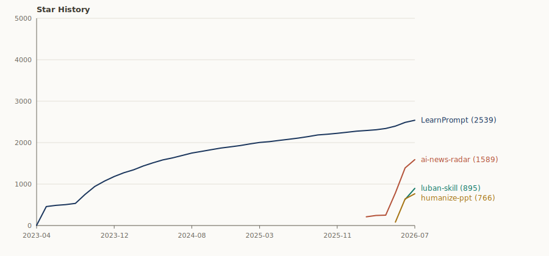

# LearnPrompt

[中文文档](./README.md) | README in English

I’m Carl, an old-school AI builder driven mostly by curiosity. I spend my time testing AI tools in real workflows, creating content, writing open-source tutorials, and building agent-based workflows.

For me, AI has moved far beyond the chat box. It has become a workbench where I learn new things, write code, organize research, build decks, and automate the boring parts.

**Stay curious, always.**

That is the reason I keep building LearnPrompt, AI Warts, and Carl Skills. I don’t want to chase every hot trend, and I don’t want to turn new tools into launch-event summaries.

What I care about is simpler: when ordinary people get access to these tools, can they actually get more meaningful work done?

👉 Project matrix: [learnprompt.pro/skills](https://learnprompt.pro/skills/)

---

## What I’m building

**LearnPrompt · A permanently free, open-source Chinese AI practice guide**

LearnPrompt is where I started, and it is still the earliest public project behind this account. It is a continuously maintained Chinese learning path for AI, covering Claude Code, Codex, OpenClaw, Hermes, prompt engineering, ChatGPT, RAG, agents, AI programming, agent skills, Obsidian, Midjourney, Runway, Stable Diffusion, digital humans, AI voice and music, and large-model fine-tuning.

If you are learning AI systematically for the first time, start here.

Website: [learnprompt.pro](https://www.learnprompt.pro)

**AI News Radar · A 24-hour radar for AI updates**

AI moves too fast. The real problem is not a lack of information, but the fact that there is too much of it to read properly.

The Bole Skill inside AI News Radar turns AI and tech sources into a continuously running radar with GitHub Actions, web pages, and automated summaries. It can evaluate a new source, put it through a 7-day cooling-off period, judge whether it is worth following long term, check whether it overlaps with the sources you already track, and decide the most stable way to plug it into your information flow.

It serves a plain need:

**Scroll less. Save attention for the changes that actually matter.**

**Luban · Polishing a working skill into a public asset**

You wrote a skill that works fine for you, but nobody installs it. Luban treats it as a piece of craft: inspect the material, survey the trade, take measurements, plane slowly, refire — five moves, every cut gated by verification, ending with an evidence-backed polishing report.

Its first job took ai-news-radar from v0.6 to v0.7.0, four PRs merged within a single conversation. It earned 800+ stars in its first month.

**Humanize PPT · Make the deck feel like a human is speaking before generating slides**

Many AI-generated decks go wrong before the first slide is even made. Raw material is dropped in and immediately flattened into a boring outline. At that point, even the best HTML PPT skill can only do so much.

Humanize PPT studied more than 50 TED talks and handles the narrative arc, audience payoff, and speaking order before any concrete slide production begins.

**Skillrush Town · A small town for tracking rising skills**

Skillrush Town started with the ClawHub Top 100. It records which AI skills are rising every day, then expands the same method to more leaderboards and update feeds, such as Claude Code changelogs and model rankings like AA Index.

The point is not the leaderboard itself. What remains is a public-source monitoring workflow: fixed collection rules, daily snapshots, historical comparison, generated reports, and a GitHub Pages site where the results can be shared.

**The Workshop Family · skills named after Chinese craftsmen**

I package methodologies that survived real use into a family of person-named skills. One name, one craft:

- **Luban** polishes a "working skill" into a public asset people can install, verify, and share;
- **Paoding** dissects any blogger's viral playbook with zero API — and distills it into an installable content coach;
- **Cailun** turns the conclusions of a chat into a single shareable page in three seconds;
- **Afu** is the butler at your Obsidian inbox: Inbox to Wiki to Todo to Calendar;
- **Yugong** stops you from nudging the agent round after round — hand the mountain to a loop that digs by itself;
- **Partner** lets Claude Code plan and review while Codex implements and ships, with one Session Receipt keeping score;
- **Irasutoya Illustrations** turns the most valuable judgment of an article into a reaction-character picture that talks back.

The name carries the story; the positioning carries the pain. For heavy agent users there is also the **CC Harness six-pack**: memory, compression, verification, orchestration — one command installs them all.

**Workbench Sidekicks · three small tools I can't work without**

bugu chirps to report status while an agent grinds through long tasks, carl-weread recommends what to read today based on where you're stuck, and x-article-publisher turns a Feishu doc into an X Article in one step.

**Carl Skills · Turning real AI workflows into reusable skills**

I test a lot of AI tools every day. But a video, an article, or a chat transcript gets buried quickly by the next wave of information.

I want the useful parts to stay, so an agent can reuse them next time.

Carl Skills is the new repository for that direction. It will gradually collect AI workflows that grow out of content production, research organization, tool reviews, deck making, Feishu and Obsidian collaboration, and hands-on Hermes, Codex, and OpenClaw practice.

It grew out of tens of millions of tokens of everyday conversations.

---

## What I believe

**Build first, theorize later.** I don’t trust armchair takes on whether an AI tool is useful. I don’t think model rankings are enough either. A tool has to enter real tasks. It has to help me draft an article, finish a code change, or turn scattered notes into a usable review before I count it as useful.

**Tutorials should leave steps for ordinary people.** LearnPrompt was built from the beginning for people who are just getting started with AI. If someone can try one more step or run one more real case after reading it, that matters more than memorizing a pile of concepts.

**Workflows are worth saving.** A chat disappears. An article expires. A tested workflow can stay, be reused, be changed, and eventually be handed back to an agent to run again.

---

## What this repository is

This repository is both the default profile README for the GitHub account `LearnPrompt` and the project repository for the open-source LearnPrompt AI tutorial site.

For people opening the GitHub profile for the first time, it explains who I am, what I’m building, and which projects represent the work.

For people who have used LearnPrompt before, it records where the tutorial site is heading next.

Two years ago, LearnPrompt solved a set of very specific problems: how to understand prompts, how to use ChatGPT, and how to get started with tools like Midjourney, Stable Diffusion, and Runway.

But AI moves too fast.

**A lot of old tutorials are already out of date. If I learn slowly enough, apparently I don’t have to learn at all.**

What feels worth rebuilding now is a version of LearnPrompt that fits today’s AI-native workflow.

To me, an AI-native tutorial should be less of a tool directory and more of a guide to real tasks. It should be organized around questions like:

**How do I use AI to research, write, make decks, edit code, organize a knowledge base, and build my own agent workbench?**

With skills, this can finally be done in a new way.

In the past, writing tutorials mostly meant collecting materials manually, taking screenshots, and writing step-by-step instructions. Next, I want LearnPrompt itself to become a project maintained by AI workflows: using wiki skills to break down topics, updating outdated content, saving tested processes, and turning repeated real use into learning paths that ordinary people can follow.

The new LearnPrompt will remain free and open source, and it will keep Chinese learning paths as its main thread. It will gradually grow from an early AIGC tutorial into an AI-native guide for real work.

The direction is roughly this:

- From tool onboarding to real tasks, such as writing an article, making a deck, building a research library, or asking an agent to maintain a project.
- From static tutorials to updateable workflows, where the pages are supported by skills, scripts, and reusable processes.
- From learning a single tool to building your own AI workbench, where ChatGPT, Claude Code, Codex, Hermes, OpenClaw, Obsidian, and Feishu are understood inside one workflow.

That is why I’m reorganizing this repository now.

---

## Find me

**WeChat Official Account / Channels:** 卡尔的AI沃茨

**Social:** [Bilibili](https://space.bilibili.com/1820008345) · [Xiaohongshu](https://xhslink.com/m/AUj3yYs85qi) · [X](https://x.com/aiwarts) · [Jike](https://okjk.co/mO7Cg4) · [YouTube](https://www.youtube.com/@aiwarts101) · [Instagram](https://www.instagram.com/carllee2077)

**Feedback and discussion:** add me on WeChat at `aiwarts101`, or open an [issue](https://github.com/LearnPrompt/LearnPrompt/issues) on GitHub.

**Business inquiries:** [carl@goodcase.ai](mailto:carl@goodcase.ai)

## Star History

## Reference

The following tutorials and documents were referenced while building this project. Thanks to their creators:

1. [Learn Prompting](https://learnprompting.org/zh-Hans/)
2. [KKKKhazix/khazix-skills](https://github.com/KKKKhazix/khazix-skills)
3. [alchaincyf/alchaincyf](https://github.com/alchaincyf/alchaincyf)
4. [op7418/guizang-ppt-skill](https://github.com/op7418/guizang-ppt-skill)
