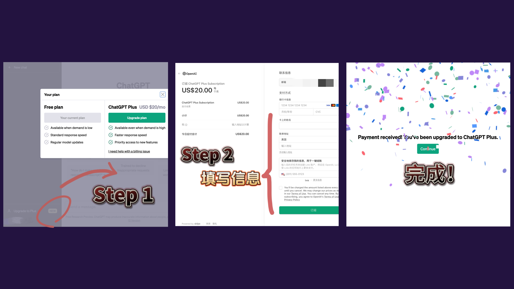

# 🟢 ChatGPT 注册 & 充值

## ChatGPT 注册/登陆

前置条件
- 纯净可访问 [ChatGPT](https://chat.openai.com/) 的网络 ip纯净度检测网址：https://scamalytics.com/ip
- 国外手机号

###  虚拟号码（可选）
- 虚拟接码网站[https://sms-activate.org](https://sms-activate.org)

> 手机号对应的国家无需跟后续GPT4充值的银行卡或礼品卡的地区对应，这里推荐印度或印度尼西亚

整套流程非常简答：
1. 选择服务和国家
2. 买号复制
3. 在适当的字段中输入
4. 短信代码将出现在网站上

图文步骤如下：
注册好之后进行充值。选择VISA银行卡或支付宝充值

todo

接码费用一次约为1.3人名币，充值默认是美元，可以选择充最低的一美元进去

todo

搜索OpenAI并点击

todo

号码租用成功后，会显示为等待短信⌛️的状态。这时候你只需在OpenAI注册过程中的手机号码填写界面填入申请的手机号，等待验证码即可

### 注册账号
- 点击打开OpenAI的注册页面进行注册，支持谷歌账号，微软账号和苹果账号
todo
- 注册成功后会跳转到手机号填写页面
todo
- Enjoy！你已经可以开始使用 ChatGPT 了～
todo

## GPT4 充值方法 1
- 虚拟信用卡，推荐[wildcard](https://bewildcard.com/)
- [国外地址生成](https://www.meiguodizhi.com/usa-address/oregon)

激活完信用卡后，登录你的ChatGPT账号，点击Upgrade to Plus，然后点击Upgrade plan

然后填写卡片信息和账单信息（参考信用卡开卡信息）

这里账单地址最好是复用你开卡的地址

填写完信息，点击订阅/Subscribe 等待验证即可成功订阅开通ChatGPT Plus。

一个ChatGPT plus帐号诞生了😄

## GPT4 充值方法 2
- 美区AppleID
- 购买礼品卡
- [国外地址生成](https://www.meiguodizhi.com/usa-address/oregon)
- 手机号，国内外都可以，可重复

> 苹果的ID不严查，只要有个美国地址和注册的时候记录选择美国的地区就可以了，对网络没有要求，对手机号没有要求，人人都可以注册

第一步 打开支付宝 左上角切换地区到旧金山 国际热门城市
第二步 修改后返回支付宝首页 点击最下面的中间位置“惠出境”
第三步 点击新界面里的折扣礼卡
第四步 拉到最下面点击“更多大牌”
第五步 点击搜索itunes 就可以查看
第六步 输入金额并购买，会直接使用支付宝支付。

买完礼品卡，美区ID账号就可以直接订阅 ChatGPT plus,也就是GPT4

> 如果用礼品卡账户订阅 ChatGPT Plus 遇到"Your Purchase Could Not Be Completed"的问题不用慌，下载 Apple support 找客服解决就好。找之前记得把手机的地区、语言、IP 都伪装成美国，并确认自己的账号没有任何滥用行为。（客服有一定几率直接封号）

### Reference

1. [https://waytoagi.feishu.cn/wiki/WtmKwrWsxi55XskcUomcDZ3onUh](https://waytoagi.feishu.cn/wiki/WtmKwrWsxi55XskcUomcDZ3onUh)
2. [https://mailberry.com.cn/2023/05/creat-region-us-appleid/](https://mailberry.com.cn/2023/05/creat-region-us-appleid/)
3. [https://twitter.com/oran_ge/status/1659412600118218755](https://twitter.com/oran_ge/status/1659412600118218755)
