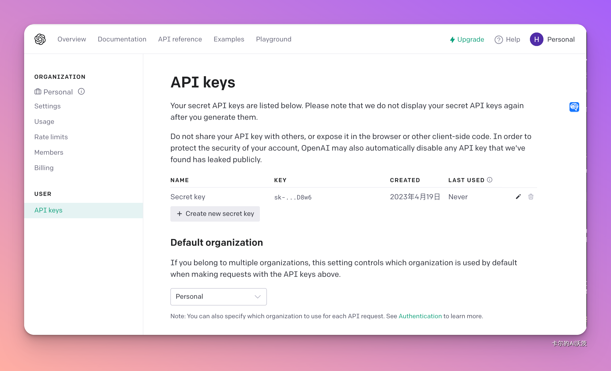
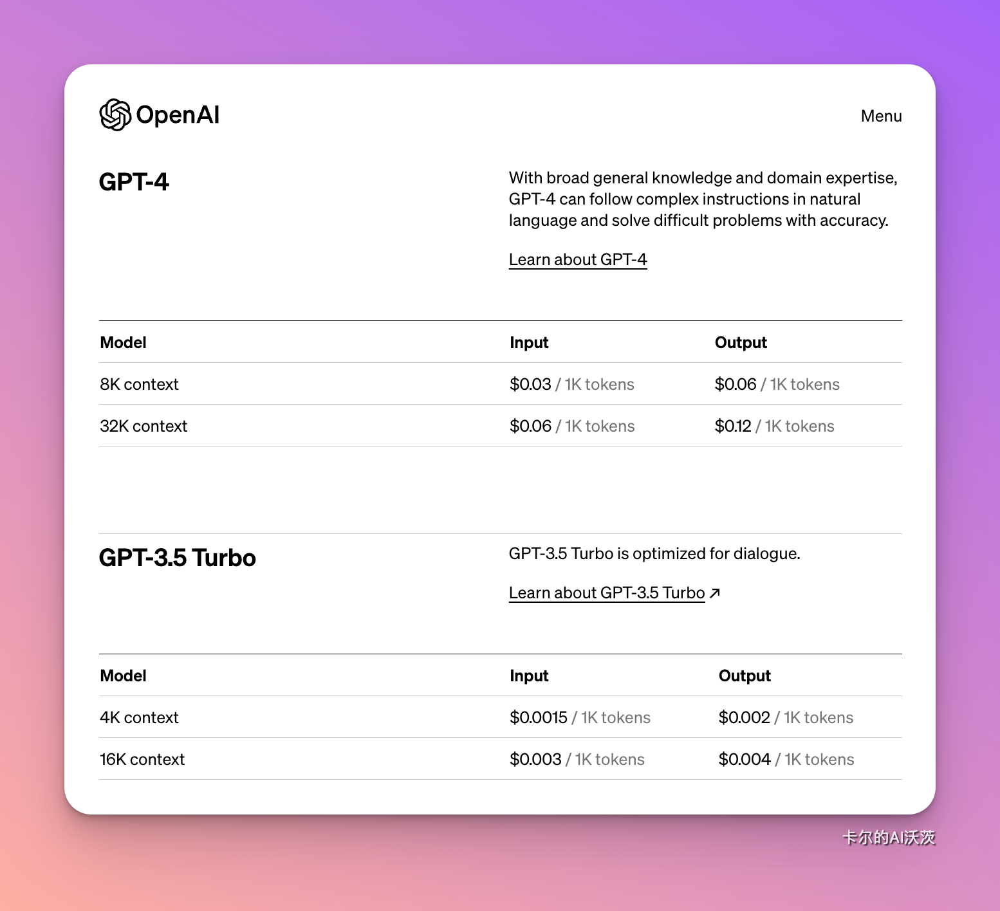
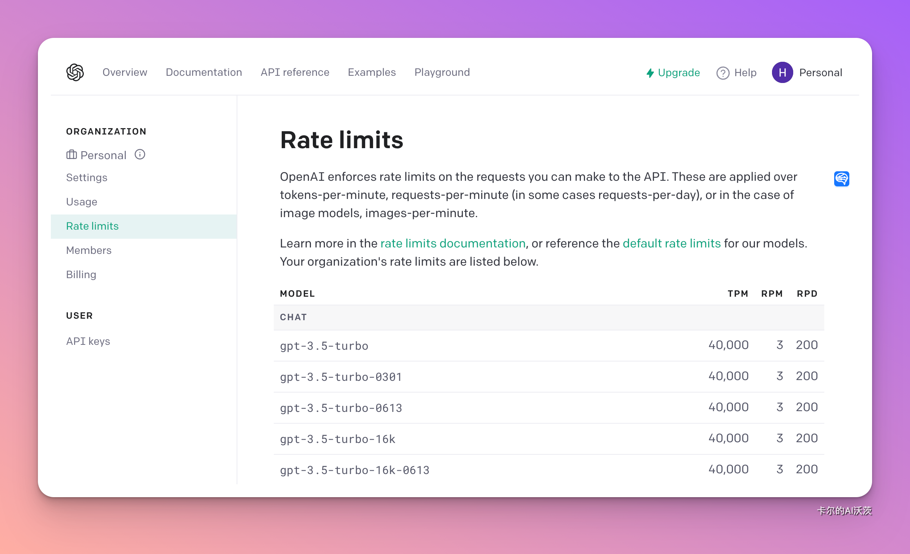
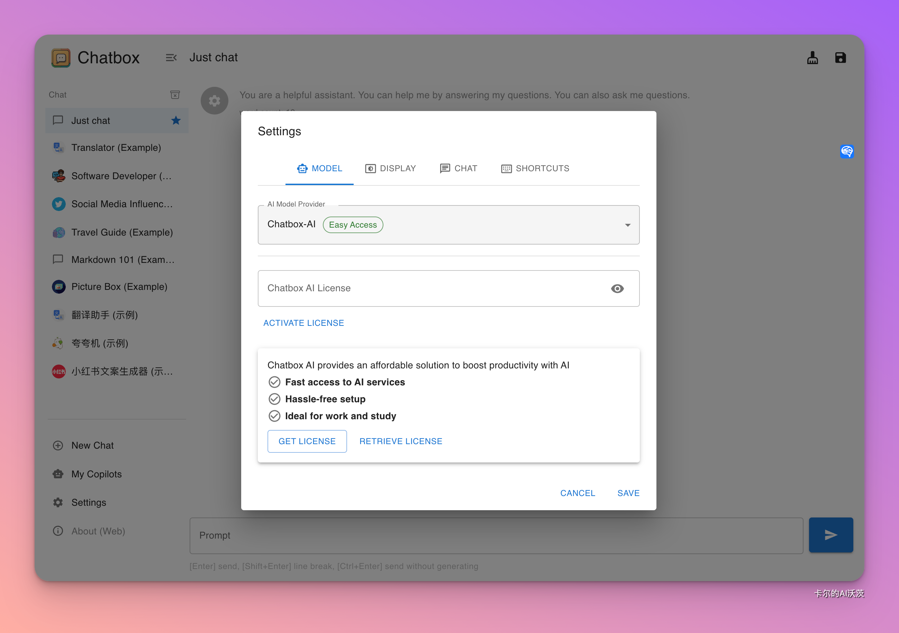
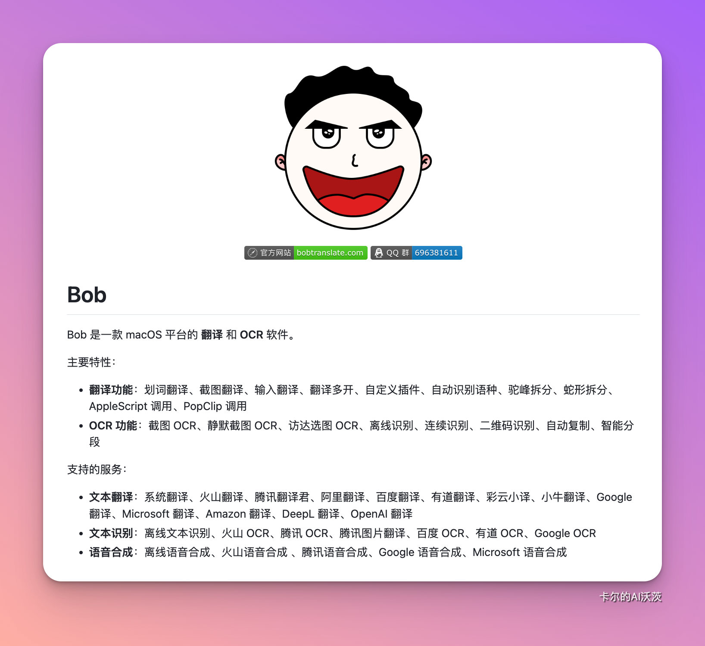

# 🟢 为什么用 ChatGPT API？ 

引用人工智能先驱吴恩达先生说过的话：“一个系统需要的远不止一个提示（prompt）或者一个对LLM（大性语言模型）的调用。”

API的优点：
- 集成更深: 通过 API，您可以将 ChatGPT 集成到自己的系统和工作流中，实现更深层次的定制和控制。
- 个性化的响应: 您可以根据特定需求和场景调整模型的响应，例如，通过改变温度（temperature）和最大token数来控制模型创造性和详细程度。
- 批量处理: 如果需要多个提示或LLM调用，API 允许您进行批量处理和并行化，从而实现更高效的操作。
- 安全合规：通过 API，您可以确保数据在传输和处理过程中的安全性，并可以符合特定行业或地区的合规要求。

## API

- OpenAI账号访问[API Key申请网站](https://platform.openai.com/account/api-keys)
- 创建API Key，Key能够创建多个。如下图点击“Create new secret key”，创建之后需要复制保存，关闭窗口后就看不到了。

> API调用是收费的，但是OpenAI已经为我们免费提供了5美元的用量

点击[link](https://openai.com/pricing)访问完整价格列表

### 速率限制

OpenAI 对您可以向 API 发出的请求强制实施速率限制。这些应用于每分钟token数、每分钟请求数（在某些情况下为每日请求数），或者在图像模型的情况下应用于每分钟图像数。

实施速率限制有几个不同的原因：
- 它们有助于防止滥用或误用 API。例如，恶意参与者可能会用请求淹没 API，试图使其过载或导致服务中断。通过设置速率限制，OpenAI可以防止此类活动。
- 速率限制有助于确保每个人都可以公平访问 API。如果一个人或组织发出过多的请求，则可能会使其他人的API陷入困境。通过限制单个用户可以发出的请求数量，OpenAI 确保最多的人有机会使用 API，而不会遇到速度变慢的情况。

下面列出了部分速率限制。详细列表可点击[link](https://platform.openai.com/account/rate-limits)跳转访问。

> 解除速率限制可以填写[分享需求证据](https://docs.google.com/forms/d/e/1FAIpQLSc6gSL3zfHFlL6gNIyUcjkEv29jModHGxg5_XGyr-PrE2LaHw/viewform)表格，以当前速率限制向一部分用户发布服务，收集 10 个工作日的使用情况数据，然后根据该数据提交正式的速率限制提高请求，以供OpenAI的审核和批准。

## 模型列表

# 支持API的优秀软件

1. **OpenCat**：本地桌面ChatGPT客户端，支持iOS和macOS。与ChatGPT每月20美元的订阅费相比，轻度使用的API价格更低。

2. **ChatBox**：开源免费的OpenAI API桌面客户端，支持Windows、macOS和Linux。用户可以自定义KEY和API Host地址，并在本地保存聊天记录，管理多个会话，并设置不同的Prompt。

3. **Bob**：优秀的macOS翻译软件。在gpt-3.5-turbo更新后，翻译速度显著提升。

4. **PopClip**：macOS上的「划词操作增强工具」。接入API key后，选中文字即可弹出AI按钮，实现“一键”获取ChatGPT的帮助与回答。

5. **bilingual_book_maker**：利用OpenAI API翻译电子书，每本书的成本约为3美元。

6. **xiaogpt**：将ChatGPT接入小爱同学，增加趣味性😄。

更多基于 ChatGPT API的工具和应用，可访问[Awesome ChatGPT API](https://github.com/reorx/awesome-chatgpt-api)

## 关于token

在大型语言模型中，"token"扮演着一个关键角色。它是文本中的一个最小单位，可以是一个单词、标点符号、数字或符号等。让我们深入了解token在自然语言处理中的重要性：

1. **Tokenization**
   - **定义**：Tokenization是将句子或文本分成tokens的过程。
   - **应用**：模型接收一串tokens作为输入，并尝试预测下一个最可能的token。tokens可以通过embedding操作转换为向量表示，以便在神经网络中进行处理。

2. **Token数的限制**
   - **关键限制**：Token数是ChatGPT等大型语言模型的关键限制之一。
   - **个性化交互**：较大的上下文长度允许模型查询用户的上下文和数据，实现更强的个性化交互。
   - **准确性和流畅性**：大型上下文窗口使模型更准确、更流畅，并提升模型的创造力。

3. **不同模型的Token限制**
   - **GPT模型**：从官方文档可以看到，不同的GPT模型有不同的token限制。例如，32K是模型的token上限。
   - **Claude-2-100k模型**：与ChatGPT竞争的Claude-2-100k模型的上下文上限是100k，一口气输入几本书都不是问题！

### 为什么要了解token限制

在使用大型语言模型时，了解token限制的重要性在于它影响了两个关键方面：

1. **当前对话的输入限制：**
   - 你一次性输入的内容不能超过模型限制的tokens。这意味着你必须在给定的token范围内准确、简洁地表达你的需求。

2. **总体上下文长度限制：**
   - 在一次完整的对话中，你的输入加上模型的输出不能超过模型限制的tokens。如果超出限制，最前面的对话将被遗忘，可能导致你最初设定的prompt失效。

如果prompt本身太长，可以考虑用英文设定，并要求模型用中文输出。这样可以节省token，留给更多次数的对话

### Reference
1. [官方完整指南](https://platform.openai.com/docs/api-reference/introduction)
2. [官方模型列表](https://platform.openai.com/docs/models/gpt-4)