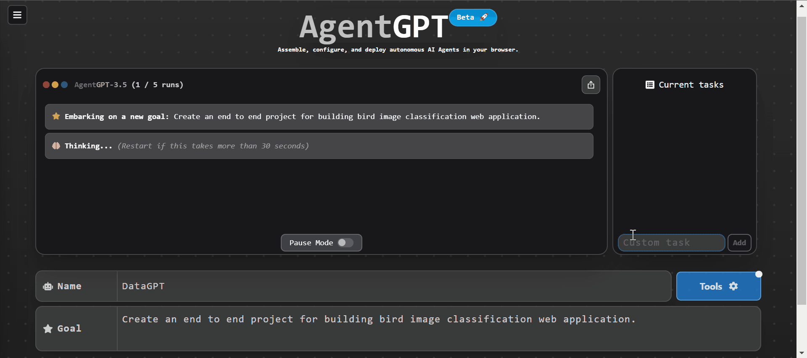
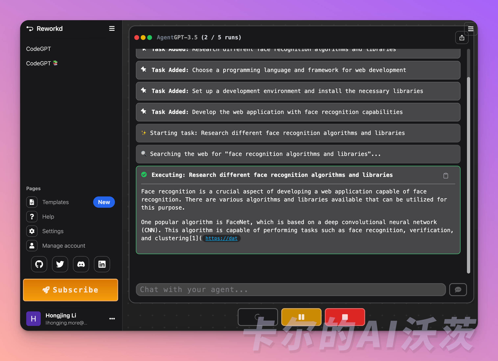
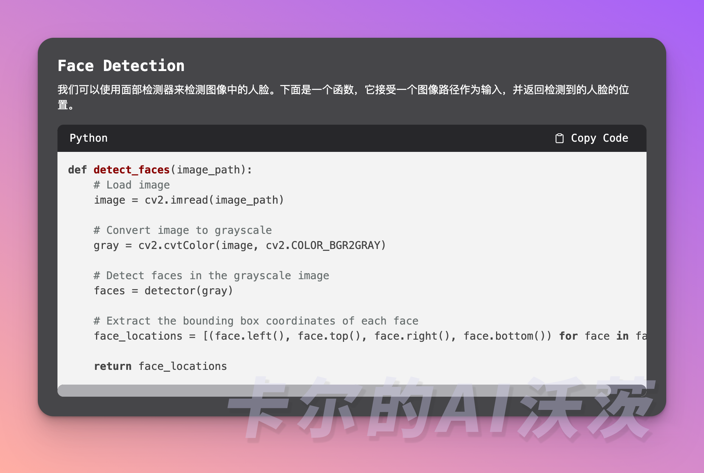

# 🟢 AgentGPT

这是AgentGPT的自我介绍：

> AgentGPT: Create and run an autonomous agent (AutoGPT) from a website, no login required.

AgentGPT 是一个基于 Langchain 和 OpenAI 基础构建的 AI Agent。它是一个 AI 代理平台，使您能够在浏览器或个人计算机中创建、配置和部署自主 AI 代理。

AgentGPT 允许您配置和部署自治 AI 代理。命名你自己的自定义 AI，让它开始实现任何可以想象的目标。它将尝试通过思考要做的任务、执行它们并从结果🚀中学习来达到目标。

🎉开始阅读前，如果你对其他文章感兴趣，可以到欢迎页关注我们！「卡尔的AI沃茨」开源中文社区实时获得后续的更新和最新的教程🎉

## AgentGPT 和 AutoGPT 之间的区别

AutoGPT 是一款功能强大的 AI 工具。但在开始使用之前，您需要设置 Git、安装 Python、下载 Docker 桌面程序并获取 OpenAI API 密钥。

AgentGPT 实际上是基于 AutoGPT 架构进行了改进，为您增加了一个网页界面，摆脱了繁琐的搭建和安装过程。从本质上来说，它就是一个 AutoGPT，您无需自行搭建，也不必担心繁杂的构建步骤，只需要登录网站就可以使用。

## 简单使用 😊

> 前置准备：在使用AgentGPT之前，您需要获取OpenAI API密钥。访问 OpenAI 网站 https://www.openai.com/。

AgentGPT 注册步骤如下：

1. 访问 AgentGPT 平台：https://agentgpt.reworkd.ai/。
2. 在 reworkd.ai 上创建一个帐户，并通过提供您的名称和目标来部署您的代理。

在我们的例子中，我们要求 AgentGPT 开发一个能够人脸识别的 Web 应用程序。这里我部分截取了中间的运行效果，AgentGPT成功帮我生成了一个人脸识别的 Web 应用，我无需写任何代码💻！

## 自己部署🚀

[Vercel](https://vercel.com/templates/next.js/agent-gpt)目前已经支持自主一键部署AgentGPT

> 恭喜你掌握了第二个 Agent！欢迎关注「卡尔的AI沃茨」🧙

## Reference
- [reworkd/AgentGPT](https://github.com/reworkd/AgentGPT)
- [Everything You Need to Know about AgentGPT](https://www.packtpub.com/article-hub/everything-you-need-to-know-about-agentgpt)
- [AgentGPT: Autonomous AI Agents in your Browser](https://www.kdnuggets.com/2023/06/agentgpt-autonomous-ai-agents-browser.html)

