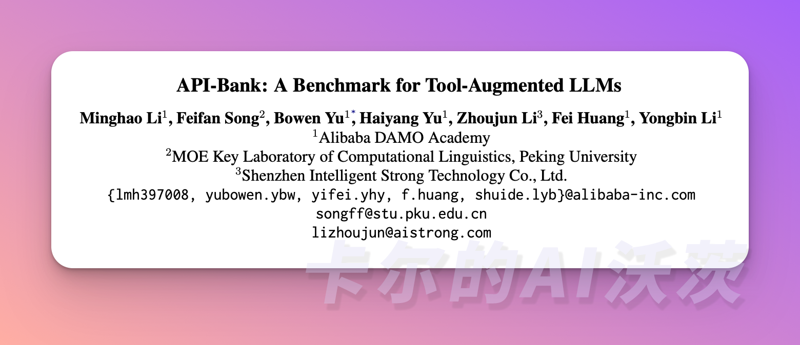
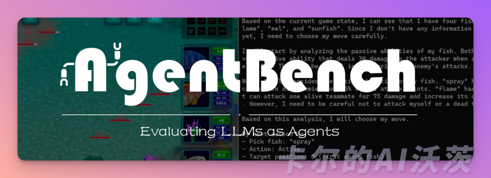

# 🟡 API-Bank & AgentBench

模型评估是Agent学习过程中至关重要的一环。通过分析数据来评估Agent的能力，可以客观地衡量它在特定任务或领域中的表现。数据评估是不断迭代和改进的基础。通过反复评估和分析数据，Agent可以逐步改进自身，并不断优化其能力。数据评估还可以将Agent与其他Agent或标准进行比较，从而了解其在同一任务或领域中的相对能力。这有助于Agent了解自身在整个生态系统中的定位和竞争态势，明确进一步提升自身能力的目标。

🎉开始阅读前，如果你对其他文章感兴趣，可以到欢迎页关注我们！「卡尔的AI沃茨」开源中文社区实时获得后续的更新和最新的教程🎉

## API-Bank

**API-Bank**是一个基准工具，用于评估增强LLM性能。它包含了53个常用的API工具，完整的工具增强LLM工作流程，以及264个注释对话，其中包含568个API调用。这些API涵盖了各种领域，例如搜索引擎、计算器、日历查询、智能家居控制、日程管理、健康数据管理和账户认证工作流程等等。

LLM会首先通过API搜索引擎来选择正确的API进行调用，并使用相应的文档来进行调用。在API-Bank的工作流程中，LLM需要做出一些决策，并且每个步骤的决策准确性都可以进行评估。这些决策包括：

1. 判断是否需要进行API调用。
2. 确定要调用的正确API：如果不够好，LLM需要迭代修改API输入，例如为搜索引擎API决定搜索关键字。
3. 根据API结果做出响应：如果结果不满意，模型可以选择改进并重新进行调用。

该基准评估了Agent在三个层面上的工具使用能力：

- Level-1: 评估调用API的能力。在给定API的描述情况下，模型需要确定是否调用该API，正确地调用它，并对API返回做出适当的响应。
-  Level-2: 检索API的能力。模型需要搜索可能解决用户需求的API，并通过阅读文档学习如何使用它们。
-  Level-3: 组合API的能力。在用户请求不明确的情况下，例如安排团队会议或预订旅行的航班/酒店/餐厅，模型可能需要进行多次API调用来解决问题。

# AgentBench

AgentBench也是一个创新的基准测试，旨在评估LLM作为自主Agent在不同环境下的表现。它涵盖了8个不同的场景，以全面评估LLM作为Agent的能力。这些场景包括操作系统、数据库、知识图谱、数字卡牌游戏以及横向思维难题。此外，还有从现有数据集重新编译的房屋控股、网上购物和网页浏览场景。通过这些测试，我们可以深入了解LLM在各种情境下的表现，并进一步提高其自主运作的能力。

> 下一节我们将带来在开发过程中，我们对Agent的感悟！欢迎关注「卡尔的AI沃茨」🧙

## Reference
- [API-Bank](https://arxiv.org/abs/2304.0824)