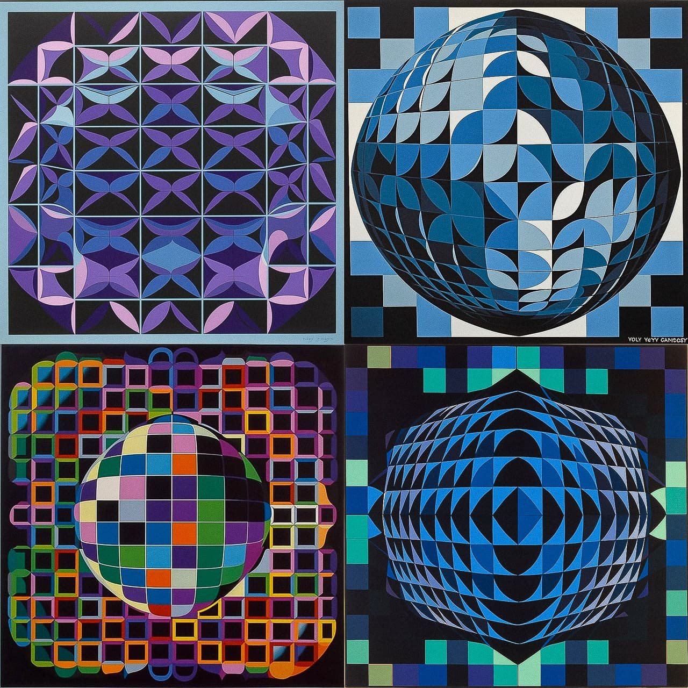
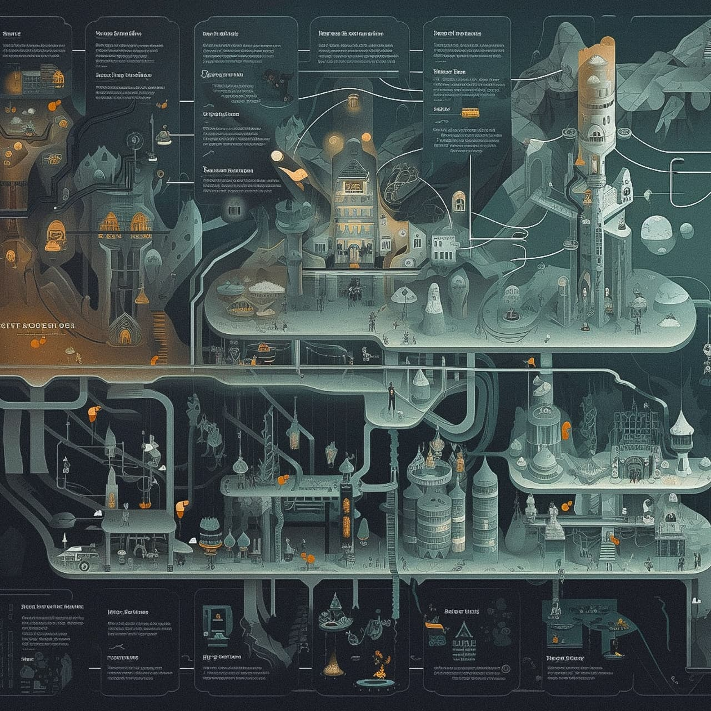

# 简介

随着 ChatGPT 的爆火，越来越多的人开始关注并尝试 AI 相关的应用。而图片生成就是其中一个备受瞩目的领域。目前已经有许多图像生成工具，如 Midjourney，Stable Diffusion，DALL-E，Firefly等。本课程主要是以 Midjourney 为主，让你可以快速了解并学会使用文生图工具。

## 最新水平

首先是 Midjourney 的图片生成水平如何？这里我截取了部份 Midjourney 官网上的例子。

如果你对 Midjourney 的了解仅仅停留在上面的话，那我可以很兴奋的告诉你实际上Midjourney能做的更多。

这里我直接展示几张 Midjourney V5算法生成的图片。

Midjourney 可用于各种垂直场景，包括但不限于logo、插图、漫画、海报、头像、人物摄影等等，所有这些我都会在下一章节中讲到。如果你有更多关于 Midjourney 的例子，非常欢迎你加入我们，与我们共同优化这一课程。

