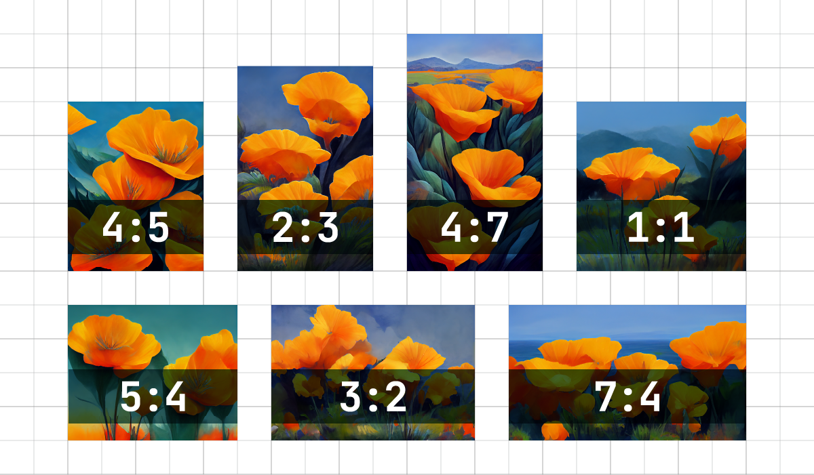
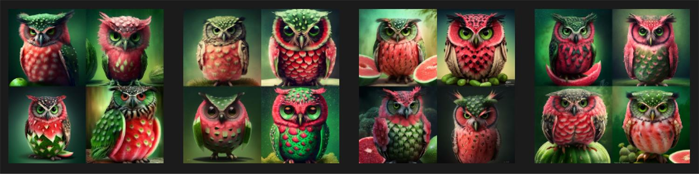
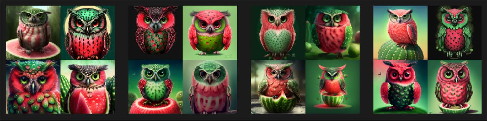
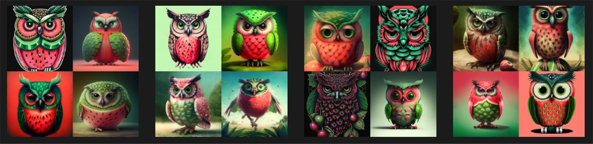
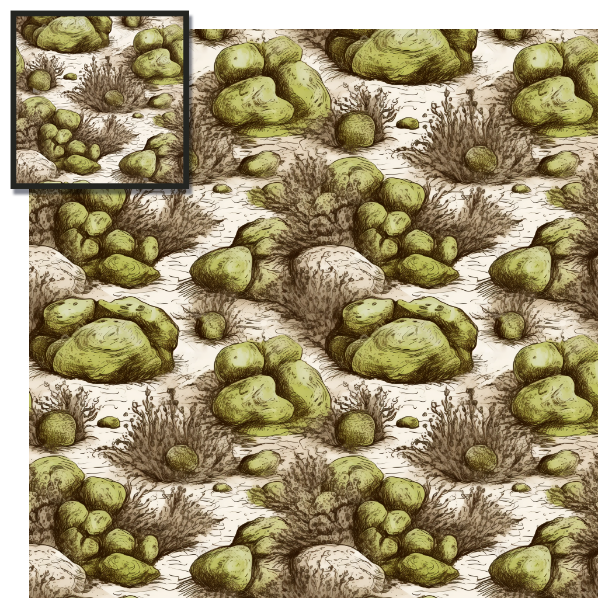
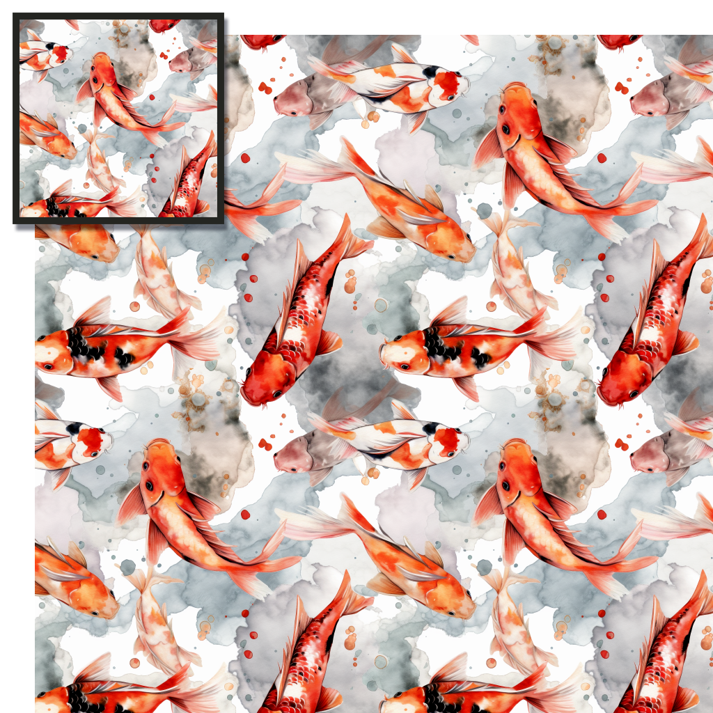
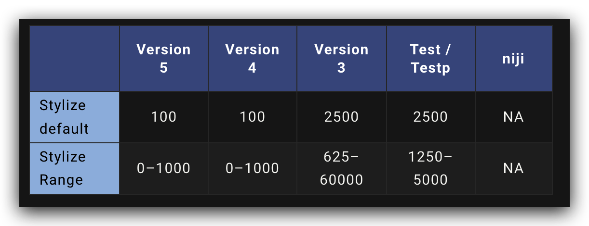
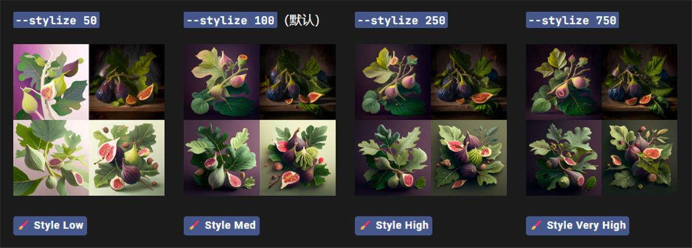
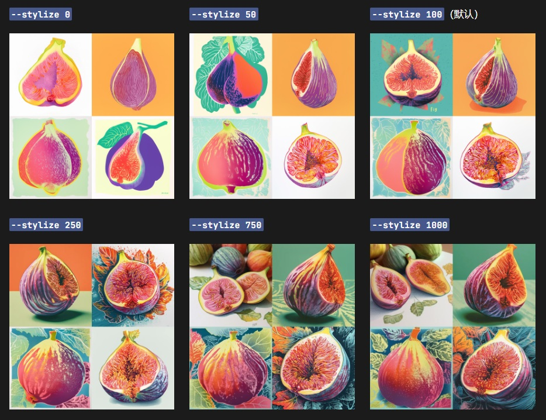

# 常用参数

在上一页当中，我们在解说基本设置的同时，举例了不少以*--*开头的参数。

参数是添加到提示中的选项，可更改图像的生成方式，图像的纵横比，在 Midjourney模型版本之间切换，更改使用的 Upscaler 等等。使用参数的好处是，我们可以用参数直接定制当前的图像的设置，而不需要调整全局设定。

Midjourney 的提示语与 ChatGPT 的不同。简单来说，你可以在ChatGPT中输入复杂的提示语，因为它可以读取语法，而Midjourney最好使用简单的提示语+关键词（词语之间用逗号连接）。

之所以将常用参数放在 Midjourney Prompt 的前面，是因为你可以将参数看作能够在图像生成中保持一致性的提示语/关键词。如果你想实现的图像（如风格、构图等）已经有了相应的参数，那么我建议你优先使用该参数，而不是在提示中用复杂的语法来描述它。

## /imagine 后缀参数

这里的参数适用于添加到提示的末尾。单个提示可以添加多个参数。

|  参数   | 中文名     | 功能 |
| ----- | --- | ----- | 
| --aspect |  纵横比 | 调整图片的比例 |
|  --chaos    | 混乱 |  改变结果的多样性。较高的值会产生更多不寻常和意外的结果    | 
| --no| 负面提示 | --no plants会尝试从图像中移除植物 |
| --quality |生成质量 | --q <.25, .5, 1, or 2>代表要花费多少渲染时间。默认值为 1。值越高渲染时间越高, 值越渲染时间越低 | 
| --seed | 随机数种子| 随机数是为每个图像随机生成的。使用相同的种子编号和提示将产生相似的图像|
| --stop |停止 |  使用--stop参数在流程中途完成作业。以较早的百分比停止作业会产生更模糊、更不详细的结果 |
| --tile | 平铺 |  生成可用作重复拼贴的图像，以创建在织物、壁纸和纹理上常用的无缝图案 | 
| --version | 模型版本  | --v <1, 2, 3, 4, or 5> 使用不同版本的 Midjourney 模型 |
| --style | 风格切换  |--style <4a, 4b, or 4c> V4模型风格切换；--style <expressive, or cute> Niji模型风格切换 |
|--stylize | 程式化 | 低程式化值生成的图像与提示非常匹配，但艺术性较差。高程式化值创建的图像非常具有艺术性，但与提示的联系较少 |

[官方完整参数表](https://docs.midjourney.com/docs/parameter-list)

## Aspect纵横比

用--aspect或者--ar更改生成图像的纵横比。纵横比是图像的宽高比。它通常表示为用冒号分隔的两个数字，例如 7:4 或 4:3。

正方形图像具有相等的宽度和高度，描述为 1:1 的纵横比。图片可以是 1000px × 1000px，或者 1500px × 1500px，纵横比仍然是 1:1。计算机屏幕的比例可能为 16:10。宽度是高度的 1.6 倍。所以图像可以是 1600px × 1000px、4000px × 2000px、320px x 200px 等。

:::note
- 默认纵横比为 1:1。

- --aspect 必须使用整数。使用 139:100 而不是 1.39:1。
纵横比影响生成图像的形状和组成。
:::

|  指令   | 详细说明 | V5| V4 | niji 
| ----- | --- | ----- | ----- | ----- | 
|vibrant california poppies --ar 5:4  |常见的纵横比 <li>--aspect 1:1默认纵横比。</li> <li>--aspect 5:4常见的框架和打印比例。</li> <li>--aspect 3:2印刷摄影中常见。</li> <li>--aspect 7:4靠近高清电视屏幕和智能手机屏幕。</li>  | 支持任何纵横比  | <li>4c:1:2 至 2:1</li> <li>4a/4b:仅：1:1、2:3 或 3:2</li> | 1:2 至 2:1 | 

## Chaos混乱
--chaos参数影响初始图像网格的变化程度。高 --chaos 值将产生更多不寻常和意想不到的结果和组合。较低的--chaos 值具有更可靠、可重复的结果。

:::note
--chaos 范围值 0–100。

默认 --chaos 值为 0。
:::

#### 低值

使用较低的 --chaos 值或不指定值将生成每次运行作业时略有不同的初始图像网格。

示例：imagine/ prompt watermelon owl hybrid

#### 高值

--chaos 每次运行作业时，使用较高的值将产生更多变化和意外的初始图像网格。

示例：imagine/ prompt watermelon owl hybrid --c 50

#### 超高值

每次运行作业时，使用极高的值将产生不同的初始图像网格，并且具有意想不到的构图或艺术媒介。

示例：imagine/ prompt watermelon owl hybrid --c 100

## Tile 重复拼贴

--tile 参数生成可用作重复拼贴的图像，以创建织物、壁纸和纹理的无缝图案。

:::note
--tile 适用于模型 版本 1、2、3、5
:::

示例: prompt scribble of moss on rocks --v 5 --tile

示例: prompt watercolor koi --v 5 --tile

## Stylize 程式化

Midjourney Bot 经过训练后可以生成有利于艺术色彩、构图和形式的图像。--stylize (--s) 用于设置强度。低值生成的图像与提示非常匹配，但艺术性较差。高值创建的图像非常具有艺术性，但与提示的联系较少。

:::note
--stylize 的默认值为 100，并且在使用默认 [V4 模型] 时接受 0-1000 的整数值。
:::

示例: /imagine prompt illustrated figs --s 100

示例: /imagine prompt colorful risograph of a fig --s 100

下一章我们将重点介绍 Midjourney 的提示语。