# 基本设置和预设

**/settings**指令为模型版本、样式值、质量值和升级器版本等常用选项提供切换按钮。

:::note
添加到提示末尾的参数将覆盖**/settings**中的设置。
:::

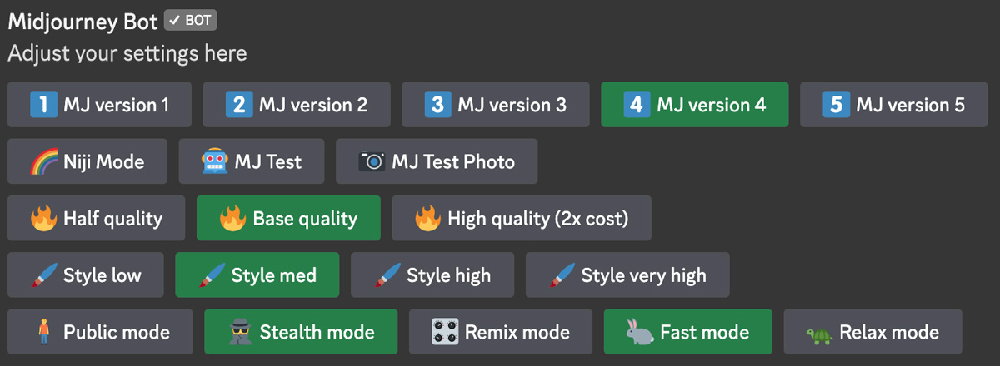

## 模型版本
- 1️⃣ MJ Version 1 
- 2️⃣ MJ Version 2 
- 3️⃣ MJ Version 3 
- 4️⃣ MJ Version 4 
- 5️⃣ MJ Version 5 
- 🌈 Niji Mode 
- 🤖MJ Test 
- 📷 MJ Test Photo

这些按钮可用于设置使用的模型版本。MJ Version 5只适用于有Midjourney订阅的用户

Midjourney 预设默认为最新型号。切换模型的方式有两种：

- 在提示后面添加**--version [v1|v2|v3|v4|v5]**。（version可以缩写成v）
- 使用**/settings**指令并选择型号版本。

### V5

V5 模型是2023 年 3 月 15 日发布的最新最先进的模型。要使用此模型，将参数**--v 5**添加到提示末尾，或使用 **/settings** 指令并选择 5️⃣ MJ Version 5。该模型具有非常高的Coherency，擅长解释自然语言提示，分辨率更高。

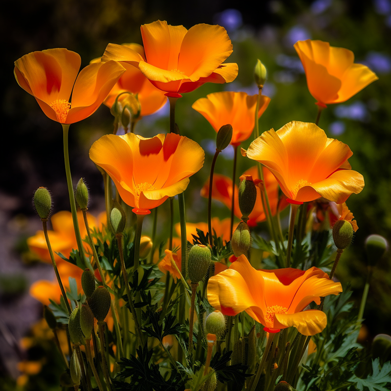
```text
vibrant California poppies --v 5
```

### V4

V4 模型是我们现在用的最多的版本，它拥有更多关于生物、地点、物体等的知识。它更擅长正确处理小细节，并且可以处理包含多个角色或对象的复杂提示。

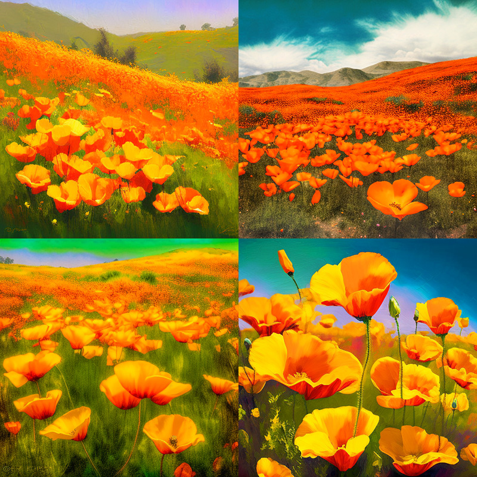

```text
vibrant California poppies
```

#### v4 风格切换 4a,4b,4c

Midjourney Model Version 4 具有三种略有不同的“风格”，对模型的风格调整进行了细微调整。通过在 V4 提示末尾添加--style 4a、--style 4b或来试验这些版本。

1. --v 4 --style 4c是当前默认值，不需要添加到提示末尾。
2. --style 4a且--style 4b仅支持 1:1、2:3 和 3:2 纵横比。
3. --style 4c支持高达 1:2 或 2:1 的纵横比。

|图片 |提示 |
|--|--|
| |vibrant California poppies --style 4a |
|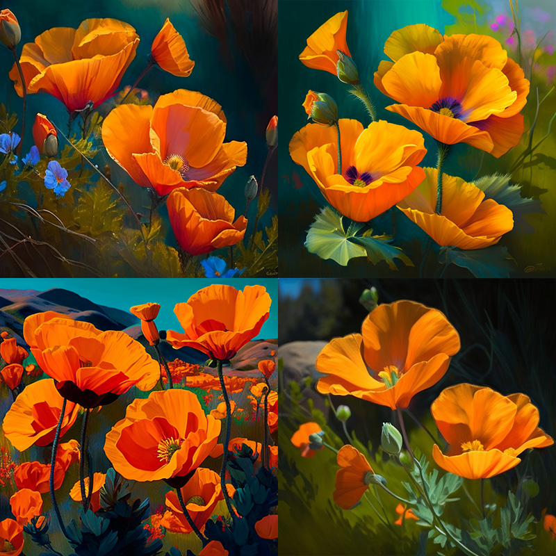 |vibrant California poppies --style 4b | 
| |vibrant California poppies --style 4c | 

### Niji

该模型是 Midjourney 和 Spellbrush niji之间的合作，经过调整可以制作动画和插图风格。该模型对动漫风格和动漫美学有更多的了解。一般来说，它在动态和动作镜头以及以角色为中心的构图方面表现出色。

提示

|图片 |提示 |
|--|--|
| |California poppies |
|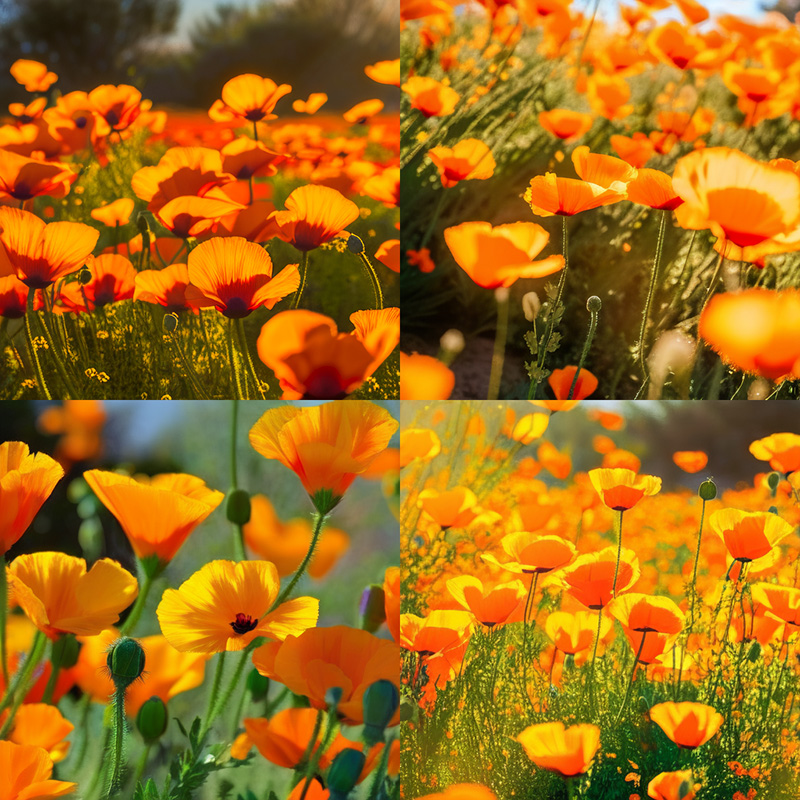 |California poppies --niji | 

### V5版 Niji

Niji Version 5 模型是最新和最先进的 Niji 模型。要使用此模型，你可以将 **--niji 5** 参数添加到提示的末尾，或使用指令 **/settings** 并选择 **5️🍏 Niji version 5**。Niji Model Version 5 还可以通过 **--style** 以实现独特的外观。尝试 **--style expressive** 或 **--style cute**：

|图片 |提示 |
|--|--|
|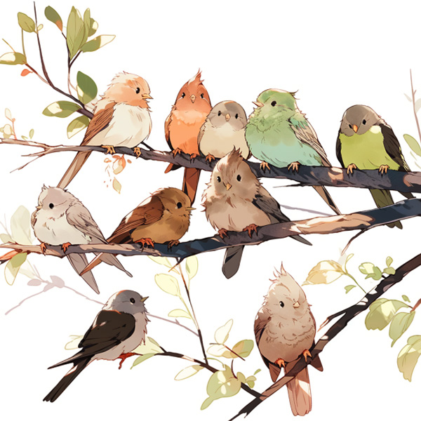 |birds perching on a twig --niji 5 |
| |birds perching on a twig --niji 5 --style expressive |
|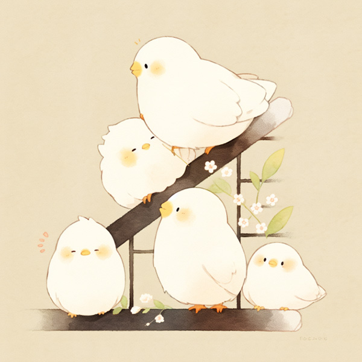  |birds perching on a twig --niji 5 --style cute| 


## 图片质量


- 🔥 Half Quality 
- 🔥 Base Quality 
- 🔥 High Quality (2x cost)

Half Quality = --q .5, Base Quality = --q 1, High Quality = --q 2.

**--quality**指令（可简写为**--q**）是用于修改生成图像所需的时间。更高质量的设置需要更长的时间来处理并产生更多的细节。**质量设置不影响分辨率**。

|图片 |quality|
|--|--|
|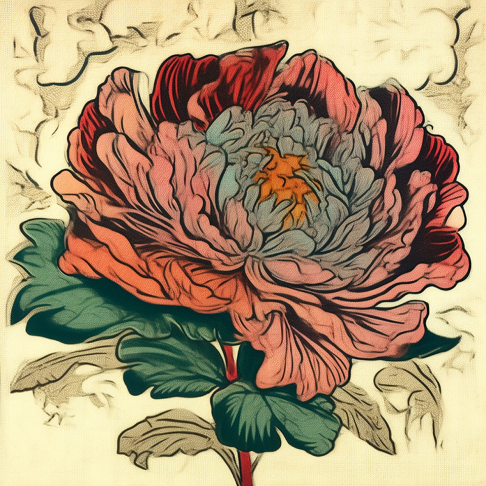 |--quality .25|
|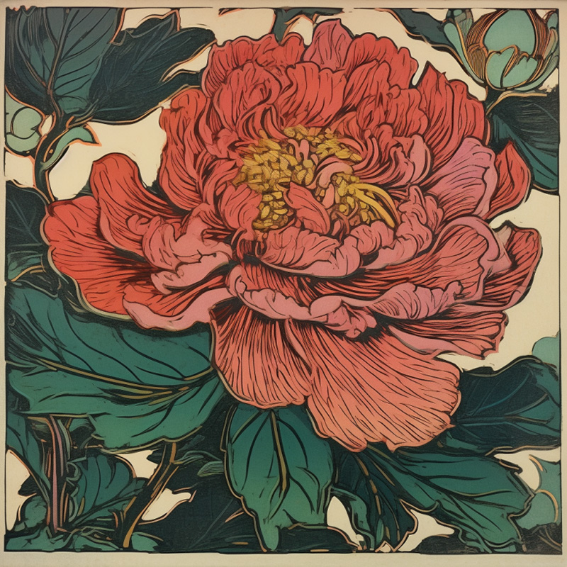 |--quality .5|
|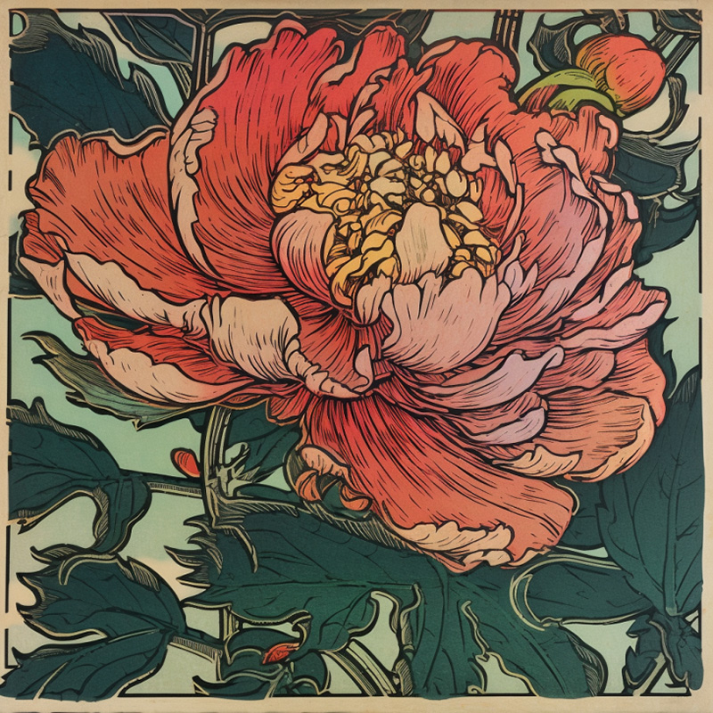  |--quality 1| 

- --quality默认值为 1。
- --quality接受以下值：.25、.5 和 1。较大的值将向下舍入为 1。
- --quality仅影响初始图像生成。
- --quality适用于模型版本1、2、3、4、5 和 niji。

更高的--quality并不总是更好。有时较低的--quality可以产生更好的结果

## Remix

使用Remix模式更改提示、参数、模型版本或变体之间的纵横比。Remix 将采用起始图像的一般构图，并将其用作新工作的一部分。

- 使用/prefer remix指令
- 使用/settings命令并切换按钮激活混音模式 🎛️ Remix Mode

Remix的使用主要分为三个步骤

1. 打开Remix模式，选择图像网格或者升级后的图像来Remix  
2. 选择“Make Variations” ，在弹出窗口中修改或输入新的提示。
3. Midjourney Bot 使用受原始图像影响的新提示生成图像。

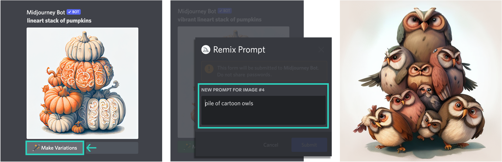

个人觉得在复杂构图上比较好用。

## 隐私 & 生成速度

下面四个参数都属于订阅用户才能设置的。

🧍‍♂️Public 🕵️ Stealth

在公共模式和隐身模式之间切换。对应于**/public**和**/stealth**指令。公共模型下，你生成的照片所有人可见；隐身模型则相反。

🐇 Fast 🐢 Relax

在 Fast 和 Relaxed 模式之间切换。对应于/fast和/relax命令。Fast 模式会消耗订阅用户的GPU使用时间。超过套餐内时长会自动切换成 Relax。

## 自定义首选项

使用 /prefer 指令创建自定义选项，以自动将常用参数添加到提示末尾。

- /prefer auto_dm 完成的工作会自动发送到直接消息
- /prefer option 创建或管理自定义选项。
- /prefer option list查看你当前的自定义选项。
- /prefer suffix 指定要添加到每个提示末尾的后缀。

### 偏好选项

```text
/prefer option set <name> <value> 
```

创建可用于将多个参数快速添加到提示末尾的自定义参数。

1. 第一步：创建自定义短语


2. 第二步：使用**/imagine prompt vibrant California poppies --mine**, 将会被解释为**/imagine prompt vibrant California poppies --hd --ar 7:4**

3. 列出所有自定义短语 **/prefer option list**

列出使用创建的所有选项prefer option set. 用户最多可以有 20 个自定义选项。


4. 删除自定义短语
要删除自定义短语，使用

```text
/prefer option set <name to delete>
```

## 首选后缀

**/prefer suffix**在所有提示后自动附加指定的后缀。使用不带值的命令进行复位。

添加后缀示例：/prefer suffix --uplight --video

复位示例：/prefer suffix