# 快速开始

## Discord 注册

Midjourney 目前是在 Discord 频道上运行。我们可以通过 Discord 的机器人进行指令操作，最终返回图片。

我们可以直接点击进入[Midjourney Discord频道](https://discord.com/invite/midjourney)。当然如果你直接搜索进入Midjourney的[官网](https://www.midjourney.com/home/?callbackUrl=%2Fapp%2F)，你同样可以通过点击右下角的绿色按钮Join the Beta来进入频道。 

:::note
如果你在Discord注册过程遇到问题，你可以查看最新的官网注册教程
- [Learn how to create your account](https://support.discord.com/hc/en-us/articles/360033931551-Getting-Started)
- [Learn how to verify your account](https://support.discord.com/hc/en-us/articles/6181726888215)
:::

## 加入 Newbies 新手频道

Midjourney 给新用户创建了 Newbies 新手频道，我们只需要在左侧栏选择任意一个 newbies-# 频道：

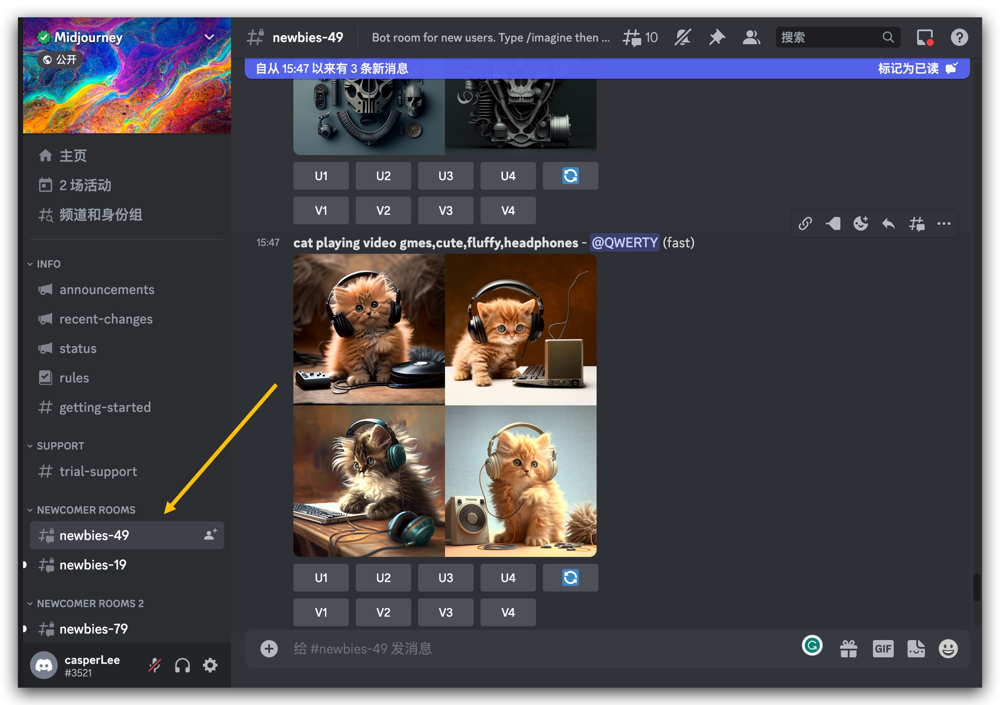

## 使用 /imagine 指令

:::note
在 Discord 上使用命令与 Midjourney Bot 互动。指令可用来创建图像，改变默认设置，监控用户信息，以及执行其他有用的任务。
:::

1. 输入 “/imagine” 或者输入“/”，从弹出窗口中选择 **/imagine**
2. 在**"prompt"**字段中输入你想创建的图像的文本描述。
3. 回车以发送你的信息。Midjourney Bot将会产生一个弹出窗口，要求你接受服务条款。你必须同意服务条款才能生成图片。

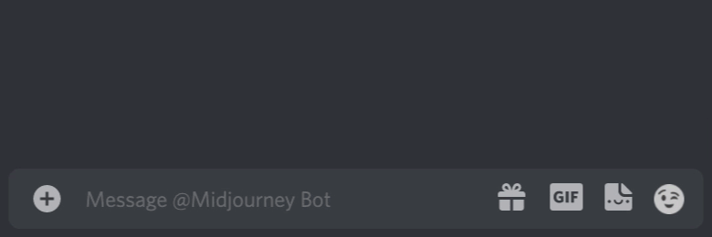

例如，我们输入：dog is playing ball, cute, fluffy

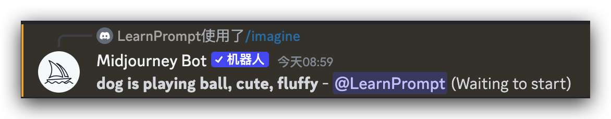

点击回车发送后，你会看到 Bot 在你原有输入的基础上添加了两个字段，一个是@"用户名"，用于区分。一个是以百分比形式显示的进度。

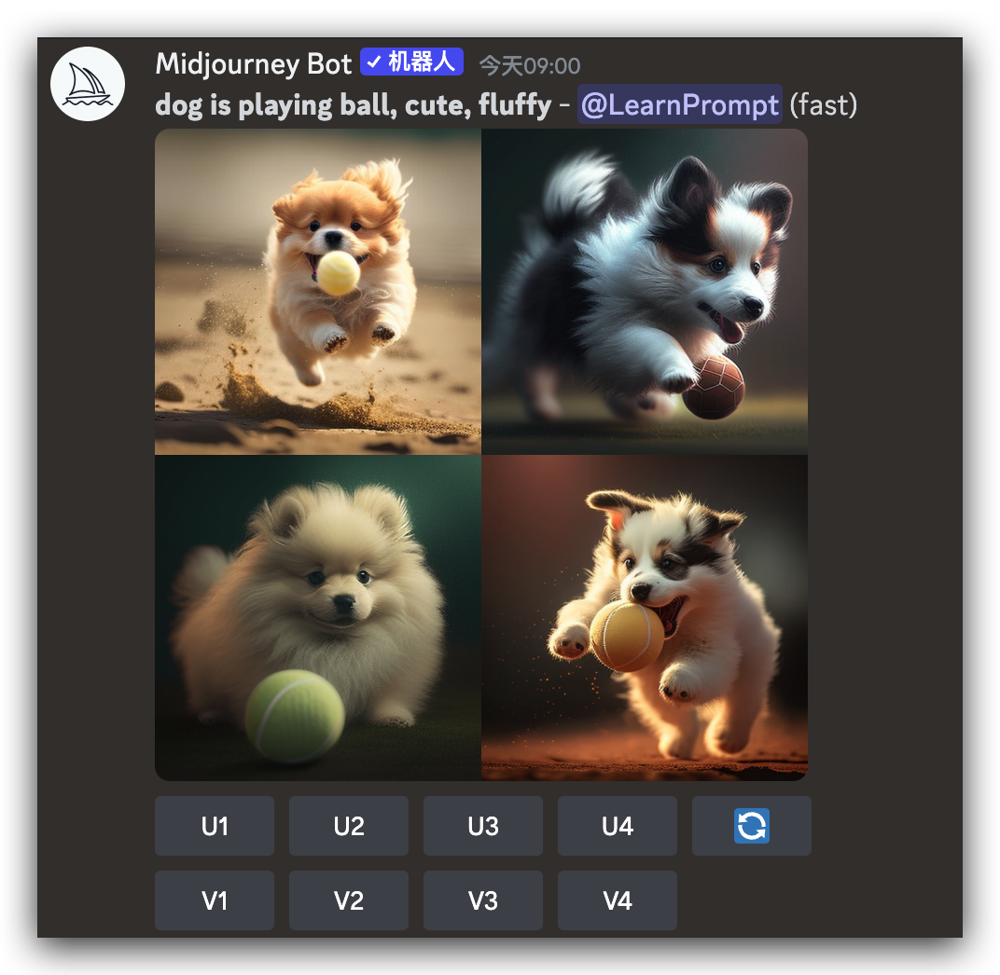

## Upscale or Upscale Redo

在初始图像网格（四张图）生成完毕后，出现两排按钮：

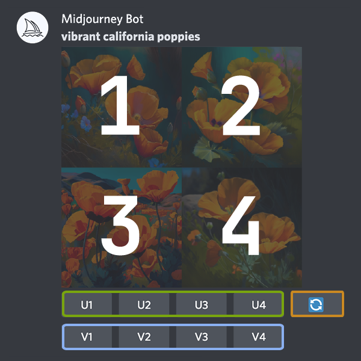

:::note
U, V代表操作，1，2，3，4代表定位
:::

回到我们刚刚生成的小狗图像，让我们试着看看这两个按钮的实际效果。

U按钮将图像放大：生成所选图像的较大版本，并添加更多细节。

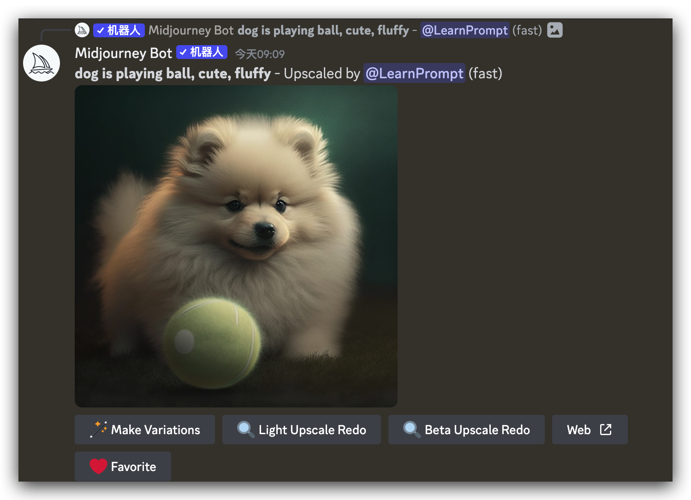

## Upscale Redo

升级（放大）图像后，你会在图像下方看到一行按钮，可以选择使用不同的升级器模型重新升级。

- Make Variations 
- Light Upscale 
- Beta Upscale

#### 常规（默认）Regular Upscale

默认升频器在平滑或细化细节的同时增加了图像尺寸。

#### 轻型 Light Upscale

轻型升级器会创建一个 1024px x 1024px 的图像并添加适量的细节和纹理。

#### Beta

Beta Upscaler 创建了一个 2048px x 2048px 的图像，而没有添加许多额外的细节。Beta Uspcaler 适用于面部和光滑表面。

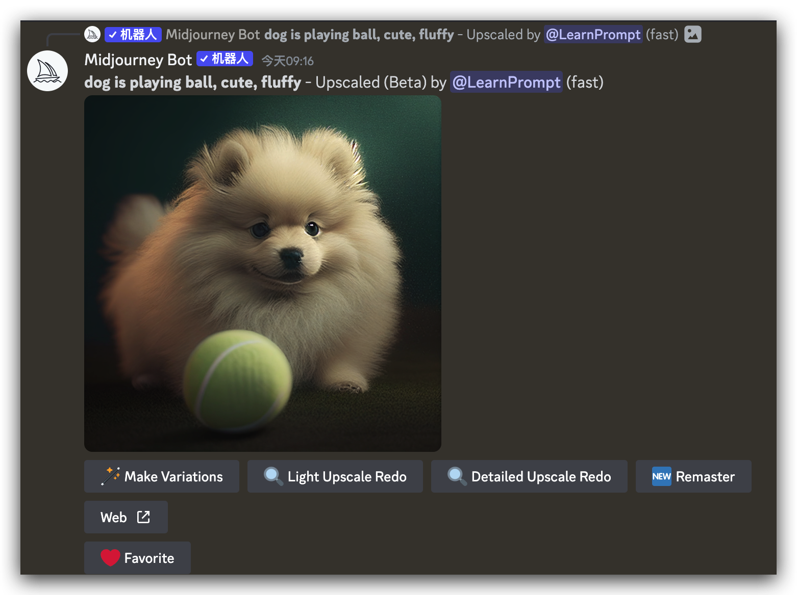

:::note
- 直接在prompt中使用升频器参数可达到同样的效果。添加--uplight,--upbeta或--upanime到提示的末尾。
- [官网最新的升级器参数细节](https://docs.midjourney.com/docs/upscalers)
:::

## Create Variations

V按钮创建所选图像的轻微变体

创建一个新的图像网格，网络里面的图片与所选图像的整体风格和构图相似。

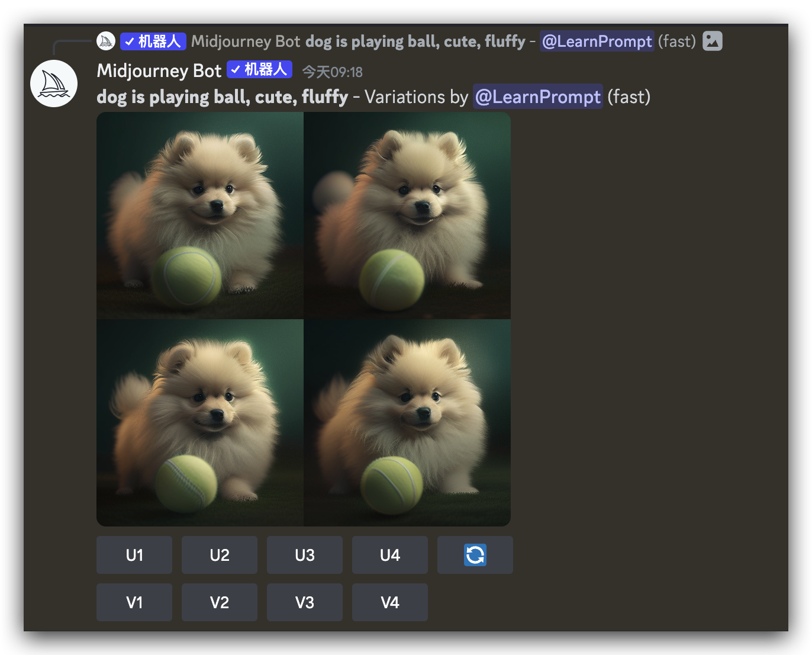

## 🔄 Re-roll

点击🔄（re-roll）意味着重新运行原始提示，产生一个新的图像网格。

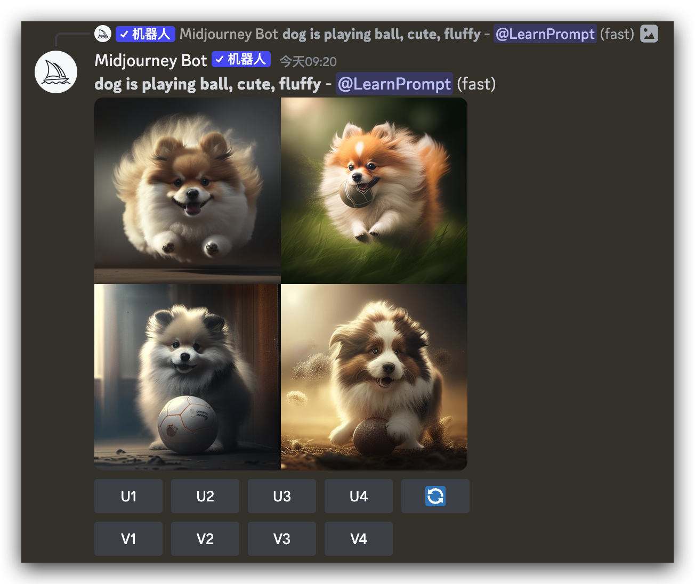

## 图片保存 

点击图片以打开它的全尺寸视图，然后右击并选择**保存图片**。在手机上，你可以长按图片，然后点右上角的下载图标。

## 邀请机器人到私人服务器

使用免费房间的缺点之一就是信息量太大，你生成的内容很容易被混在别人的消息当中。这时我们可以把 Midjourney Bot 拉到我们自己的服务器上。然而, 在私人服务器上产生的 Midjourney 图片仍然受到 Midjourney 社区准则的约束，而且生成的图像仍然是对 midjourney.com 上的其他用户可见。一旦 Midjourney Bot 加入你的服务器，你就可以开始使用 **/imagine** 指令与其交互。

### 创建服务器

点击左侧栏的**+**按钮来创建服务器，然后点**亲自创建**，选择**仅供我和我的朋友使用**，创建服务器名称，头像可以是官方默认的，填写完成之后就可以进入我们的私人服务器。

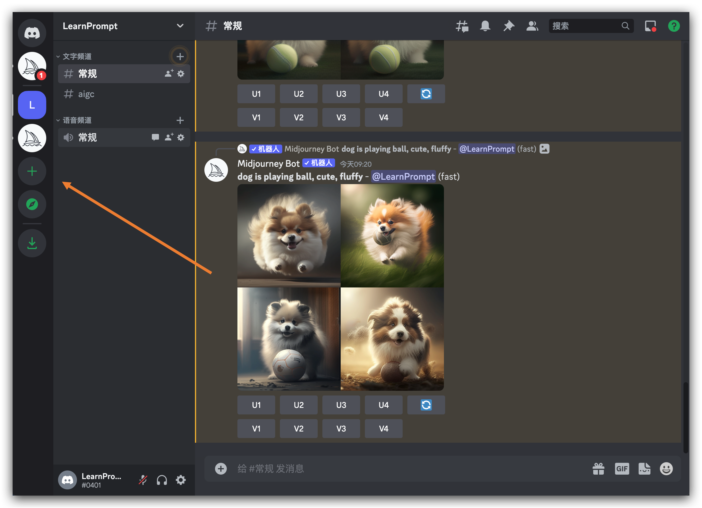

### 对话 Bot 

1. 回到免费房间的对话列表当中点击 Midjourney Bot的头像，然后在弹出的窗口选**添加至服务器**
2. 从列表当中选择要添加 Midjourney Bot 的服务器（你新建的私人服务器）
3. 点击确认并通过人类验证后，你就可以在你的服务器上看到“一只野生的 Midjourney Bot出现了”

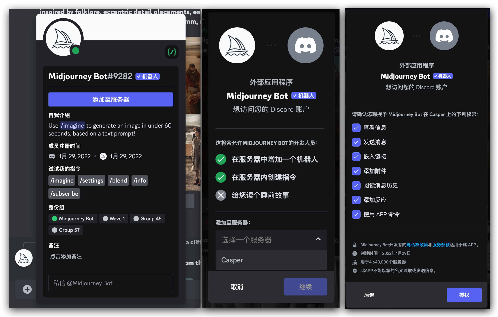

## 订阅会员

我们可以通过输入** /subscribe **指令或者访问 [Manage Sub](https://www.midjourney.com/account/) 来了解订阅计划

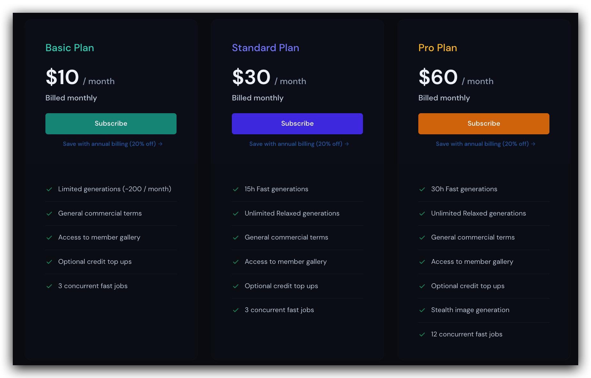

建议选择“Standard Plan”的方式，10 美金可用的200张图片数量是不够日常使用的。

至于订阅过程中遇到的支付问题，我把推荐的解决链接放在下面。

:::note
- [开卡指引](https://zhuanlan.zhihu.com/p/619289623)
:::
