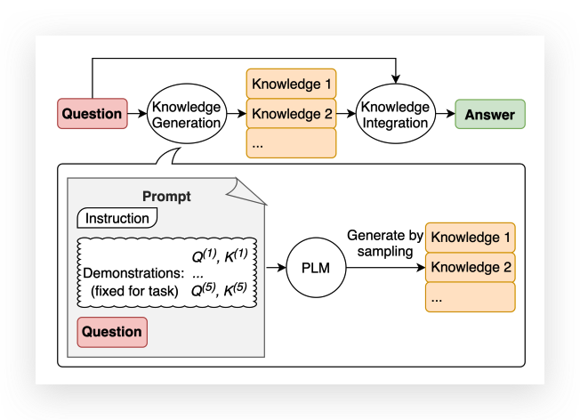

# 知识提示 Knowledge Prompting

纳入外部知识是否能促进常识性推理仍然是一个开放的问题。一系列的工作表明，外部知识的整合可以提高模型的任务表现。知识提示（ Knowledge Prompting ）不需要对知识整合的具体任务进行监督，也不需要访问结构化的知识库。相反，知识提示可以直接从语言模型中产生知识，然后在回答问题时将这些知识作为附加输入。

用作者的一句话来说“我们提出了一种简单但有效的方法，在few-shot的情况下从通用语言模型中获取知识陈述（即以自然语言陈述形式表达的知识）”。

知识提示主要分为两阶段：

1. 使用少量示范从语言模型中生成与问题相关的知识陈述
2. 使用第二个语言模型对每个知识陈述进行预测，然后选择最高置信度的预测。

## 知识生成

这里我们打算通过 ChatGPT 回复常识性问题；“How many wings does a penguin have?”

ChatGPT认为企鹅是没有翅膀的。

接着我们让 ChatGPT 生成一些跟企鹅有关的知识：

## 知识注入

这时候我们通过外部知识的注入，重新向 ChatGPT 提问：

这次企鹅终于要回了它的两只翅膀😂