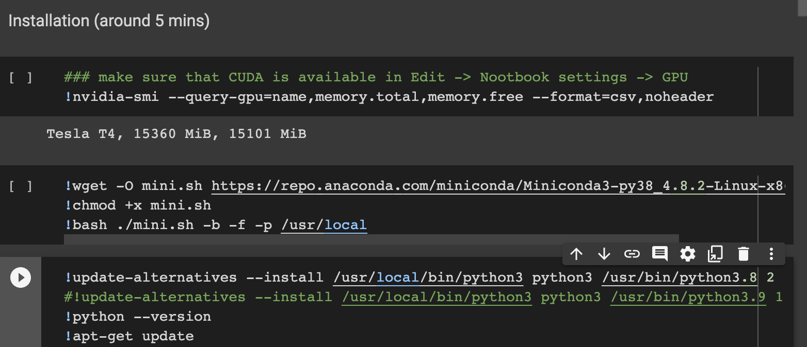
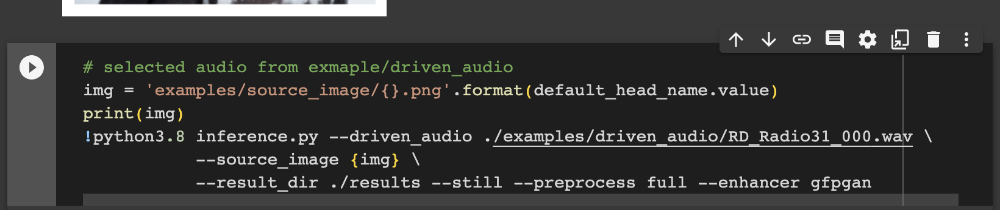

# [实战] SadTalker：让照片说话

项目地址（内含详细说明文档）：https://github.com/OpenTalker/SadTalker

先上效果：输入一张照片和一段音频，实现让照片中的人说话

<video width="250" height="400" src="/video/demo.mp4" type="video/mp4" preload="none" controls>
  你的浏览器不支持 <code>video</code> 标签。
</video>


## 运行方式一：Windows直接安装

视频教程：[《一键启动的史上最炸裂版AI工具箱来啦，SD-AI绘画、VITS文本转语音，wav2lip、sadTalker唇型同步，视频修复，支持A卡！》](https://www.bilibili.com/video/BV1ga4y1u7Ep/?spm_id_from=333.337.search-card.all.click&vd_source=35e62d366d8173e12669705f7aedd122)

## 运行方式二：Colab（需科学上网）

1. 访问 [SadTalcker 的Colab链接](https://colab.research.google.com/github/Winfredy/SadTalker/blob/main/quick_demo.ipynb)，复制到自己的云端硬盘
2. 项目默认是python3.8，如果colab之前没安装过python3.8，需要手动安装下。
    ```
    !wget -O mini.sh https://repo.anaconda.com/miniconda/Miniconda3-py38_4.8.2-Linux-x86_64.sh
    !chmod +x mini.sh
    !bash ./mini.sh -b -f -p /usr/local
    ```
   

3. 一路点运行单元格，选择图片与音频，运行，即可完成合成
 