# [实战] SadTalker：让照片说话

项目地址（内含详细说明文档）：https://github.com/OpenTalker/SadTalker

先上效果：输入一张照片和一段音频，实现让照片中的人说话

<video width="250" height="400" src="/video/demo.mp4" type="video/mp4" preload="none" controls>
  你的浏览器不支持 <code>video</code> 标签。
</video>


## 运行方式一：Windows直接安装

### 零、前置工作
需要git，科学上网， python3.8+ 环境。如果你不知道这些是什么的话，那这个方法不适合你。
### 一、下载ffmpeg
#### 1. 登录  https://ffmpeg.org/download.html，点击Windows，选gyan.dev
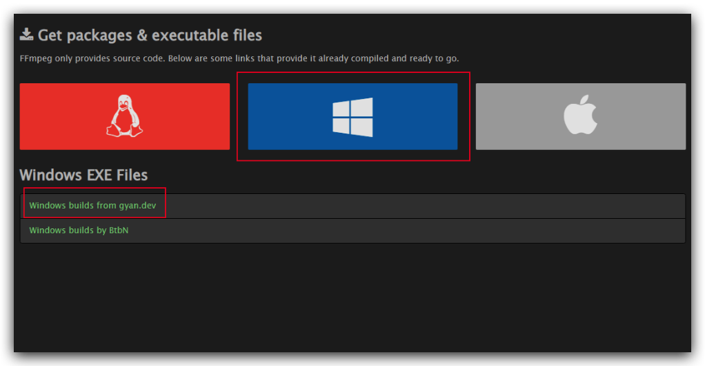

#### 2. 下载Windows构建全版本的FFmpeg
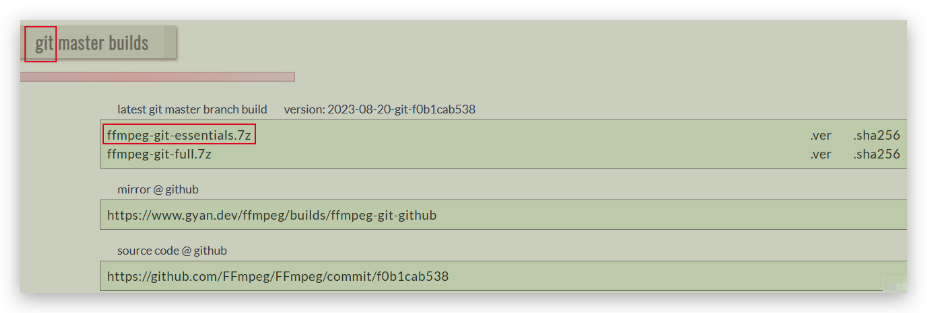
#### 3.  解压，重命名解压后文件夹为FFmpeg
p.s. 解压需要[安装7zip](https://www.7-zip.org/download.html)，好用的轻量级压缩工具。

#### 4. 配置PATH环境变量，添加完后记得点确定
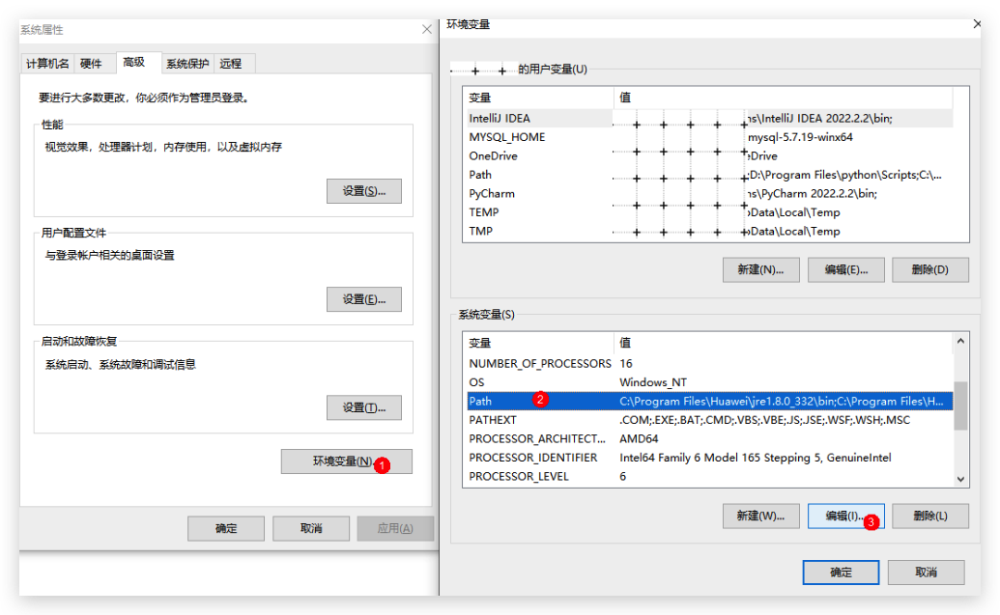
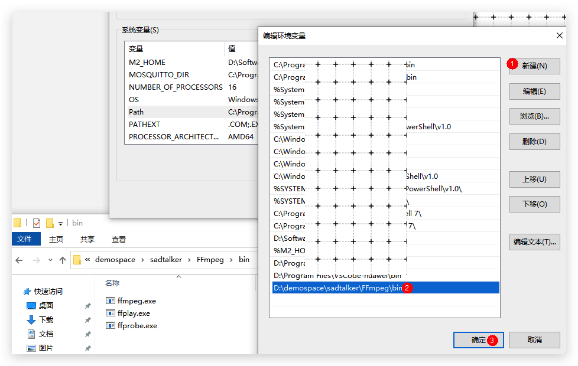


#### 5. 检查是否安装成功
	打开【命令提示符】，输入ffmpeg，如图所示
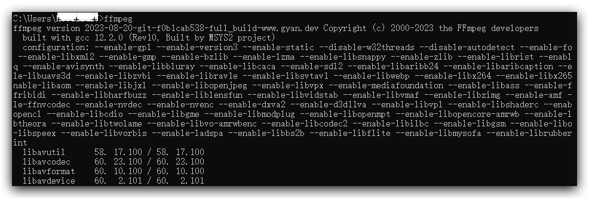
### 二、下载SadTalker代码
git clone https://github.com/Winfredy/SadTalker.git
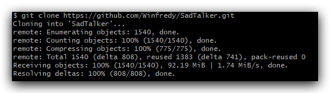

### 三、下载SadTalker模型文件
参照[《官方文档》](https://github.com/OpenTalker/SadTalker#-2-download-trained-models)有三种方式，其中百度网盘是不用翻墙的，模型文件涉及以下两个文件夹：
- [checkpoints](https://pan.baidu.com/s/1P4fRgk9gaSutZnn8YW034Q?pwd=sadt),  提取码: sadt
- [gfpgan](https://pan.baidu.com/s/1kb1BCPaLOWX1JJb9Czbn6w?pwd=sadt),  提取码: sadt

把下载好的模型文件放到checkpoints和weights下面
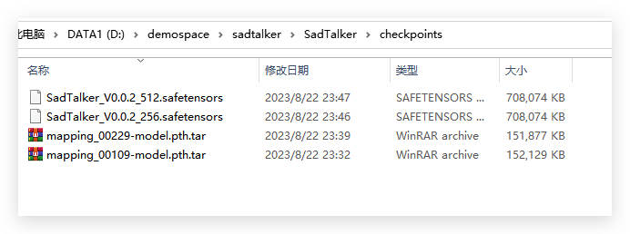
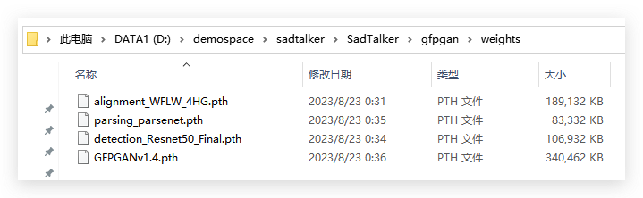


### 四、启动webUI
第一次运行需要下载依赖，会有点慢
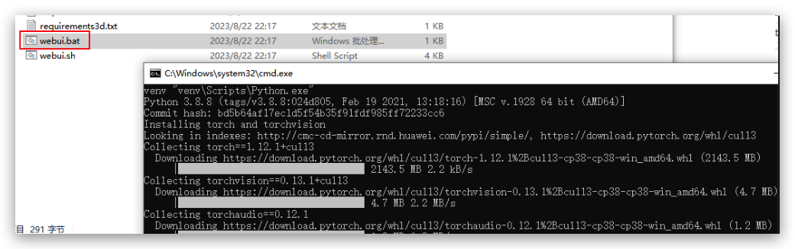
### 五、浏览器运行demo
默认地址为http://127.0.0.1:7860，拖入图像和语音，点击Generate即可进行合成（注：SadTalker/example下有样例可以拖进来试）
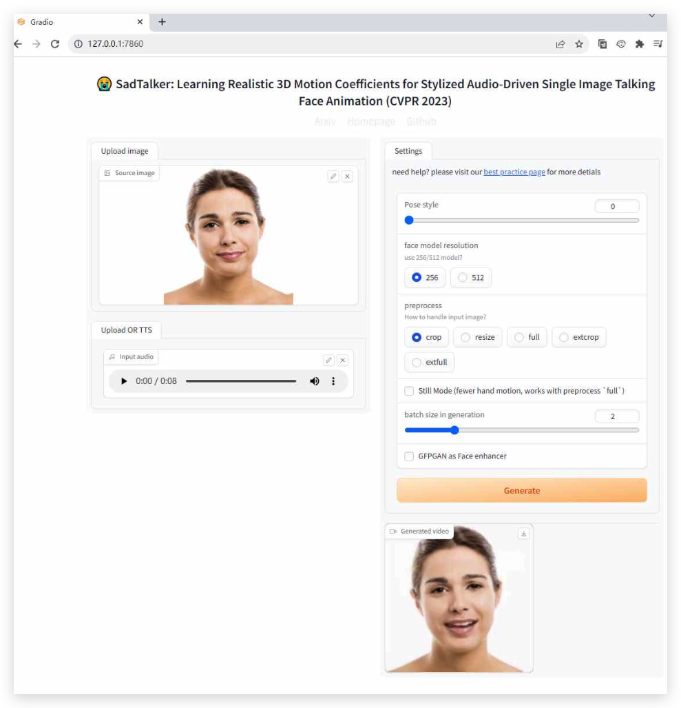

### 常见问题：
#### 1. 点击Generate后右上角提示【Expecting value: line 1 column 1 (char 0) 】
关掉代理服务器，请参考[[Bug]: Something went wrong Expecting value: line 1 column 1 (char 0) #9174](https://github.com/AUTOMATIC1111/stable-diffusion-webui/issues/9174)

#### 2. 脚本内拉取模型文件失败
解决方法：手动下载好模型文件，放在weights下面。模型文件下载请参考[这里](https://github.com/OpenTalker/SadTalker#-2-download-trained-models)。

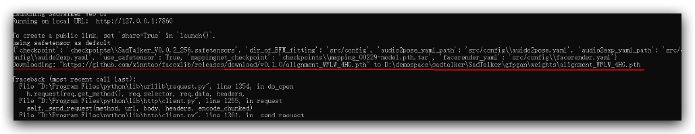


## 运行方式二：Colab（需科学上网）

1. 访问 [SadTalcker 的Colab链接](https://colab.research.google.com/github/Winfredy/SadTalker/blob/main/quick_demo.ipynb)，复制到自己的云端硬盘
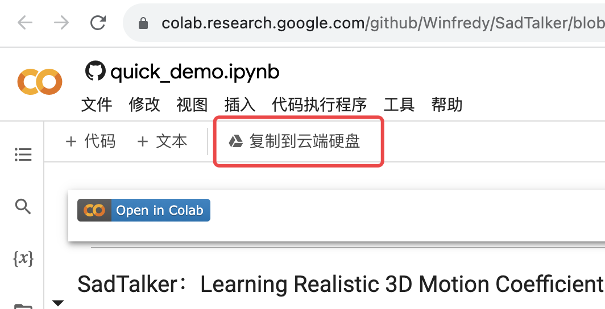

2. 点击不同单元格，依次运行
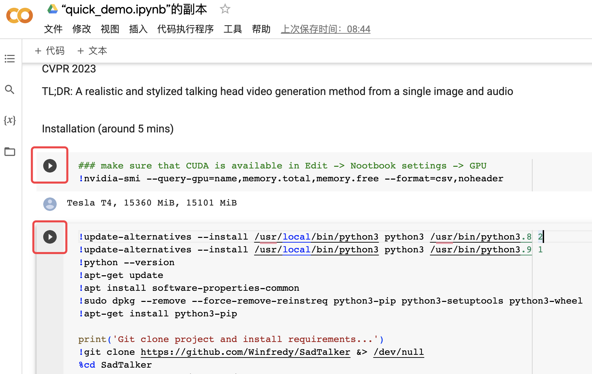

3. 选择图片，运行，即可完成合成
 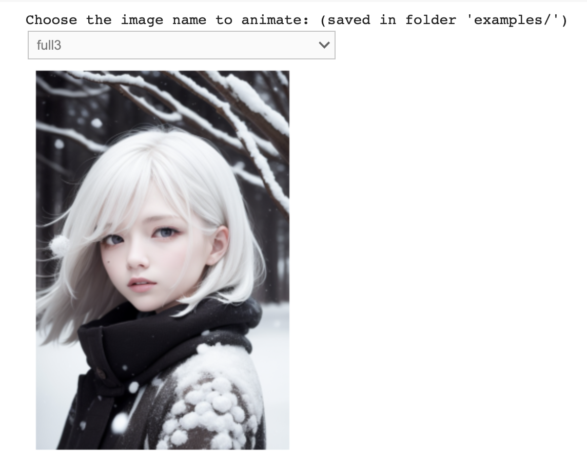

4. 运行
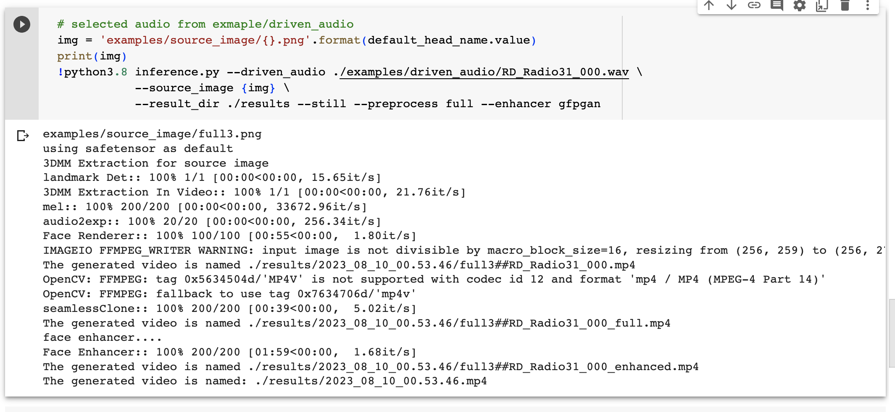

5. 预览结果
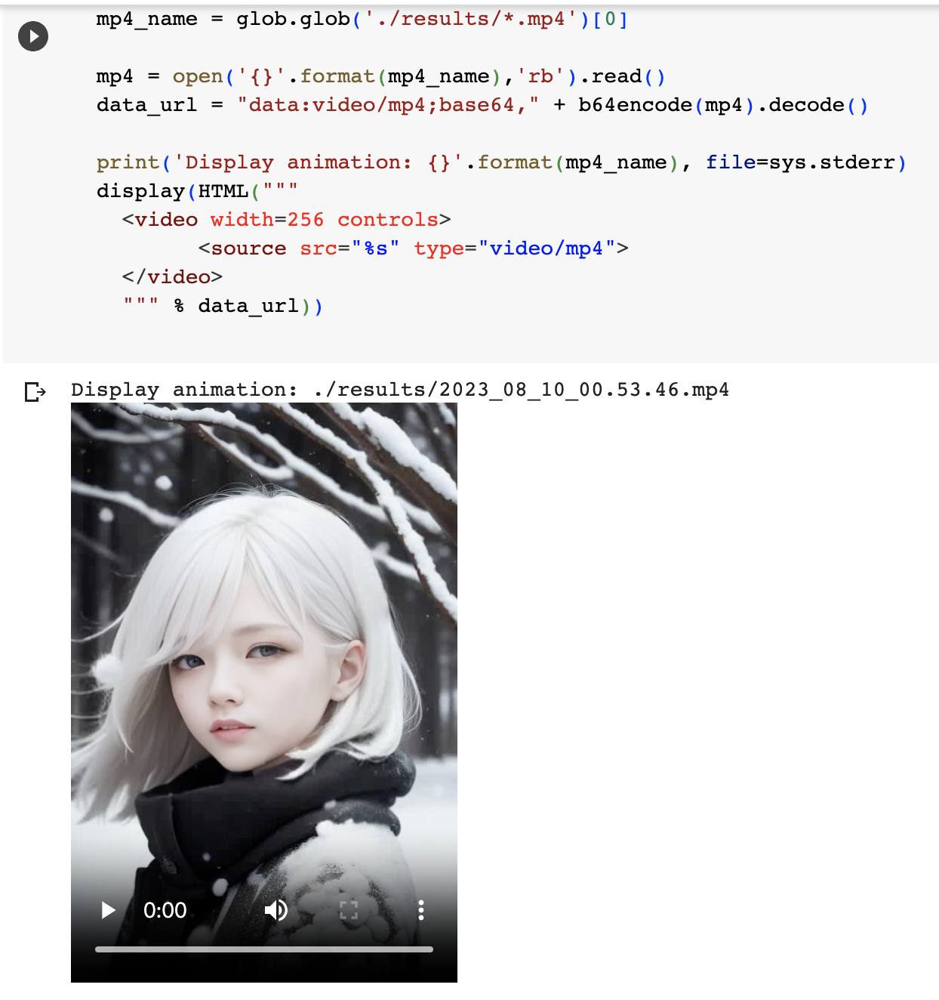

 ### 常见问题
 #### 1. pip install 时提示 python3.8: command not found
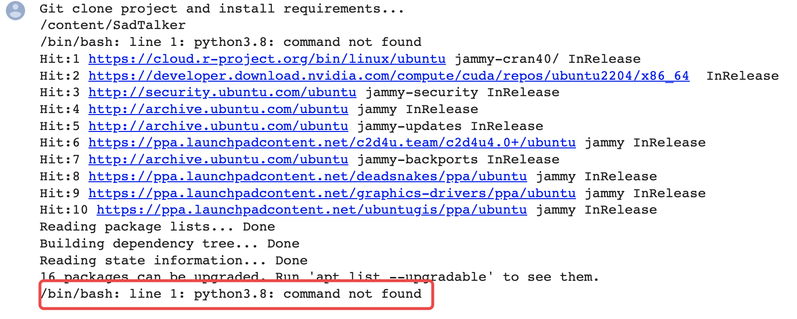

解决方法：手动安装下python3.8

``` shell
!wget -O mini.sh https://repo.anaconda.com/miniconda/Miniconda3-py38_4.8.2-Linux-x86_64.sh
!chmod +x mini.sh
!bash ./mini.sh -b -f -p /usr/local
```
   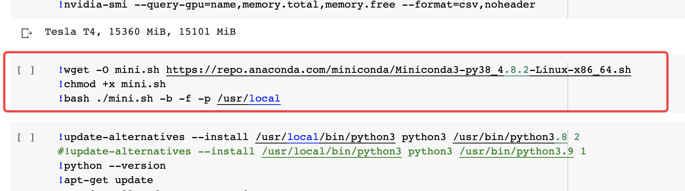