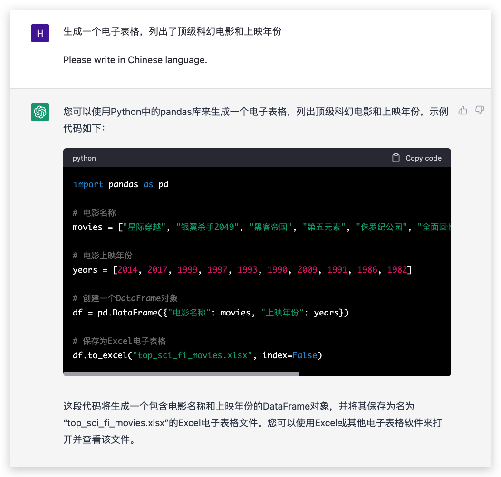

# 提供示例

目前我们与 ChatGPT 交流的主要形式是文字。提示除了**指令+问题**的形式外，还可以包含例子。特别是当我们需要具体的输出时，提供例子可以省去我们对具体任务的解释，帮助ChatGPT更好地理解我们的确切需求，从而提供更准确，更有针对性的答案。

## 1-shot 单个示例

> 值得注意的是，shot代表的是“样本”。0-shot就是没有样本直接给模型输入文本，1-shot就是提供模型一个单一的示例。

### 表格生成

如果我们使用上一篇的提示模版，**指令+问题**的话，这里的prompt应该是“生成一个电子表格，列出了顶级科幻电影和上映年份”

ChatGPT 理解成了我想使用 python 语言生成一个电子表格。虽然它给出了对应的程序，但这并不是我们想要的，我们需要直接得到想要的表格。

那么，如果我们利用 ChatGPT 的多轮对话能力，对表格生成任务进行补充解释呢？

ChatGPT真的不能生成表格信息吗？我们是否只能按照它上面建议的步骤，使用Excel文件输入并调整，得到我们想要的表格？

在这一点上，我们其实可以通过举例子，让ChatGPT更有针对性的输出。

可以看到，当我们使用这个例子后，ChatGPT 不仅产生了我们想要的格式，而且输出的数据也比前两个结果多。

## few-shot 多个示例

我们可以不局限于一个例子；few-shot是>=2个样本的例子的统称。在few-shot的情况下，我们可以提供多个例子。

### 广告文案

除了用例子指定特殊的输出格式外，我们还可以用例子进行风格模仿。

好的广告文案有自己的风格，生成的语言也相对简短。让我们试着生成一则酒类广告。

这里的例子是出自吉乃川《东京新潟物语》的广告文案

- 酒，两个人分着喝就会觉得更暖。
- 在东京失恋了，幸好酒很烈。

:::note
上面是一个Dyno互动嵌入的例子。如果你没有看到它，请确保在你的浏览器中打开了Javascript。由于这是一个互动的演示，你可以编辑文本并点击 "Generate"来重新运行AI。
:::
