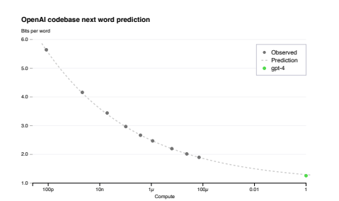
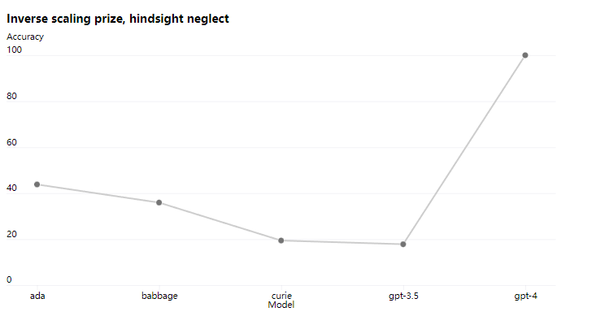

# 预测scaling

前面提到过OpenAI为了稳定地训练大语言模型专门建立了训练模型的集群，并且有专门的优化方法能够在不同尺度的实验上可以稳定地预测。OpenAI的团队在GPT-4开始训练的时候就已经能预测GPT-4最终完成的loss，具体来说他们在使用一个小一万倍的模型上训练出来的Loss，并且推出GPT-4的Loss，最终证实了预测与实际的Loss是拟合的。

 

上面这张图，纵坐标可以看成是loss的指标，横坐标是计算的规模，绿色的点是GPT-4最终训练完成后的loss，而灰色的点是不同尺度下训练的模型的loss，可以看出用小模型训练出的loss延伸出去后与实际GPT-4训练完成的Loss是拟合的。因此他们可以用更快的速度尝试更多的方法，做大量的实验。

除此之外，在集群上训练大模型会遇到非常多的问题，比如训练的loss跑飞，断网，设备中断等，而OpenAI的基础设施为能够让训练非常的稳定，除了钞能力外还需要团队有非常强大的工程能力。

然而目前并不是所有能力都能预测，比如inverse scaling prize的一个专门给大模型找茬的比赛。GPT-3出现后很多人认为模型越大效果越好，而一部分的研究者认为不一定，于是去寻找一些模型越大，效果越差的一些任务，于是便诞生了这个比赛。其中一个叫hindsight neglect的任务，简单来说这个任务就是：过去你做一件事的时候很理性的判断做了一个决策，这个决策按道理来说是正确的，可惜运气不好，最后这个决策的结果不是很好，于是再问你如果能回到过去，你会继续做这个理性的决策还是选择更冒险的决策？

理想情况下，我们应该每一次都做理性的决策是最理想的，然而之前模型越大反而越不理智。GPT-3之前的模型，随着模型越大准确率越低，而到了GPT-4则开始反过来，GPT-4的准确率已经接近100%，于是可以推测可能GPT-4已经拥有了一定的推理能力。

 