# 能力

## GPT-4能力大赏

## 常识知识推理
一个猎人向南走了一英里，向东走了一英里，向北走了一英里，最后回到了起点。他看到了一只熊，于是开枪打了它。这只熊是什么颜色的？
答案是白色，因为这种情况只可能发生在北极，那里生活着北极熊。在这种情况下， GPT-4 正确地识别了这些事实，并得出结论，熊是白色的，而它的前身 ChatGPT 放弃了并说“我不知道”
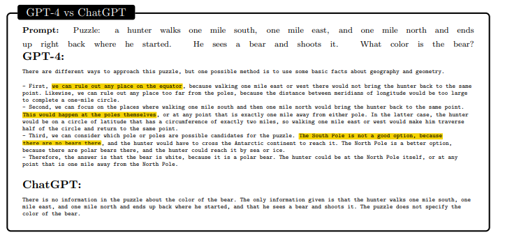 

我驾驶一架飞机离开我的营地，直接向东飞行 24901 英里，然后回到营地。当我回到营地时，看到一个老虎在我的帐篷里吃我的食物！这只老虎是什么物种？
答案是任何生活在赤道上的老虎物种，例如孟加拉虎和苏门答腊虎。AI 系统需要知道地球赤道长 24901 英里，只有在赤道上才能向东或向西行驶并返回同一点，以及哪些老虎物种生活在赤道上。同样，GPT-4 成功地找到了关键信息并解决了谜题，而 ChatGPT 立即放弃了
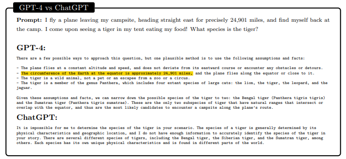 

## 编码能力

让GPT-4生成数据可视化代码
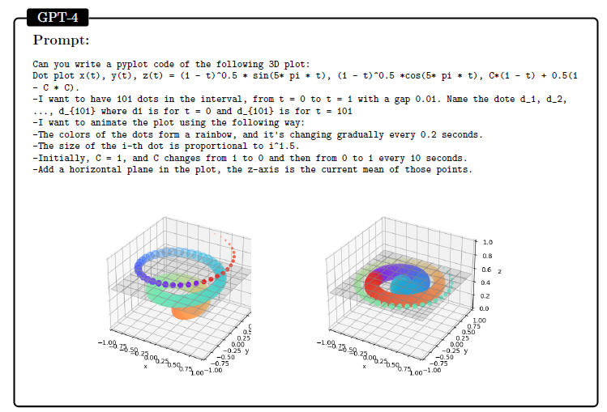 

让 GPT-4 使用模糊的规格要求，用 HTML 和 JavaScript 编写一个 2D 坦克战争游戏。游戏涉及复杂的逻辑和状态管理，包括敌人、玩家、炮弹和墙壁对象的逻辑，以及碰撞的逻辑。再次，GPT-4 生成了一个完全功能的游戏，甚至添加了“常识”未指定的细节，如“炮弹应在撞击墙壁后消失”。它还能够根据用户的请求编辑游戏。相比之下，ChatGPT 不仅拒绝创建游戏，而且生成了一个不会根据 WASD 键移动的正方形和三角形的代码。它根本不动，只有在按下“d”键时向下指，并在按下“a”键时向上指（即使这也是错误的，因为“w”应该向上指，“s”向下指）。

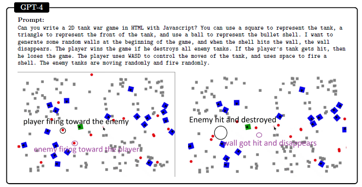 

我们要求 GPT-4 和 ChatGPT 预测和解释一个 C 程序的输出，该程序需要打印两个结构的大小。GPT-4 正确地解释了输出可能因编译器使用的对齐规则而异，并给出了一个可能具有 4 字节对齐的输出示例。ChatGPT 忽略了对齐问题，给出了错误的输出，并且还做出了一个关于顺序不影响结构大小的错误陈述。
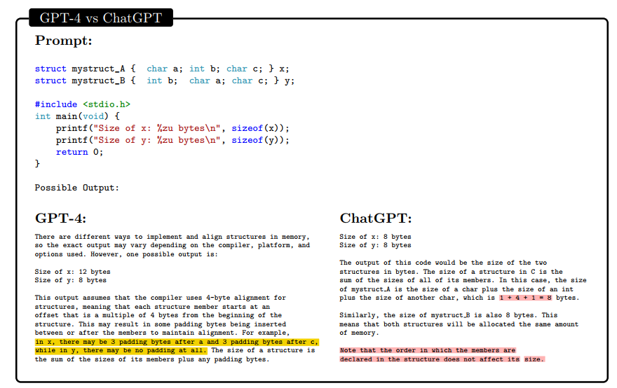

## 数学能力

两个模型都意识到拉格朗日乘数法在这个问题中很有用（这种策略适用于在约束条件下最小化某个表达式的问题）。虽然 ChatGPT 以错误的方式应用了这种方法（如果是人类，可能会被视为缺乏理解力），但 GPT-4 提出了一个合理的论证。
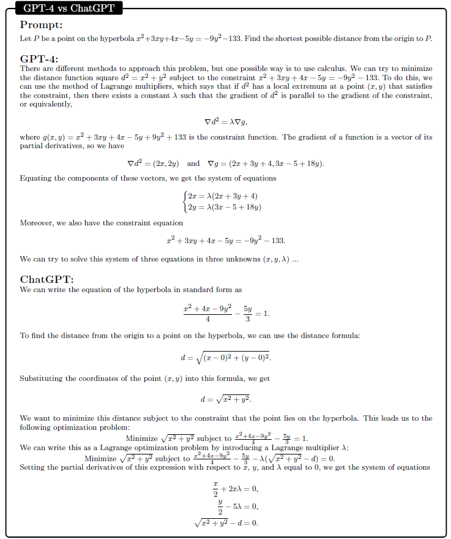

对隐函数的求导，GPT-4 正确应用隐函数求导法，考虑到 y 和 x 的导数之间的依赖关系。ChatGPT 的答案以“我们可以使用链式法则”开始，这与此问题无关，并特征是继续附以大多不连贯的论证。
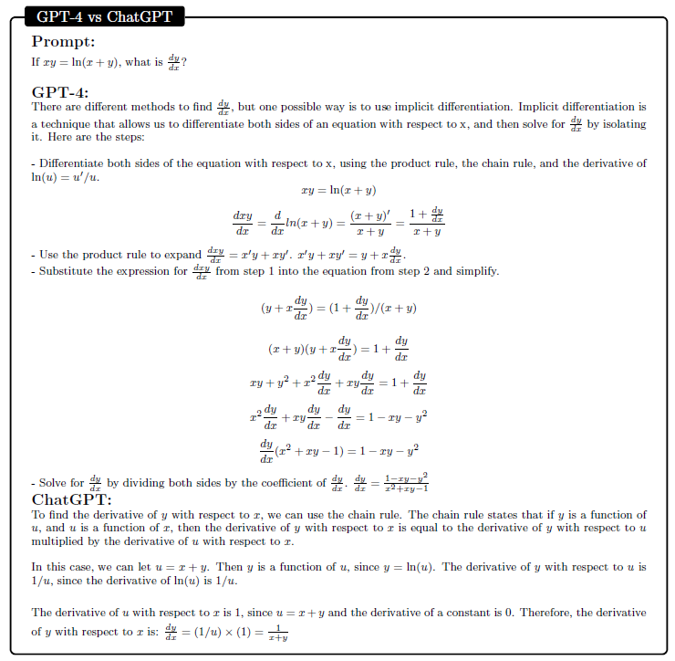

## 视觉能力

使用 Javascript 生成一个 3D 模型。我们用提示语「一个由浮岛、瀑布和桥梁组成的幻想景观，天空中有一只飞龙和一个位于最大岛上的城堡」来对 GPT-4 发出指令。与 2D 实验类似，我们要求 GPT-4 以各种方式修改 3D 模型，如添加、重新定位、重新着色对象和改变飞龙的轨迹等。
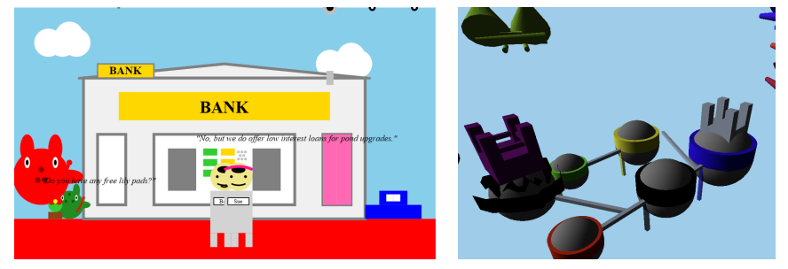

## 音乐

当被指示生成一个简短的曲调（下图）时，模型能够生成有效的 ABC 符号。这个曲调有一个清晰的结构，小节之间的拍子一致，音符遵循逐渐上升和下降的模式。曲调还使用了一组一致的音符，节奏有重复的模式。然而，模型似乎没有获得理解和声的技能。事实上，在生成的曲调中，连续的音符几乎总是相邻的（即，跟在 C 后面的音符通常是 B 或 D），在测试了 10 个生成的曲调后，我们无法提取任何清晰的和弦或琶音。

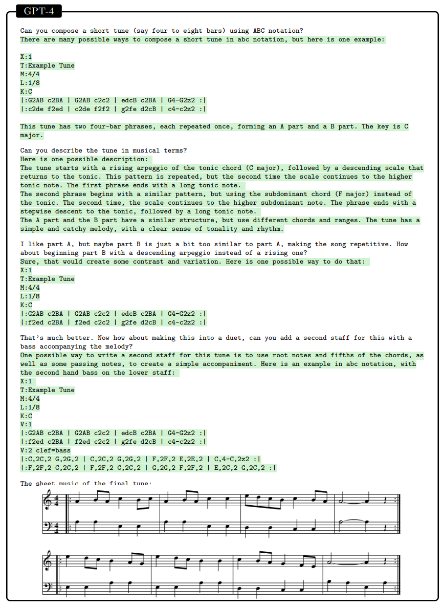

## 做题能力
在日常普通的对话任务中，GPT-4和GPT-3.5的差距是非常小的，而随着任务复杂性的增加，GPT-4的优势就会显现出来，它会更可靠更有创造力，并且能处理更细微的指令。OpenAI官方为了验证GPT-4和GPT-3.5的区别, 专门收集了一些考试的问题，比如奥赛的题目，美国AP课程、SAT考试等题目来让模型来做。由于模型预训练的数据集太大了，OpenAI的研究员还专门分开了两个测试版本，一个是直接让模型做题出分数，另一个是把在预训练集中可能出现过的题目去除，让模型去做它没见过的题目，两者取较低分的那个作为模型的考试分数来增加说服力。

下图中展示的是GPT模型的考试结果，横坐标为考试科目，纵坐标为在这些考试中排名的百分比。GPT-4 在大多数考试中都超过了GPT3.5。

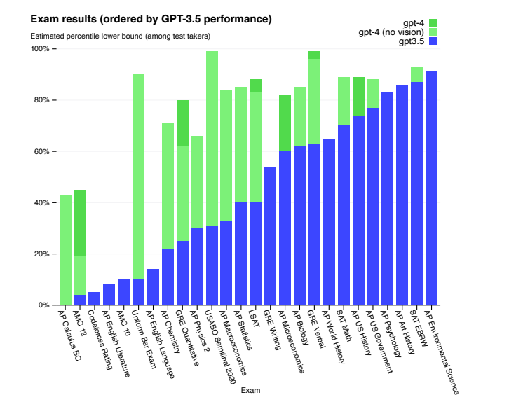

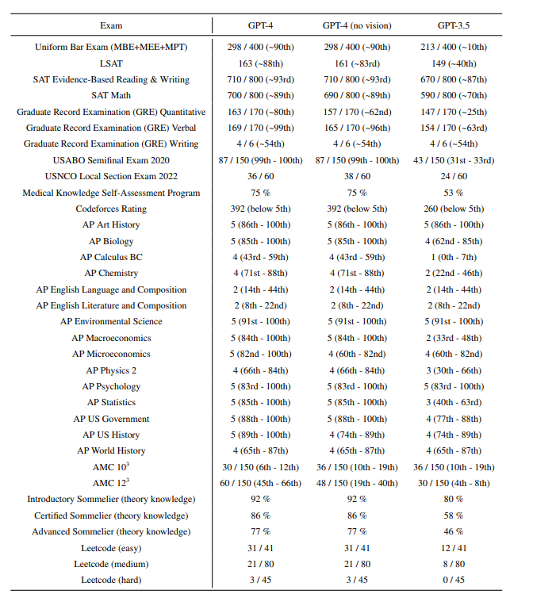 

然而很有意思的是， 在AP English Writing的这项考试中，模型的分数并不高。根据我们平时使用GPT最常用最强大的功能是用来生成各种文案和语言润色，然而在英语写作考试中，GPT的表现并没有表现的很好，我们猜测GPT没有诞生真正的智能，它还没有真的思考能力，在文本生成的时候很多时候说的话都是很空洞的，这样的文章如果在写作考试中很难拿到足够的高分。

除此之外，GPT在数学方面的能力较差。

当然，在传统的自然语言处理的一些任务的benchmark上，GPT-4还是把榜单都刷新了一遍。
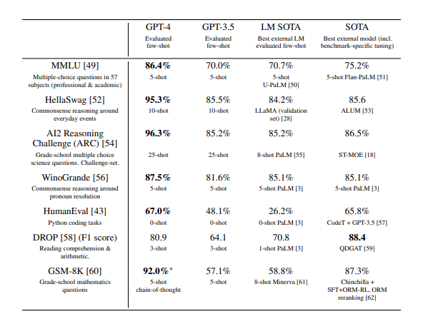 

## 多语言能力
除了英文之外，GPT-4在其他语言方面也有优秀的表现，包括了繁体和简体中文，根据下图可以看到在26种语言中，有24种语言GPT-4的表现超越了GPT-3.5和其他的一些语言模型，其中还包括了一些没有什么训练数据的语种（Latvian,Welah, Swahili）。虽然不知道GPT-4的训练预料中有多少语种，但有一些开源的只使用英文预训练的语言模型也具有多语言的能力，这点非常的有意思。
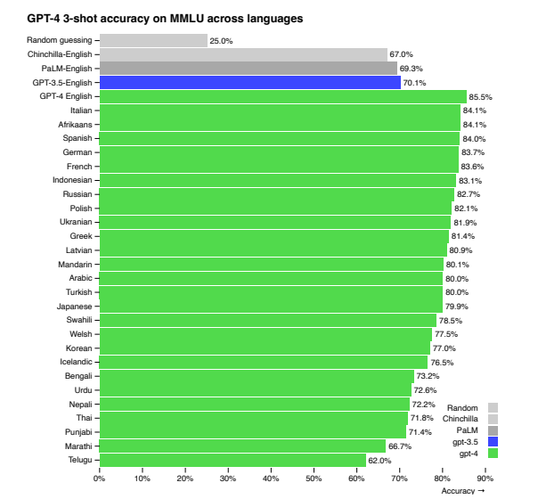 

## 视觉能力
GPT-4拥有可以接受图片输入作为Prompt，然后生成文本，CoT（思维链）， in-context learning 在图像方面也适用，不过可惜的是图像输入的功能目前GPT-4还在内测，没有公开给大家测试。

