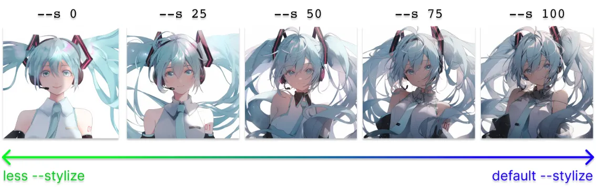
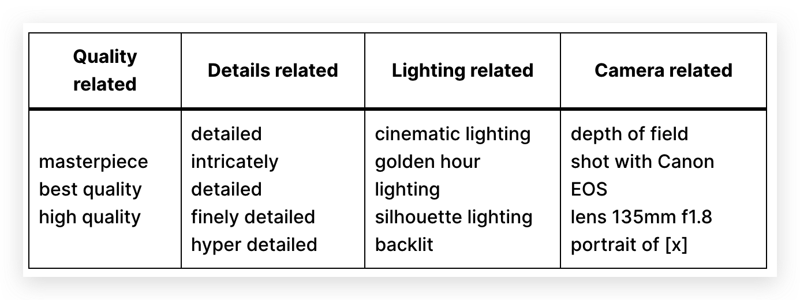
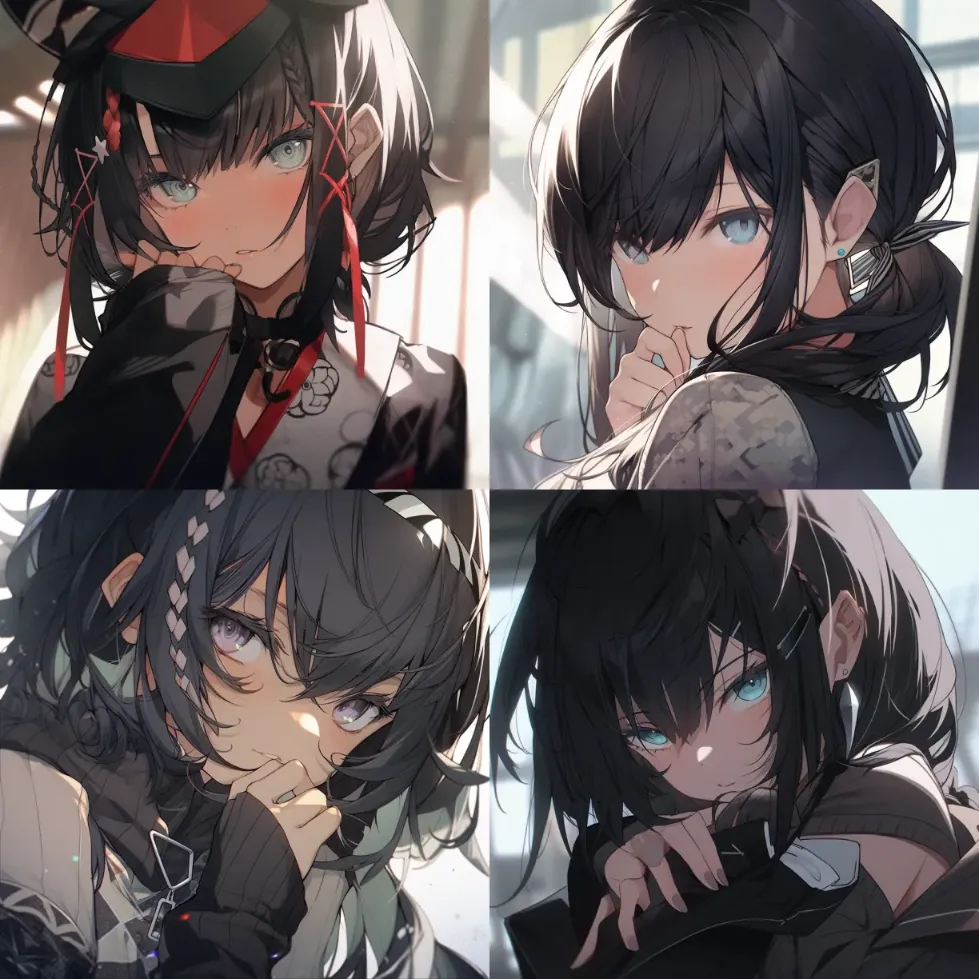
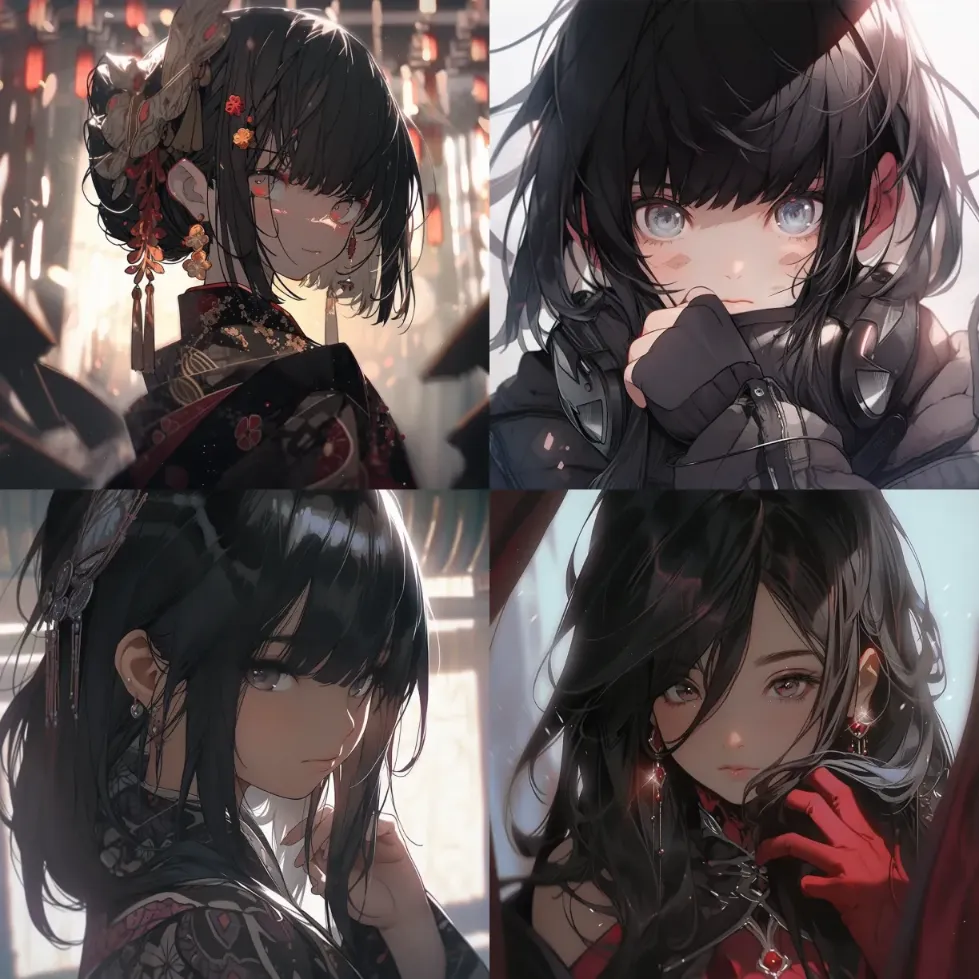
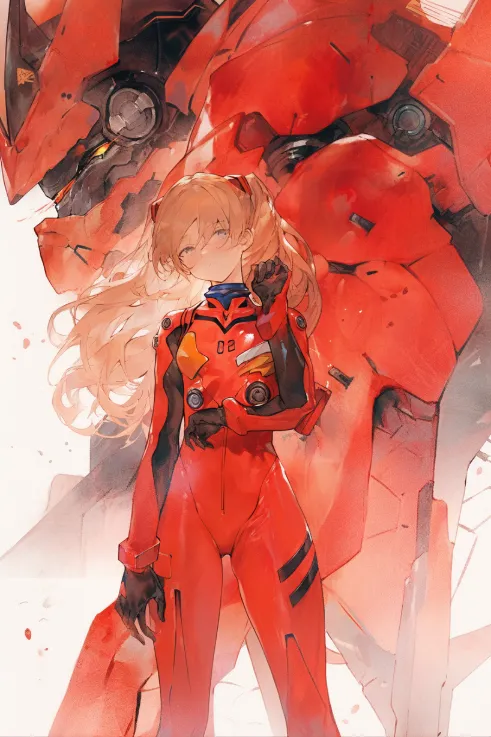
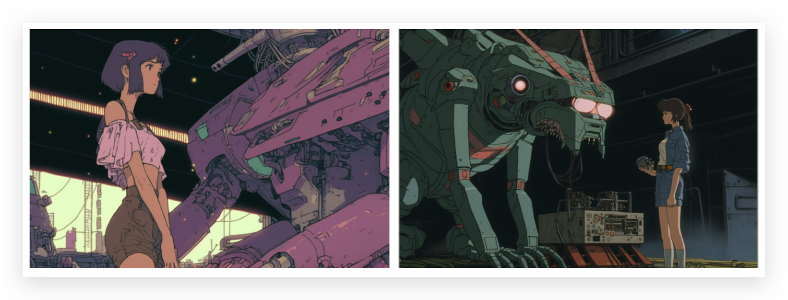
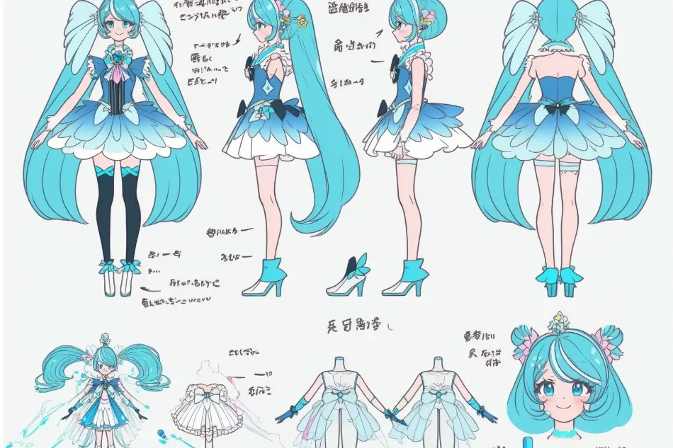
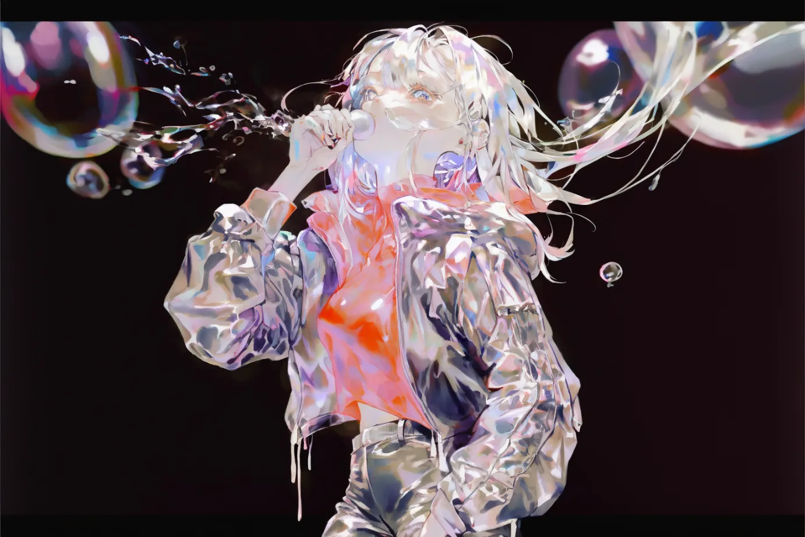
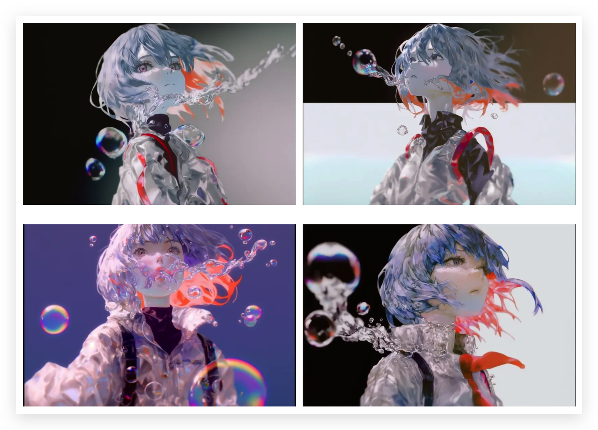
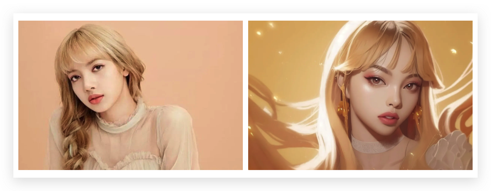

# 动漫设计

使用 Midjourney 生成动漫有两种方法：使用Niji模式或使用标准的 Midjourney 模型。Niji V5 是 Midjourney 的动漫专用模型。它建立在标准 Midjourney 模型的全新架构之上，更擅长生成命名的动漫角色。Niji V4于2023年12月发布，Niji V5于2023年4月1日发布。

## 控制程序化

我们可以使用**--stylize**获得更多有趣的变化，范围是--s 0到--s 1000。默认值为 100。降低风格化值，你会获得更多样、更有趣的结果。



## 使用“质量标签”



| 图片 | 提示 |
|--|--|
| | girl with black hair, looking at viewer, depth of field |
| | girl with black hair, masterpiece, best quality, ultra-detailed, cinematic beautiful lighting, intricate details, looking at viewer, depth of field |

你可以尝试在提示使用其中一部分的关键词，但无需过度使用，它们的收益会递减。

## 角色生成

AI 动漫模型（NAI Diffusion、Anything 等）的大量训练数据都来源于 [Danbooru](https://danbooru.donmai.us/tags?commit=Search&search%5Bcategory%5D=4&search%5Bhide_empty%5D=yes&search%5Border%5D=count) 图像，因此 Danbooru 的角色标签计数是检查 Niji 是否可以生成角色的好方法。

下面是一些以Danbooru标签计数为特征的页面：

- [热门人物](https://danbooru.donmai.us/tags?commit=Search&search%5Bcategory%5D=4&search%5Bhide_empty%5D=yes&search%5Border%5D=count)
- [顶级艺术家](https://danbooru.donmai.us/artists?commit=Search&search%5Border%5D=post_count)

| 图片 | 提示 |
|--|--|
| | 90s anime still, **asuka langley soryu** wearing a red, neon genesis evangelion, watercolor illustration --ar 2:3 --niji 5 |
| | In the center of a huge cloud swirl there is an anime beautiful girl in jk uniform and miniskirt, midscape, Son of Weather, Shinkai Makoto style, daub oil painting texture and Chinese painting style mix, braids, bangs, acrylic thick paint, intricate details, art oil painting, anime characters, comic style, Pixar style, abstract, flat, two-dimensional, Particle crushing effect, simple painting style --ar 2:3 --uplight --q  |

## 复古动漫

你可以尝试以下设计师和导演来让你的图片更有复古风格：

- Yoshiyuki Sadamoto - 新世纪福音战士的创始人
- Hayao Miyazaki - 宫崎骏
- Tsukasa Hojo - 城市猎人的创造者
- Naoko Takeuchi - 美少女战士的创造者

直接用年代相关的关键词也能达到类似的效果：

- 1970s anime 1980s anime, 1990s anime
- retro anime
- retro anime screencap



```text
80s anime still, girl fixing a mech, retro fashion, muted retro colors, style of Dragons Heaven --ar 3:2
```

## 角色设计和概念表

角色设计和概念表有助于设计师在不同的姿势、角度和表情中保持角色的一致性。

- expression sheet
- character design sheet
- character turnaround sheet
- dress-up sheet / fashion sheet
- items sheet / accessories
- character pose sheet
- concept art sheet

上面的关键词可以进行两两搭配。



```text
character design sheet, magical girl blue hair --ar 3:2
```

## 图片提示

如果你有喜欢的插图的设计、构图、主题、姿势或颜色，你可以将其用作提示的一部分，Niji会将吸引人的元素应用到新图像中。



如果你喜欢这张图片的颜色和风格，并想创建一张类似的图片，比如来自新世纪福音战士的 Rei：



```text
[LINK TO ORIGINAL IMAGE] Rei from Evangelion --ar 3:2
```

要执行 img2img，请将图像链接粘贴为提示的第一部分。如果你只有本地的图片，你需要将原始图片发送给Midjourney。然后右键单击图像>“复制链接”。将此链接粘贴为提示的第一部分。


## 照片动漫化

你同样可以将现实世界的照片放到Niji里面，使得输出的图片具有动漫的风格。



```text
gold color theme, masterpiece, stylish anime girl with long blonde hair, facing the camera, detailed pupils, depth of field --ar 3:2
```