# 建筑设计

## 基础结构

这是一个非常适合在 V5 中的生产建筑的提示结构。

我们不妨先回顾一下上一章节的通用模板：

**主题 + 背景,环境,氛围 + 风格 + 参数**

在建筑生成的设定下，我们可以使用

**主题详细描述 + 周边环境 + 建筑风格或时期、建筑师、设计师和摄影师 + 参数**

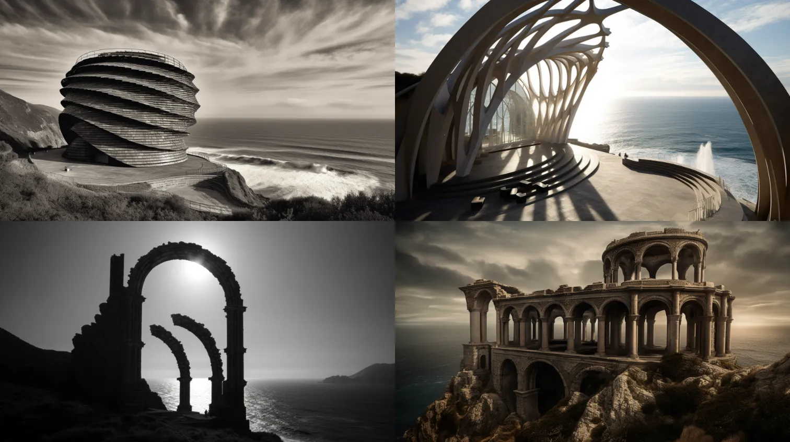

```text
spiraling massive gothic monolothic structure with arches on a cliff, crashing waves and a sky tinged with the sun, hellenic, designed by Hidetaka Miyazaki, photography by Hélène Binet --ar 16:9 --c 3
```

提示语的顺序很重要。越靠近提示的开头，一个词的影响就越强。因此，如果你真的想强调一个建筑师的风格，你可以把他们的名字放在第一位：

** 建筑师姓名 + 主题的详细描述 + 周围环境 + 其他风格，美学，设计师和摄影师 + 参数 **

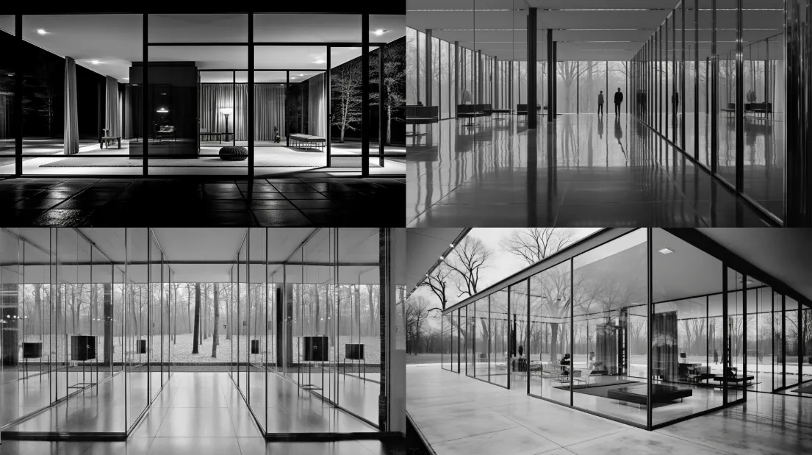

```text
Ludwig Mies van der Rohe, house with glass and mirrors and grid columns, light and modern and transcendent, photographed by Ezra Stoller --ar 16:9 --c 2 --s 90
```

使用参数：

- 使用--ar 参数设置纵横比。--16:9（风景）和--9:16（肖像）适用于建筑摄影图像。
- 在摄影中，最常见的长宽比是 4:3、3:2，最近在现代相机中是 16:9。
- 混乱：--c参数使结果更加多样化（范围为 0-100，默认值为 0）。
- 程式化: --s 参数是生成倾向于模型默认样式的程度（范围是 0-1000，默认值为 100）


## 著名建筑师

### 扎哈·哈迪德 Zaha Hadid

已故的扎哈·哈迪德 (Zaha Hadid) 是有史以来第一位获得建筑界奥斯卡奖（普利兹克奖）的女性，她以采用弯曲、俯冲线条的未来主义设计而闻名。

```text
Futuristic skyscraper with a biomorphic design, lush vertical gardens, and soaring glass facade, inspired by Zaha Hadid, photographed by Candida Höfer --ar 16:9 --c 3
```

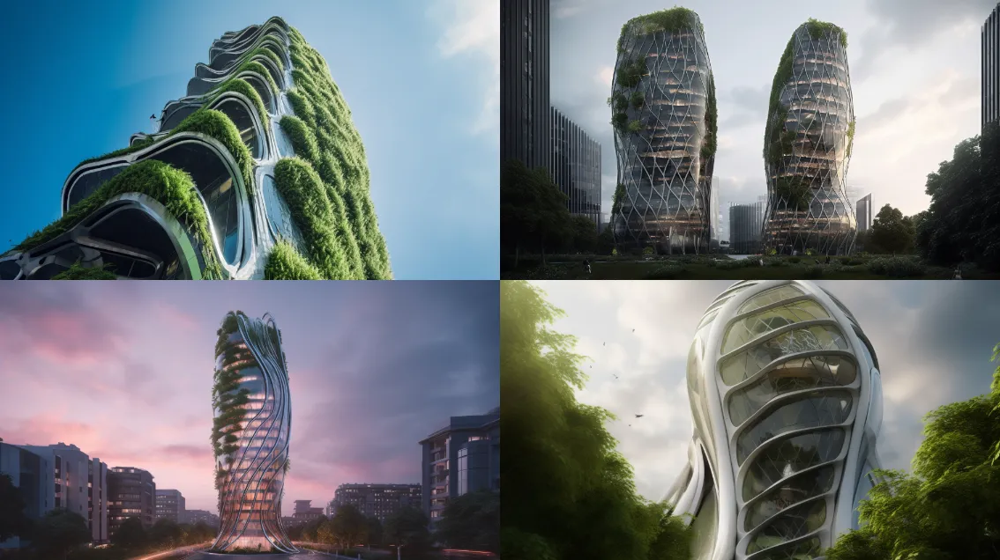

### 勒·柯布西耶 Le Corbusier
勒·柯布西耶 (Le Corbusier) 原名 Charles-Édouard Jeanneret，是一位瑞士-法国建筑师、设计师和城市规划师，被广泛认为是现代建筑的先驱之一。

```text
Minimalist concrete structure with geometric forms and dramatic shadows, inspired by awe, Brutalist style, Le Corbusier, photographed by Ezra Stoller --ar 16:9 --c 2
```
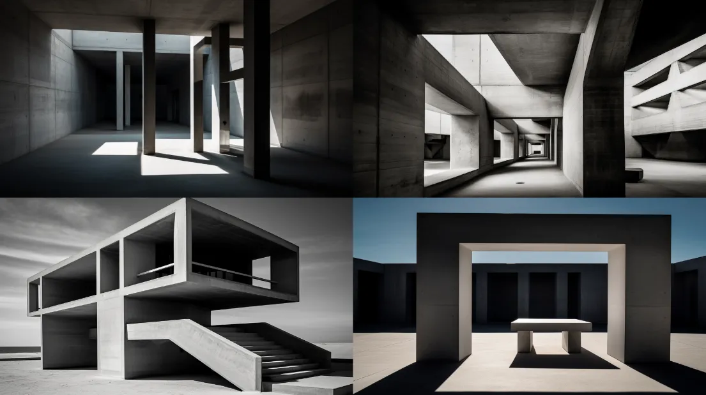

### Kengo Kuma 隈研吾

隈研吾（1954年8月8日—），著名日本建筑师，曾获日本、意大利、芬兰等国之建筑奖。建筑作品散发日式和风与东方禅意，在业界被称为“负建筑”、“隈研吾流”；又以自然景观的融合为特色，运用木材、泥砖、竹子、石板、纸或玻璃等天然建材，结合水、光线与空气，创造外表看似柔弱，却更耐震、且让人感觉到传统建筑的温馨与美的“负建筑”。

```text
large interior by Kengo Kuma, Harmonious blend of natural elements and modern design, an eco-friendly structure, pools and falling water --ar 16:9 --c 1
```

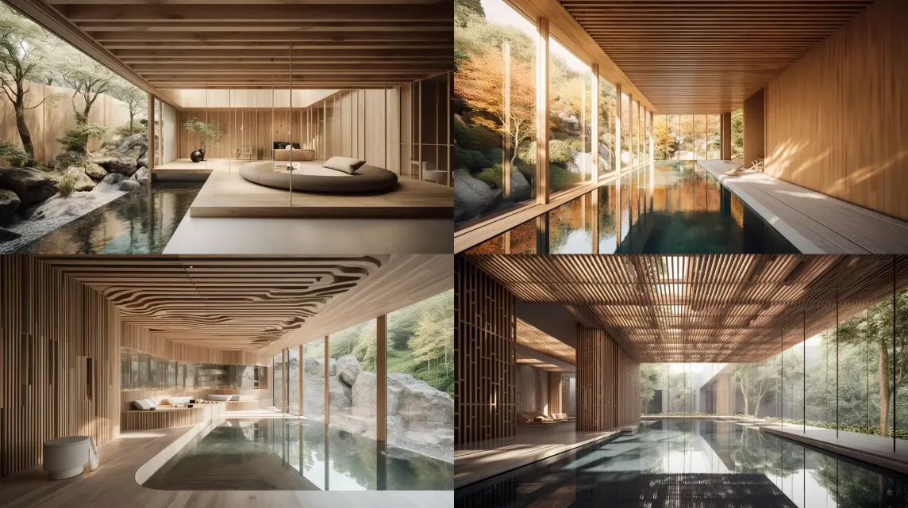

## 建筑摄影师

除了建筑师之外，摄影师也是很重要的一部份。如果你的提示语里面包含摄影师的话，我建议你加上**-s**程式化参数，并将值设置低于100（默认值为100）

### 海伦比奈 Hélène Binet 

Hélène Binet 是一位瑞士和法国建筑摄影师。她以通过光线、阴影和纹理捕捉建筑空间的精髓而闻名。

```text
photo by Hélène Binet, upward angle, delicate balance of light and shadow, rich textures, soul and essence of a space, very visually captivating --ar 16:9
```

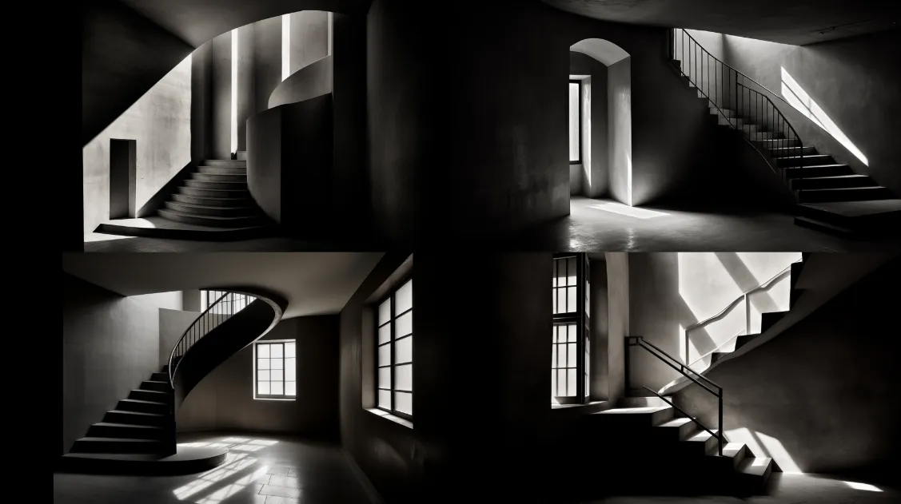

### Candida Höfer

德国摄影师 Candida Höfer 以雄伟的广角摄影捕捉了大型空旷的公共和机构空间。

```text
Captivating grand interior, a vast architectural space, photography by Candida Höfer, symmetry, color, and intricate details, --ar 16:9 --s 50
```

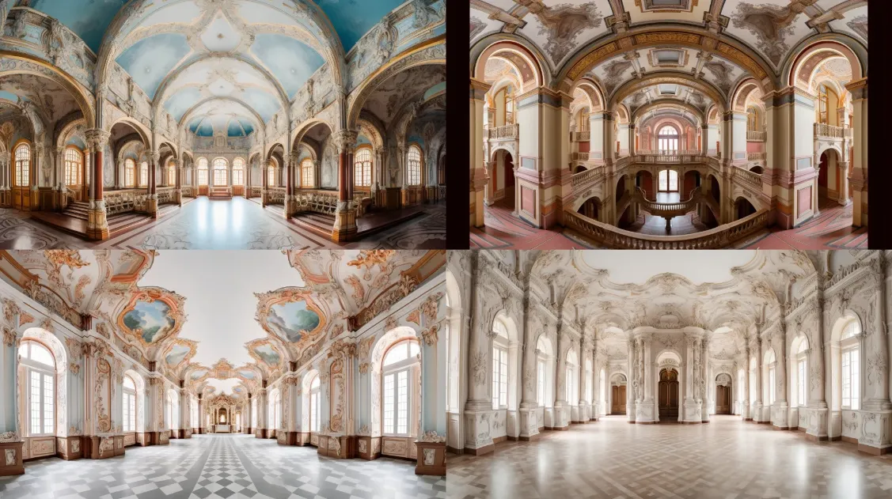

### Julius Shulman

Julius Shulman 是加州建筑摄影师。他以美化现代洛杉矶生活方式的照片而闻名，并且是记录美国现代主义 70 多年来发展的关键人物。

```text
Julius Shulman architectural photography of a house in the LA hills overlooking the city, --ar 16:9 --c 1 --s 90
```

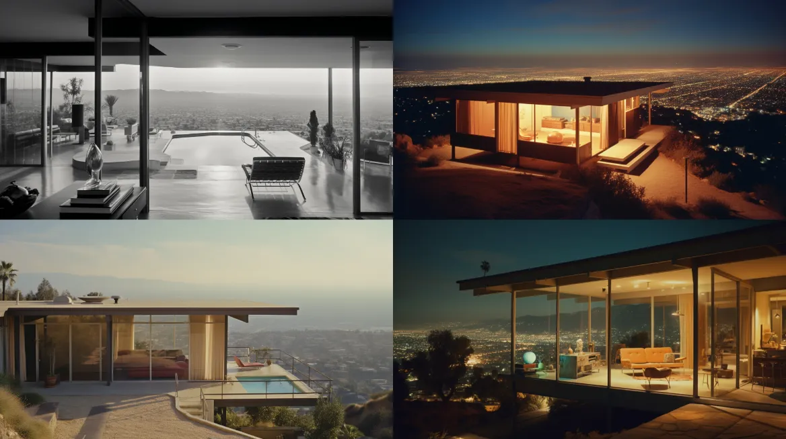

## 建筑风格

### 现代主义

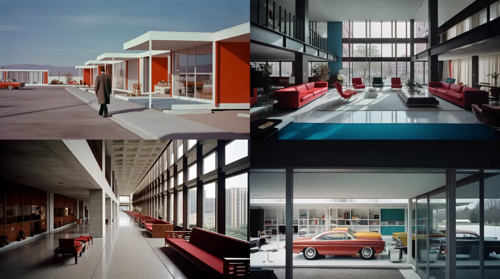

```text
Modern Architectural Design, methodical use of space, artistic, Modernism, photographed by Ezra Stoller, color photography --ar 16:9
```

### 哥特式建筑

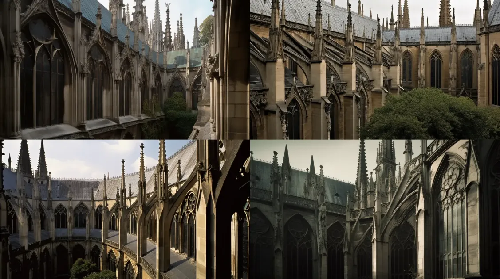

```text
Gothic architectural Design, flying exterior buttresses, long stained-glass windows, ribbed vaults, and spires, photo by Hélène Binet --ar 16:9
```

## 风格混合

使用提示符“ Hybrid ”来组合两种架构风格

### 新哥特式和野兽派建筑

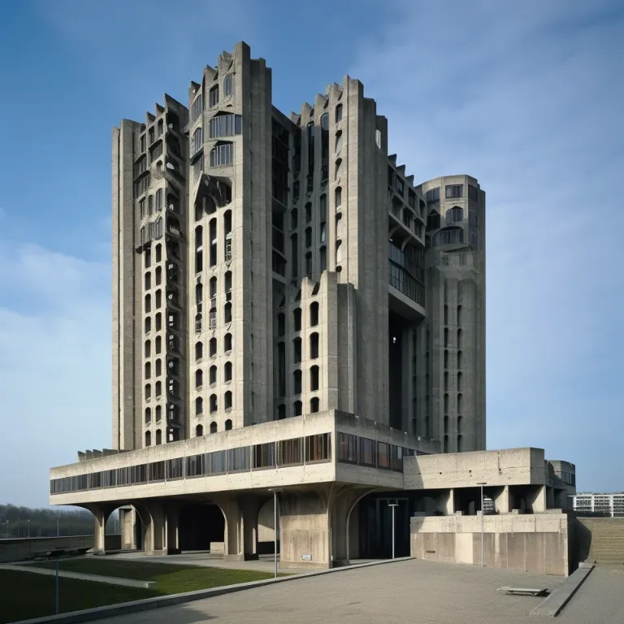

```text
Hybrid Neo-gothic and brutalist architecture combination style --ar 16:9
```

## 未来主义

提示语：hyperrealistic futuristic

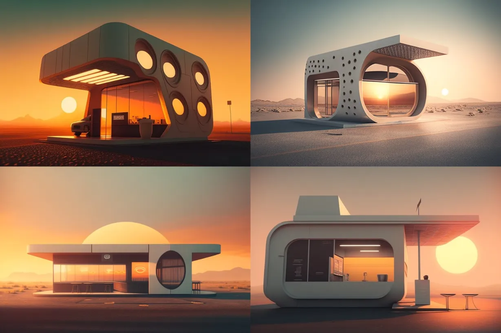

```text
hyperrealistic futuristic coffee shop, minimalist, morning sun, drive through, --q 2 --ar 3:2
```