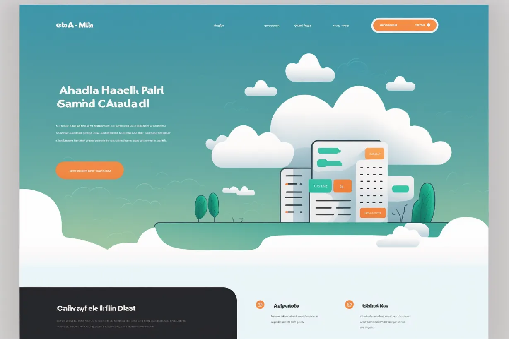
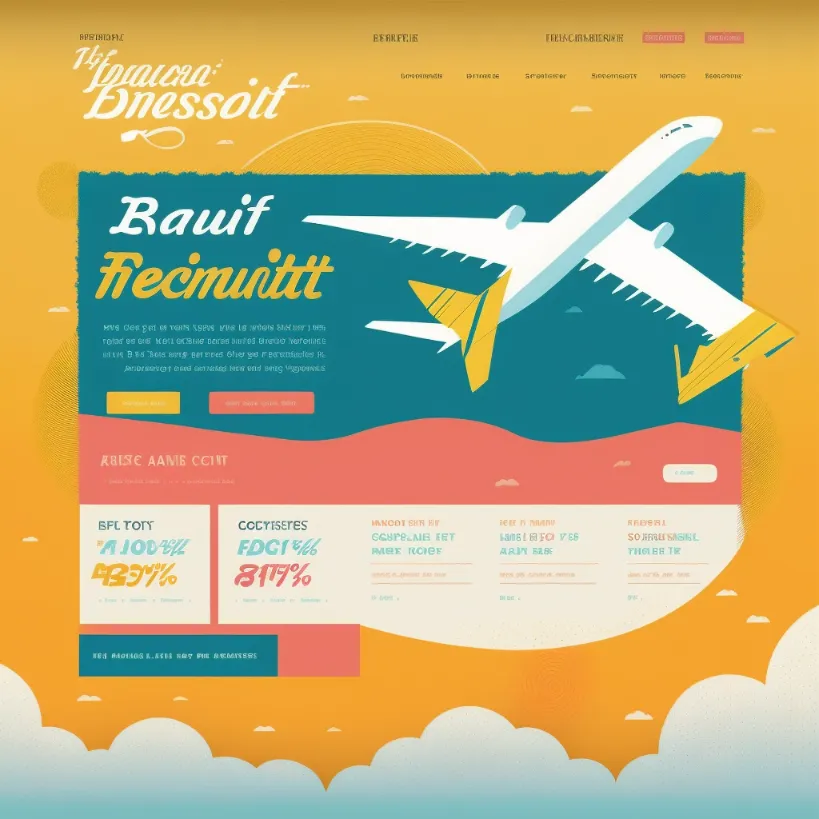
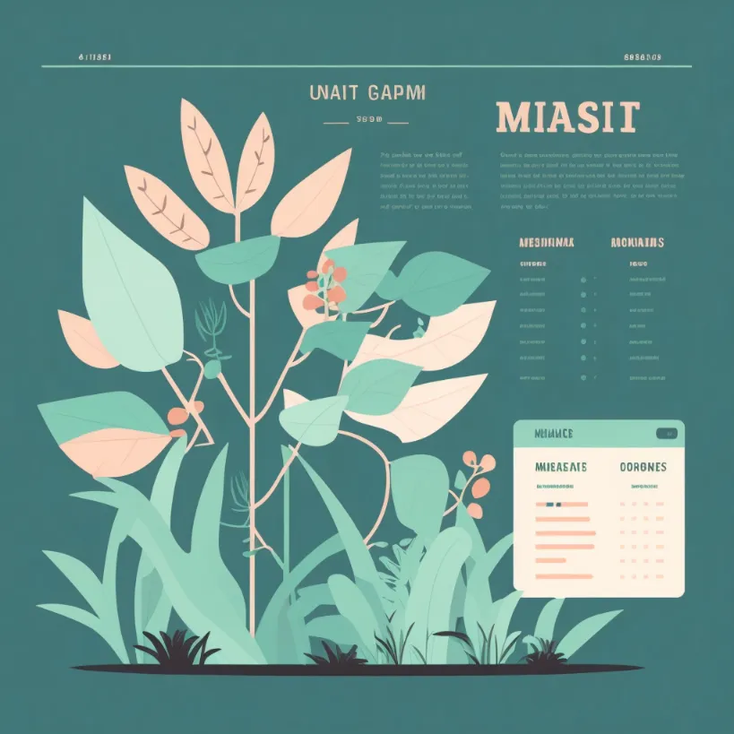
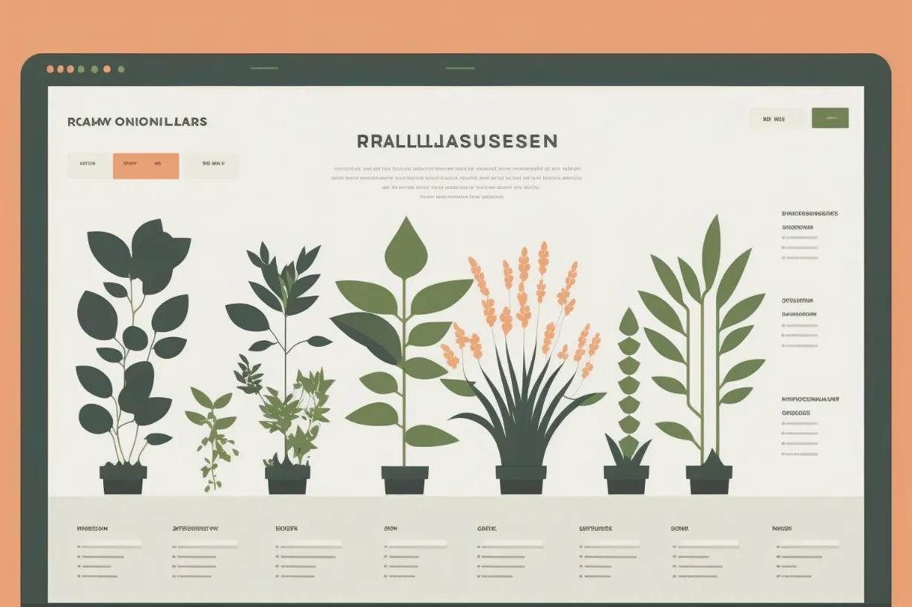

# 网页设计

## 快速开始

用 **“ web design for...”** 或 **“ modern web design for..”** 来快速开始你的提示。

```text
web design for a generic SaaS startup --ar 3:2
```



## 否定提示**-no**

使用**--no**告诉 Midjourney 你不想要什么。Midjourney 的默认风格倾向于**现实和详细**。但这可能不适用于所有品牌。例如，如果你是一个更注重科技的品牌，你可能会想要更简单的图形和插图，因为这些已经成为现代品牌的标志。

- Midjourney 的默认样式，有很多细节和阴影。

```text
web design for a flight discount service
```


相同的提示，但带有否定提示：

```text
web design for a flight discount service --no shading realism photo details
```



## 纵横比

适合网页设计的纵横比是**--ar 3:2**

正方形的构图看起来更像是信息图表。



```text
web design for a plant database, minimal vector flat --no photo detail realistic
```

当纵横比增加时，图像的内容会发生变化。



```text
web design for a plant database, minimal vector flat --no photo detail realistic --ar 3:2
```