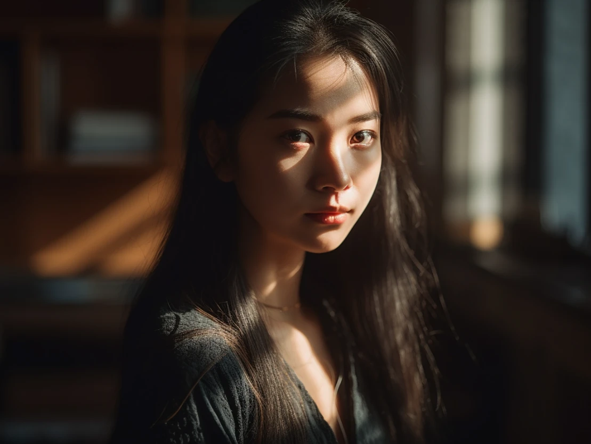
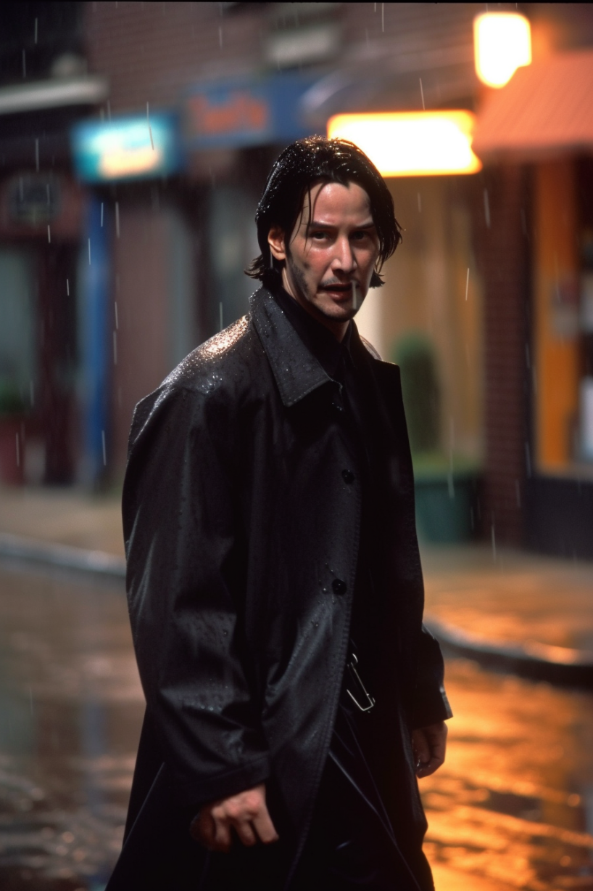
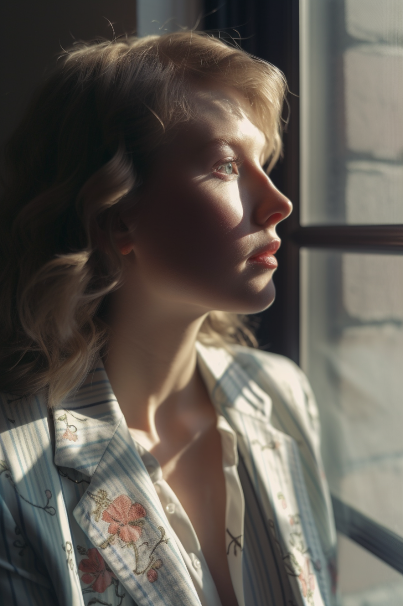
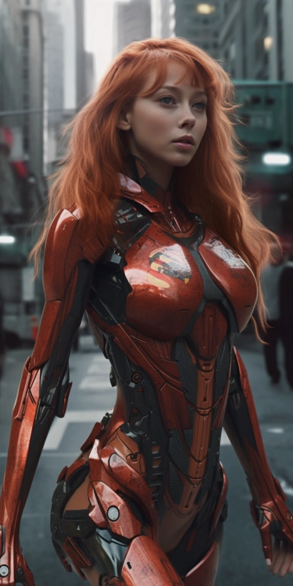
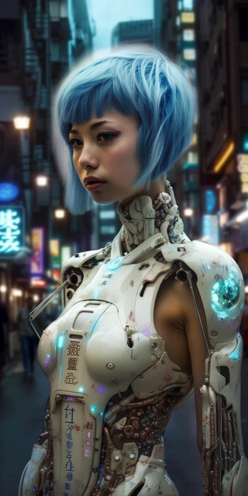
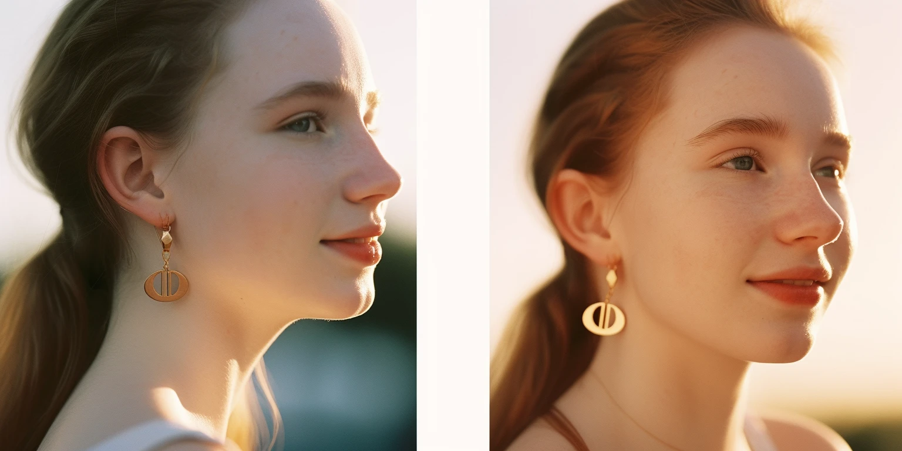

# 人物照片

V5 跟 V4 相比在人物生成的真实感上有了更大的进步。

 

```text
21years chinese girl, in school, beauty, long black hair, sun light，insane detail, smooth light, real photography fujifilm superia, full HD, taken on a Canon EOS R5 F1.2 ISO100 35MM --ar 4:3 --s 750 --q 2
```
## 明星

V5 认识很多名人，你可以在描述主体的时候，加上名人的名字，就可以生成该名人的照片。

|图片 |提示 | 
|--|--|
| |Young, handsome Keanu reeves In a black long leather coat walking down the street in the rain --ar 2:3 --uplight |
| | Taylor Swift looking out the window wistfully, wearing a floral pastel linen blazer, natural afternoon light, side-angle view, 4k --ar 2:3 --stylize 1000 |
| | actor jason momoa dressed as khal drogo drinking a mimosa isolated on a white background --s 250 |


## 现实生活中的虚构人物

通过 Midjourney， 你可以将你喜欢的虚构人物带到现实生活中来。

|图片 |提示 | 
|--|--|
| |Photorealism, beautiful Asuka Langley Soryu in sci-fi armor  in a futuristic city --ar 1:2 --q 2 --c 20 --s 750 |
| | photorealism, beautiful, Rei Ayanami in sci-fi armor in a futuristic city --ar 1:2 --q 2 --c 20 --s 750 |

## 多角度

尝试从同一提示生成多个图像。Midjourney 现在可以为同一个人或事物创造多个角度。



```text
realistic portrait photography of beautiful girl, pale skin, golden earrings, summer golden hour, kodak portra 800, 105 mm f1. 8; image split into 2, different angles of the girl --ar 2:1
```