# 游戏艺术

Midjourney 现在可以生成可直接在游戏中使用的资产。

## 像素艺术

### 游戏机

将像素艺术融入提示的最简单方法之一是参考旧游戏机。尝试将以下设备添加到你提示的前面：

- NES | 红白机
- SNES | 超级任天堂
- PlayStation | 游戏机
- Sega Genesis | 世嘉创世纪
- Sega Dreamcast | 世嘉Dreamcast

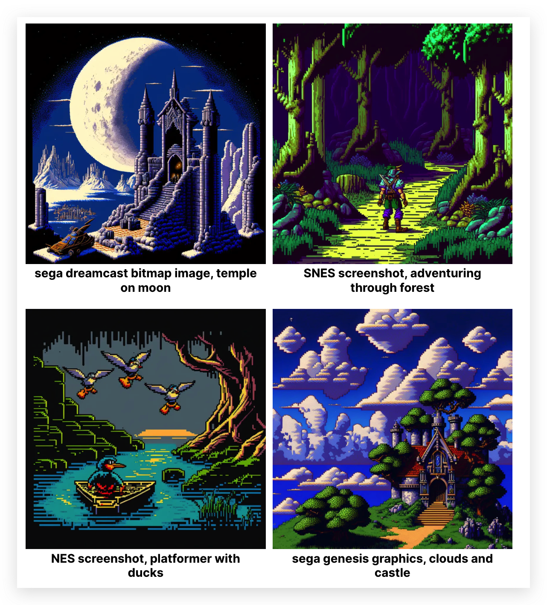

### x-bit

8 位/16 位/32 位最初是指这些控制台中使用的处理器，但现在可以用于指代那个时代的艺术/音乐。

- 8-bit pixel art
- 16-bit pixel art
- 24-bit pixel art
- 32-bit pixel art

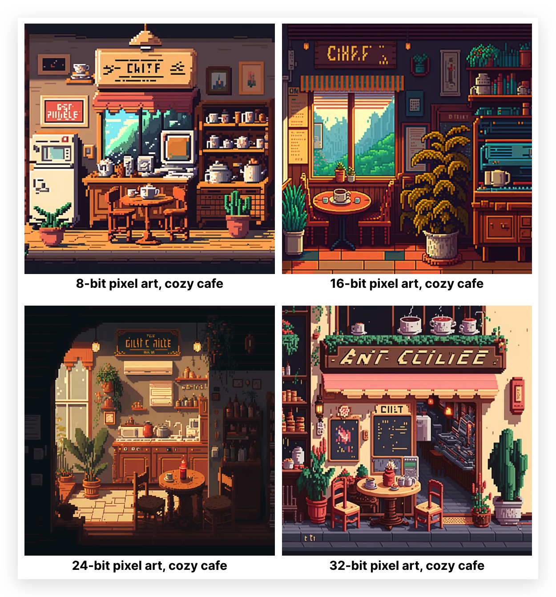

### 游戏风格

当然，你还可以参考旧游戏的风格以获得出色的效果：

#### 恶魔城 (1986)

第一个恶魔城由 Konami 于 1986 年为 NES 发行。它大受欢迎，成为任天堂最具影响力、最经典的游戏之一。该系列以其难度和新颖的机制以及其黑暗的哥特式艺术风格而闻名。Midjourney 擅长重现使恶魔城系列如此与众不同的哥特式视觉形象。

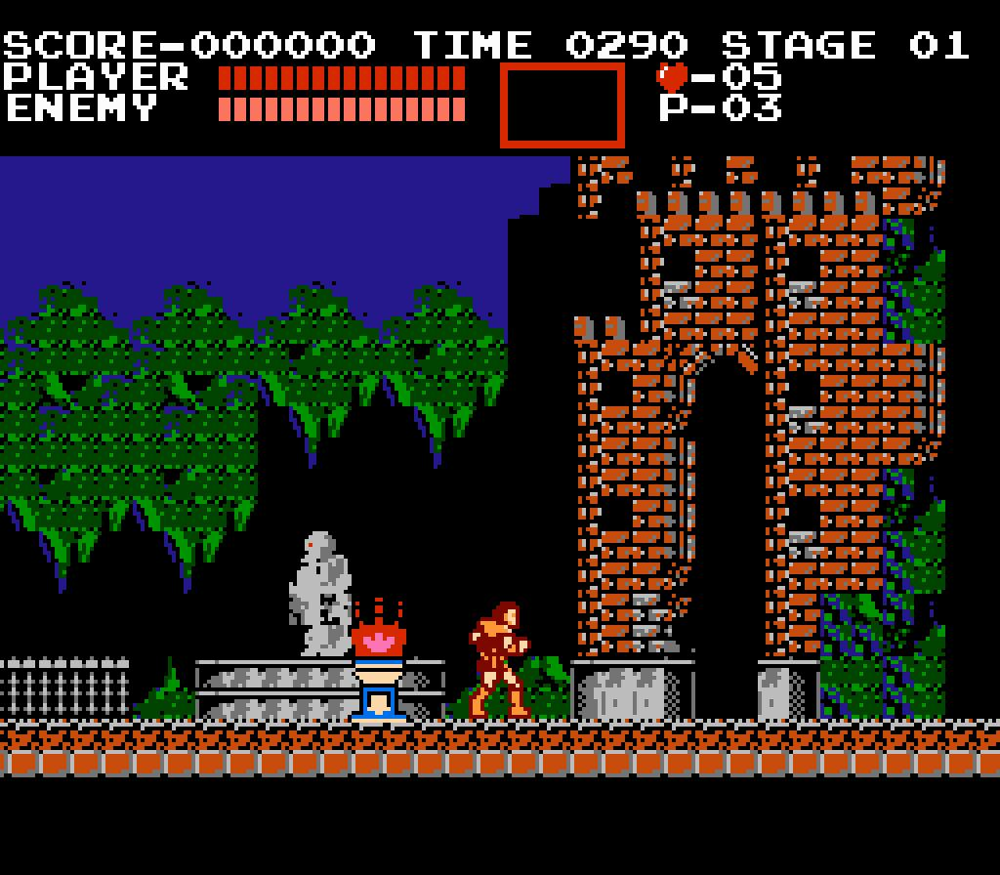

|图片 |提示 | 
|--|--|
|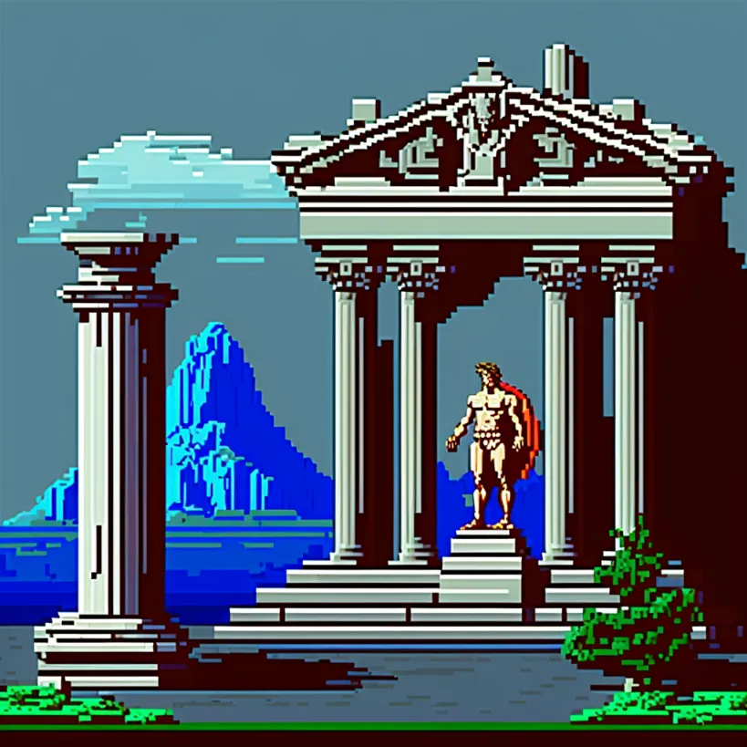 |clean pixel art, greek temple with statue of apollo, style of castlevania 1986 |
|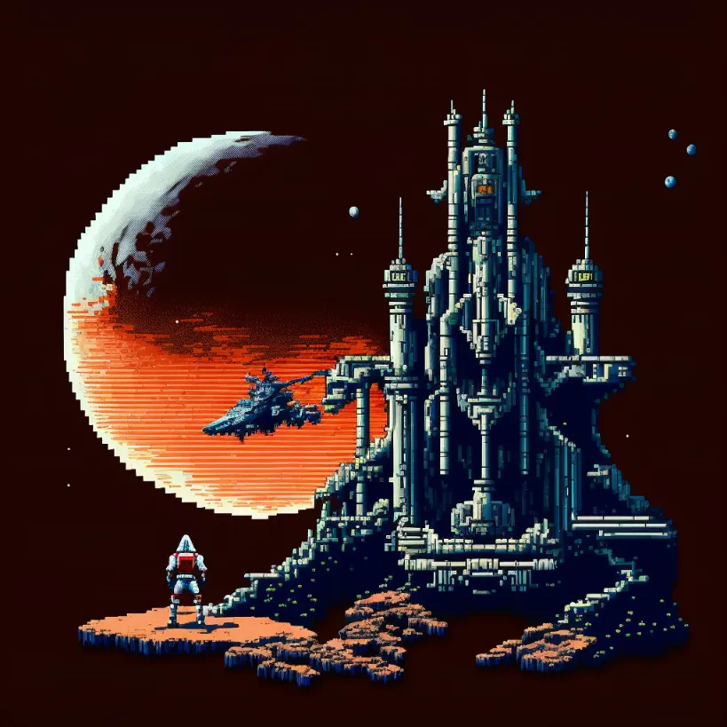 |clean pixel art, moon base with rover, style of castlevania 1986 |

#### 合金弹头 (1996)

最初的合金弹头于 1996 年在 Neo Geo 街机上发布。合金弹头以其块状和极端的细节水平而出名。

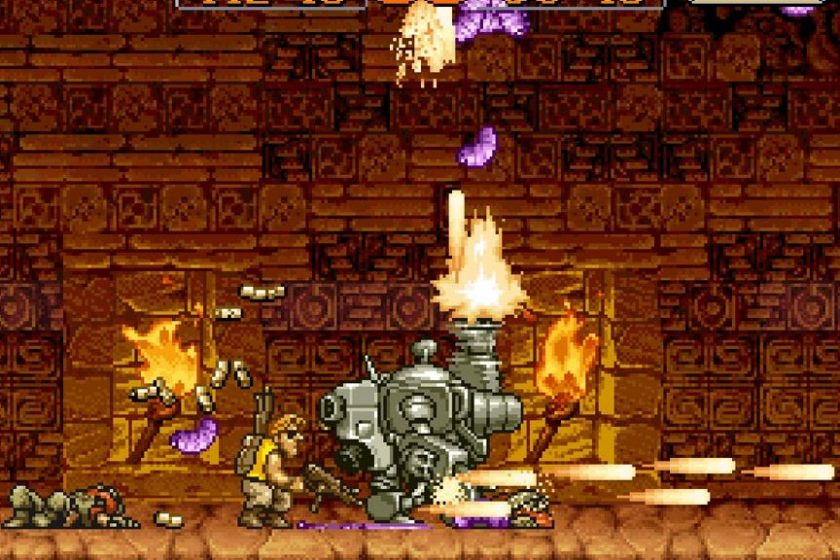

|图片 |提示 | 
|--|--|
|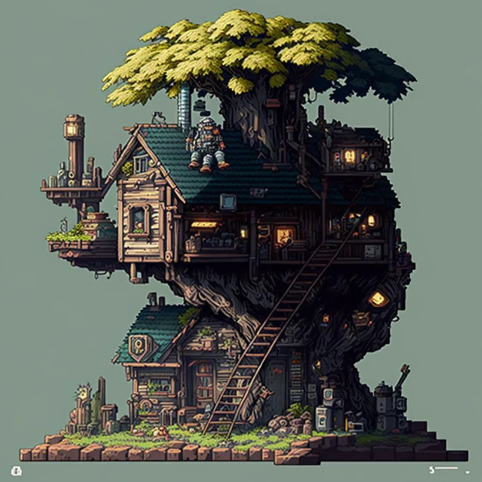 |clean pixel art, house inside of a tree, style of metal slug |
|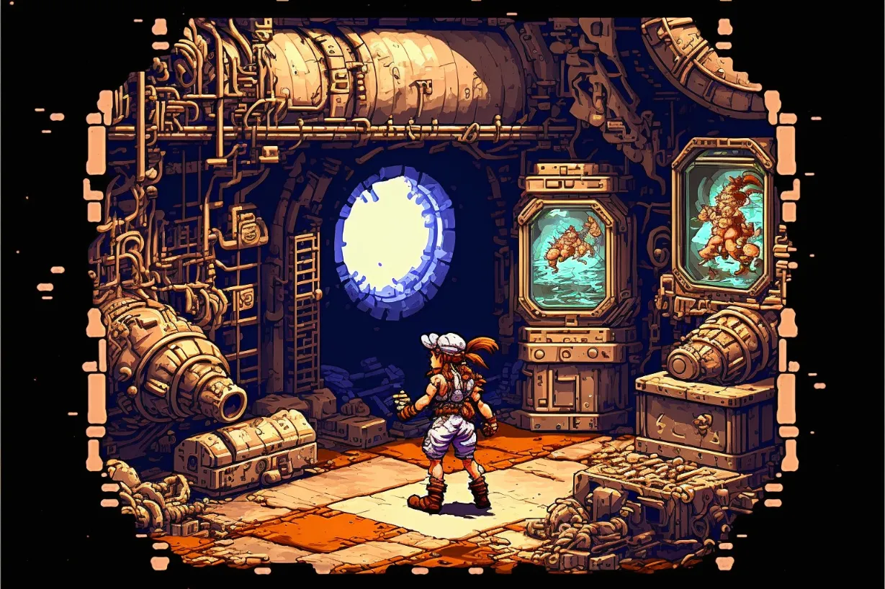 | clean pixel art, inside of dungeon, style of metal slug 1996 --ar 3:2 |

### 像素背景

#### Owlboy (2016)

Owlboy 是一封写给像素艺术的情书 。

该游戏的开发历时 10 年。在此期间，  Owlboy 团队不得不多次重新设计游戏，重新绘制美术资产，使游戏看起来“永恒”。

以下是在 Midjourney 中创建此样式的一些提示。它们非常适合背景艺术：

|图片 |提示 | 
|--|--|
|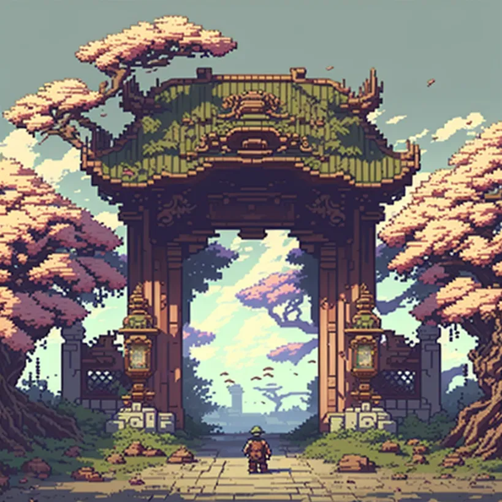 |chinese gate, style of owlboy pixel art |
|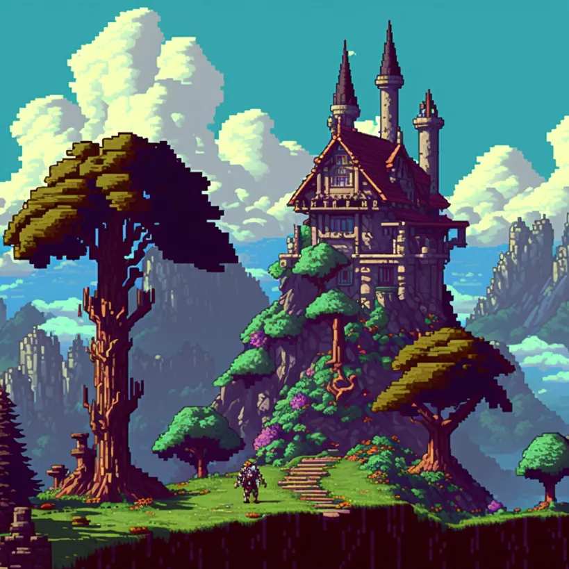 | castle on hill, style of owlboy pixel art |
|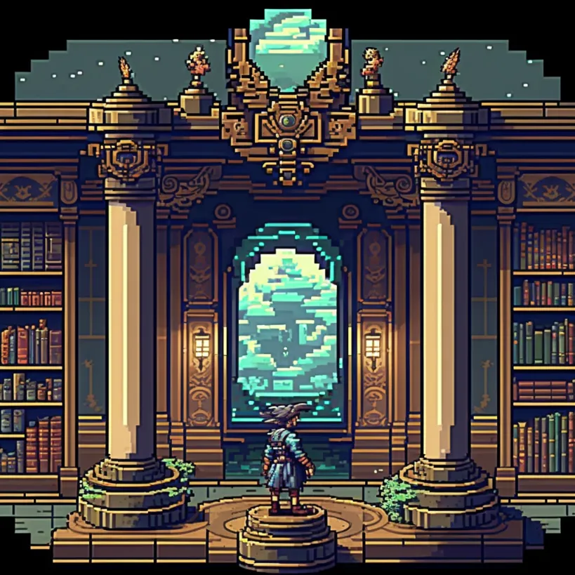 | library of alexandria, style of owlboy pixel art |