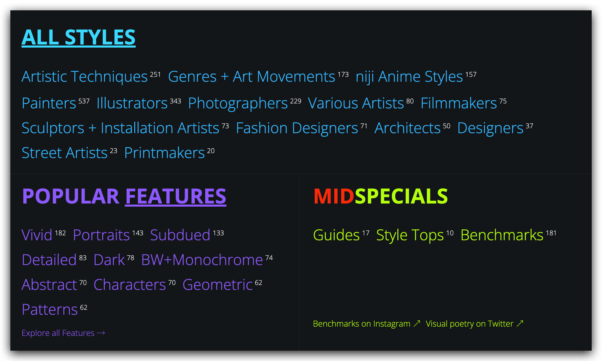

# 关键词参考库 Midlibrary

作为本章的结尾，我推荐你在 [Midlibrary](https://www.midlibrary.io/) 中收集到你喜欢的关键词。

它由国外艺术家 Andrei Kovalev 主导建立，目前收录了 2119 （截止至2023年4月17号） 种适用于 Midjourney 的流派、艺术运动、技法、标题和艺术家关键词。涵盖了插画、摄影、电影、雕像、版画等多个行业，给我们提供了大量的参考例子。

