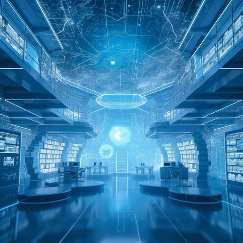

# Prompt 自动生成

前不久，Midjourney 宣布支持图片转 prompt 功能。

## 原始图片

```text
blueprint holographic design of futuristic Midlibrary --v 5
```



## Prompt 生成

1. 直接输入 **/describe** 指令
2. 通过弹出窗口上传图像并发送，Midjourney 会根据该图像生成四种可能的提示。
3. 点击图片下方的 1、2、3、4 按钮，可以直接发送 prompt。

```text
technology research and industry background concept stock photo, in the style of fairy academia, illuminated interiors, hyper-realistic sci-fi, studyplace, light azure, bibliopunk, scientific diagrams --v 5
```


## 优势

有了用**/describe**指令，你可以：

1. **学习新的提示策略并扩展 MJ 词汇量**： Midjourney 主要是用它认识的、可以直观解读的词语来描述图片。所以在大多数情况下，如果 /describe 使用了一个词、一个表达式或一个样式修饰符来描述图片，我们就可以在自己的提示中使用它。
2. **探索新艺术家**： Midjourney 在输入图像中“识别”出来的艺术家也是如此。输出提示中的每个名字都意味着（在大多数情况下）MJ 认识这位艺术家。
3. **Remix的最佳工具**：你可以看到 AI 重新诠释你的视觉艺术作品。你可以用新的角度审视它，或者从新的和独特的方式中获得灵感来进一步发展你的作品。在输入**/describe**之前打开Remix模式，你可以在后续发送之前进一步调整提示。

:::note
- /describe生成的提示不能用于生成与上传的图像一样的图。
- /describe会返回上传图像的纵横比。
:::