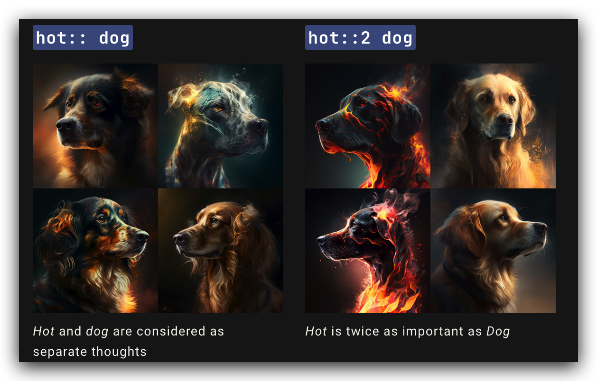

# 多提示

在提示中添加双冒号“::”向 Midjourney Bot 表明它应该分别考虑提示的每个部分。

在下面的示例中，对于提示 **hot dog**,所有单词都被放在一起考虑，Midjourney Bot 生成了热狗的图像。如果将提示分成两部分**hot:: dog** 后，Midjourney Bot会将两个概念分开考虑，从而创建一只“热”的狗。

## 多提示权重

当使用双冒号::将提示分成不同的部分时，你可以在双冒号后立即添加一个数字，以分配提示的该部分的相对重要性。

在下面的示例中，提示**hot:: dog**生成了一只温暖的狗。

将提示更改**hot::2 dog**，使“hot”一词的重要性是“dog”一词的两倍，从而产生了一只火热的狗！

:::note
- v1，v2，v3只接受整数作为权重
- v4可以接受小数位权重
:::