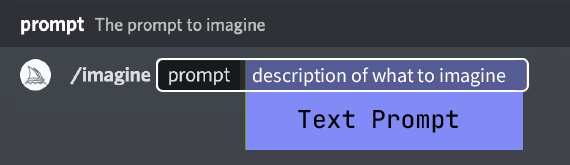
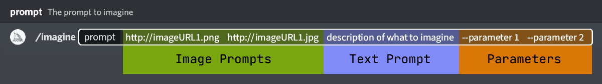
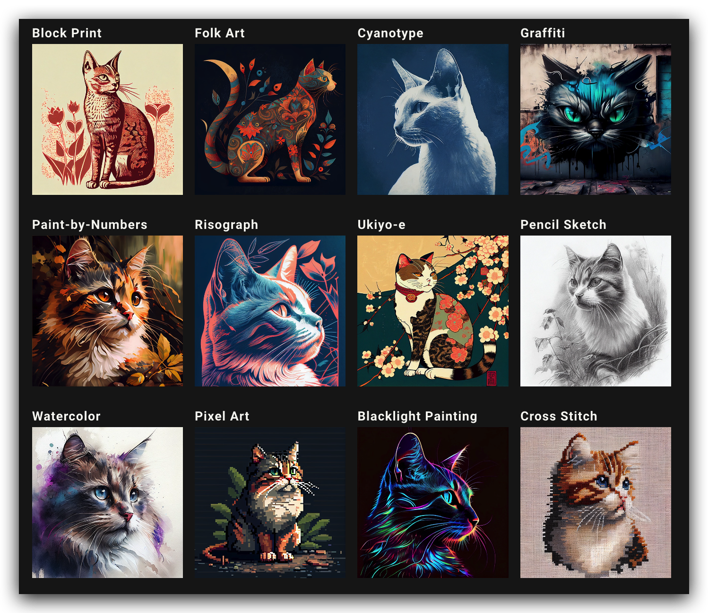
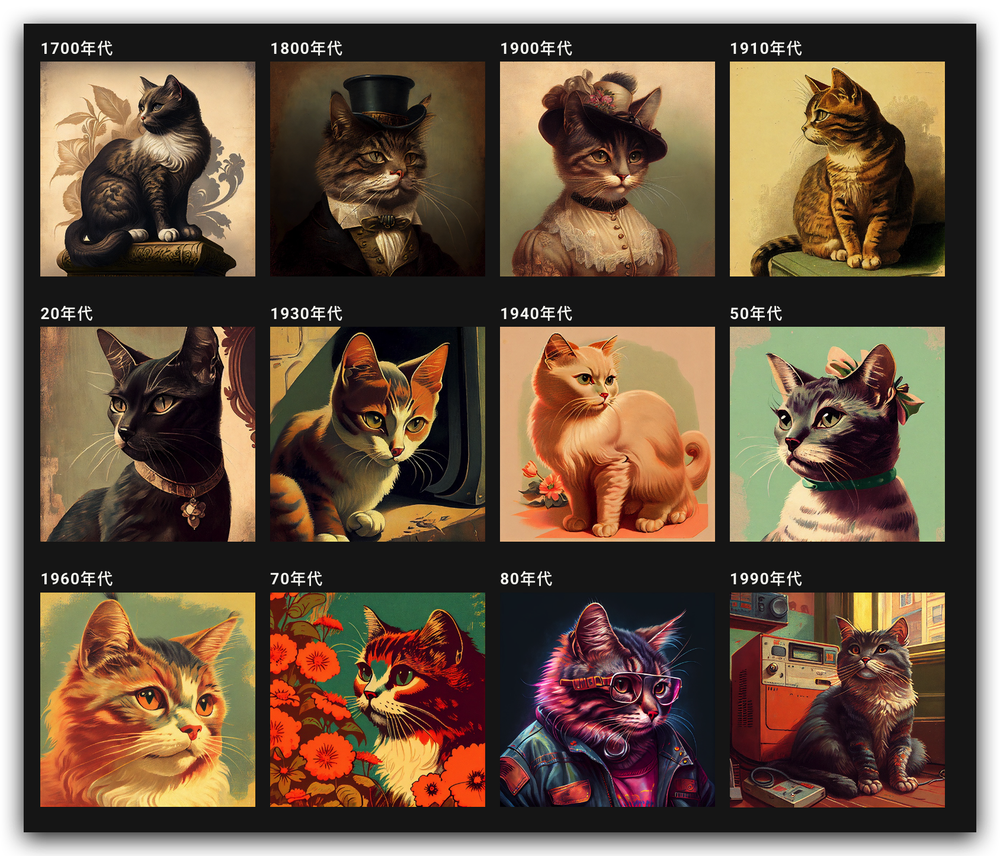
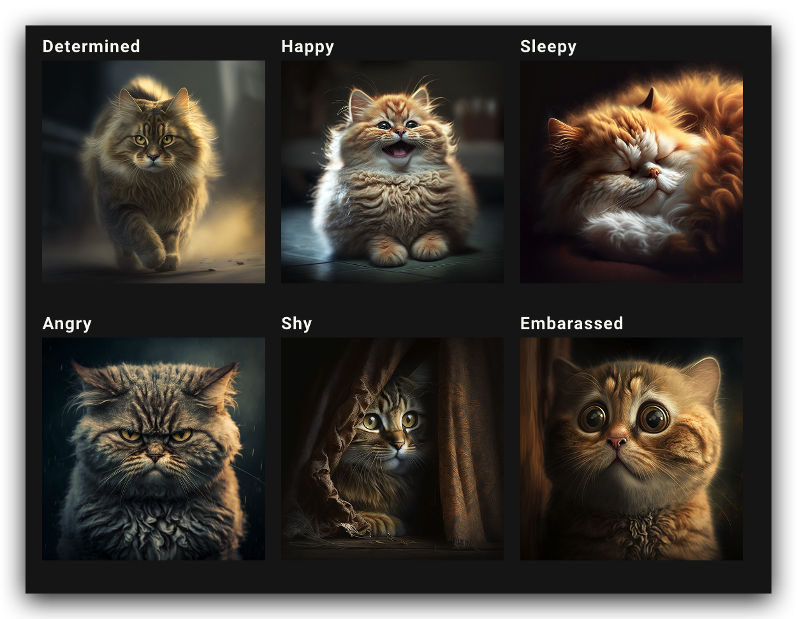
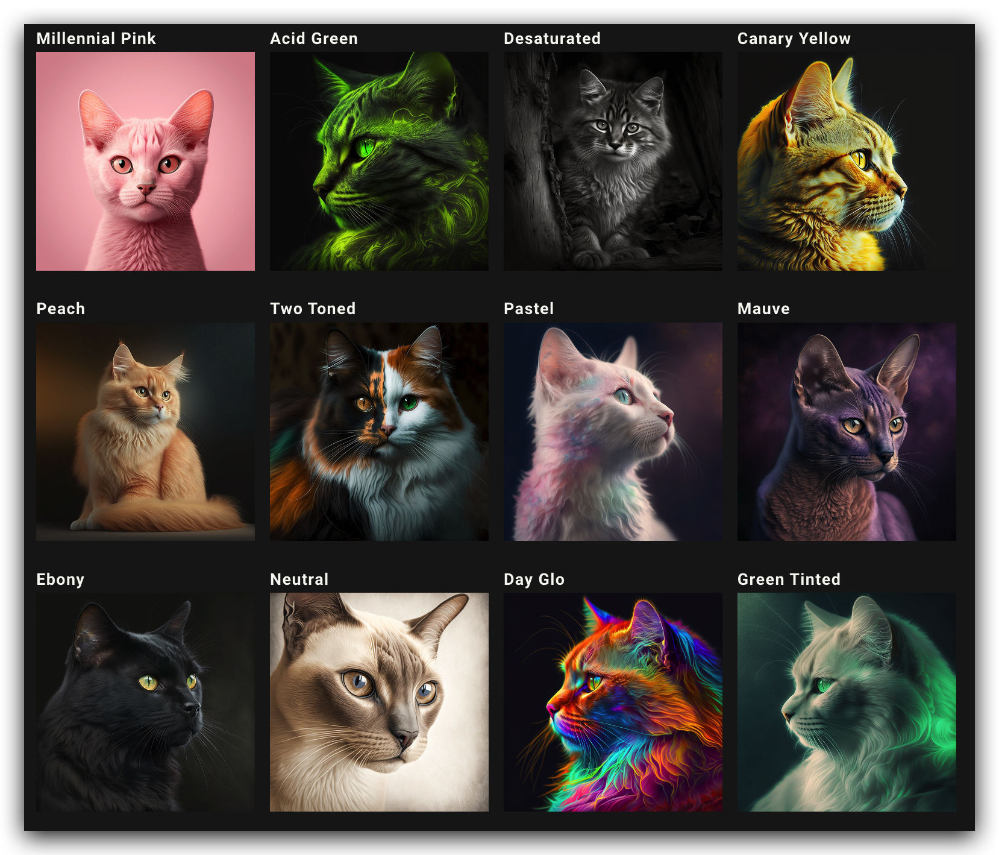
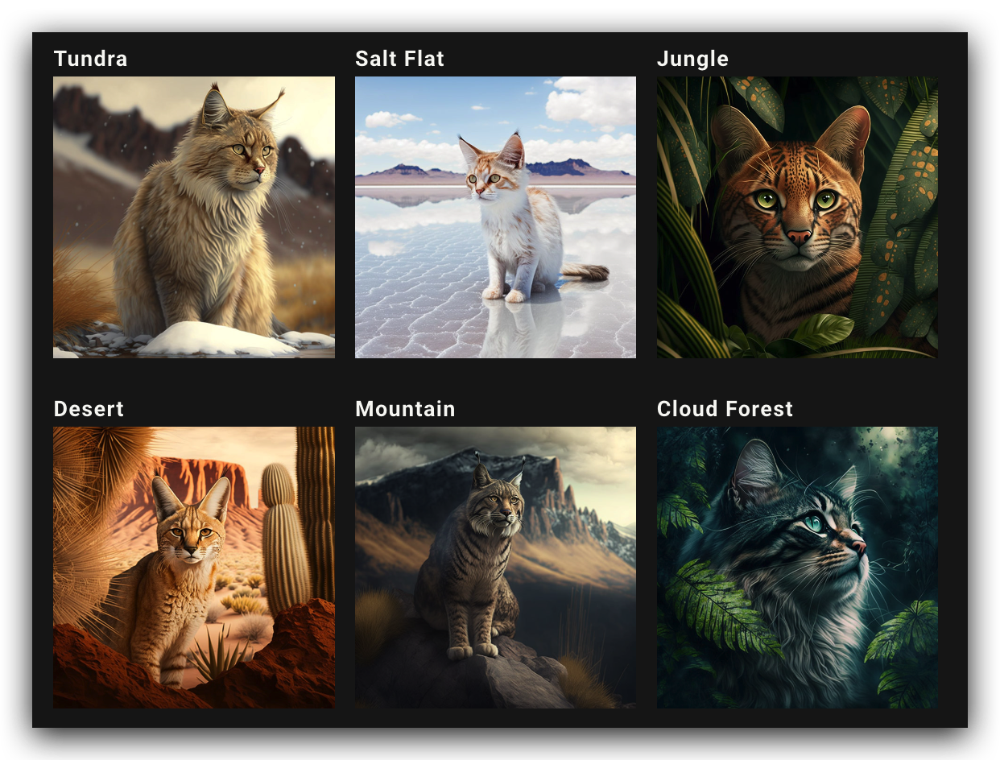

# Prompt 提示语

## 基础结构

一个基本的提示可以简单到一个单词、短语或表情符号。非常短的提示将在很大程度上依赖于 Midjourney 的默认样式。



完整 prompt：可以包括一个或多个图像链接、多个文本短语或单词，以及一个或多个后缀参数



- **Image Prompts**: 可以将图像 URL 添加到提示中以影响最终结果的样式和内容。图片 URL 始终位于提示的前面。

- **Prompt Text**：你要生成的图像的文本描述。

- **Parameters**：参数改变图像的生成方式。参数可以更改宽高比、模型、放大器等等。参数位于提示的末尾。

:::note
**Image Prompts**将在下一页详细说明
:::

## 语法原则

Midjourney Bot 并不能像人类那样理解语法和句子结构。因此单词的选择十分重要。

- 在许多情况下，更具体的同义词效果更好。例如用gigantic, enormous, or immense来取代big。
- 尽可能精简单词。更少的词意味着每个词都有更强大的影响力。
- 使用逗号、括号和连字符来帮助组织你的想法。
- Midjourney Bot 不考虑大小写。
- 最好描述你想要什么而不是你不想要什么。如果要确保某个对象不在最终图像中，请尝试使用--no参数。

V4 和V5 在解释句子结构方面略优于其他模型。

## 细节描述

尽量弄清楚重要的背景或细节：

1. 主题：人、动物、人物、地点、物体等。｜ person, animal, character, location, object, etc.
2. 媒介：照片、绘画、插图、雕塑、涂鸦、挂毯等。｜ photo, painting, illustration, sculpture, doodle, tapestry, etc.
3. 环境：室内、室外、月球上、纳尼亚、水下、翡翠城等。｜ indoors, outdoors, on the moon, in Narnia, underwater, the Emerald City, etc.
4. 照明：柔和、环境、阴天、霓虹灯、工作室灯等 ｜ soft, ambient, overcast, neon, studio lights, etc
5. 颜色：充满活力、柔和、明亮、单色、彩色、黑白、柔和等。｜ vibrant, muted, bright, monochromatic, colorful, black and white, pastel, etc. 
6. 情绪：稳重、平静、喧闹、精力充沛等。｜ Sedate, calm, raucous, energetic, etc.
7. 构图：人像、爆头、特写、鸟瞰图等。｜Portrait, headshot, closeup, birds-eye view, etc.

:::note
当你没有在提示里面说明时，对应的内容就会被随机化。在最初的时候可能会给你一些灵感，但如果你想减少随机性，可以使用提示模板将上面的元素一一补充。
:::

## 指定艺术媒介

蜡笔、刮板、印刷机、闪光、墨水和彩色纸。生成图像的最佳方法之一是指定一种媒介。

```text
/imagine prompt <any art style> style cat
```



## 年份

不同的时代有不同的视觉风格。

```text
/imagine prompt <decade> cat illustration
```



## 情感

```text
/imagine prompt <emotion> cat
```



## 色彩

```text
/imagine prompt <color word> colored cat
```



## 环境

```text
/imagine prompt <location> cat
```

