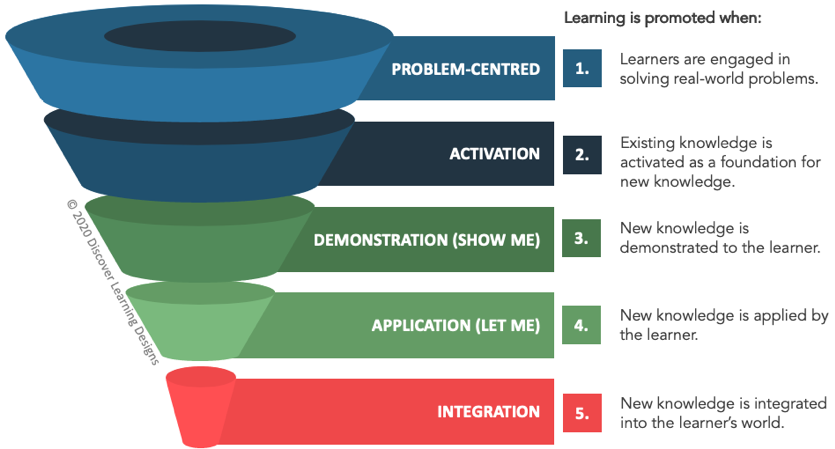
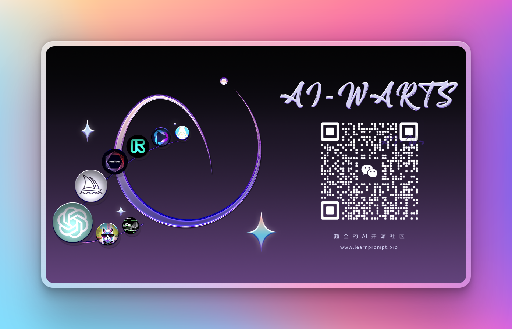

# 👋Welcome

> 我们希望能让每个人接触 AI，了解 AI，成为 AI 的创造者

欢迎👏！由开源中文社区「AI沃茨」发布的 LearnPrompt.pro 迎来了期待已久的**2.0**版本更新！这个开源 AIGC 课程网站旨在教会更多的人了解并学会 AI。正如 LearnPrompt.pro 这个名字的来源一样，Prompt是AI和我们之间的沟通桥梁，我们学习如何掌握AI的第一步也大多从learn和运用Prompt开始。

2.0版本，不仅仅是向大家展示如何通过各种便捷的方法掌控 AI 模型生成各种惊艳的内容输出，我们还将深入探讨各种 AI 相关的方方面面。AI 技术正在迅速发展，从最初的ChatGPT，到现在的文生图Midjourney、图生视频Runway、数字人制作软件HeyGen、开源大模型Llama2等，我们希望这门课程可以帮助大家对 AI 有更加全面的认知，了解 AI 技术的影响和应用，进而在 AI 浪潮中拥有自己独立思考的能力。

## 🚀课程特点

- 快速迭代： 为保持课程的时效性，我们将定期发布关于最新技术的精炼文章。请随时告诉我们您的关注焦点。
- 实用至上： 我们致力于教授直接落地的技术，让您能够迅速将所学内容融入您的项目和应用中。
- 可复现的实例： 实战才是最好的老师！我们将提供详尽的实例，强烈建议您使用对应的AI产品运行案例，以增强记忆。
- 共同进步： 我们坚信交流能使学习效果更进一步。任何疑问都可通过 GitHub issue或加入学习群告诉我们。
- 欢迎分享：LearnPrompt.pro 信奉开源思想，坚持长期主义。欢迎分享优秀的资源和知识，我们会同步到课程当中。
 
我们已精心组织好各个章节，您无需按固定顺序阅读，可自由探索感兴趣的主题。根据文章的难度级别和所需的知识范围，我们维护了一个标签系统：

- 🟢 **初学者友好**：适合完全的新手，无需任何前置知识
- 🟡 **简单**：只需基本的AI知识即可轻松上手
- 🔴 **进阶**：适合了解特定领域知识的学习者，深入学习和实践，拓展专业技能
请注意，即使是标记为🔴进阶的文章，您也可以通过学习我们的🟢初学者友好和🟡简单篇章来逐步理解其内容。

## 章节简介

- **🤖 AI基础**: AI相关基础知识，用最通俗易懂的方式来让所有读者知道AI是什么

- **😄 ChatGPT 入门篇**: 介绍prompt基本概念和使用方法

- **📝 ChatGPT 精选案例**: 提供prompt在垂直领域的应用案例

- **💪 Prompt 高级技巧**: 提供实用的模板和技巧

- **🪄 Agents**: AI下半场！Agent = LLM（大型语言模型）+记忆+规划技能+工具使用

- **💡 GPT4综述**: gpt4能力分析

- **⛓️ GPT Plugin插件**: gpt4插件开发教程

- **🎨 Midjourney 图片生成**: Midjourney文生图工具的基本使用

- **🤖 Midjourney Prompt**: 详解Midjourney Prompt的提示语模板和提示自动生成

- **🌟 Midjourney案例**: 提供Midjourney在不同的场景的应用案例

- **👩🏻‍🎤 AI虚拟数字人**: 盘点全数字人解决方案

- **🖼️ Stable Diffusion**: Stable Diffusion 从入门到精通 

- **🎥 Runway 视频生成**: 搭配ChatGPT+Midjourney的Runway视频生成

- **🔍 工具推荐**: AIGC 工具和教程的扩展阅读

## 📖学习方法推荐
推荐 David Merrill 教授提出的“首要教学原理”：
- 原则一：以问题为中心 —— 当学习者致力于解决现实世界的问题时，就会促进学习。
- 原则二：激活 —— 当现有知识被激活为新知识的基础时，学习就会得到促进。
- 原则三：示范 —— 当向学习者展示新知识时，就会促进学习。
- 原则四：应用 —— 当学习者应用新知识时，会促进学习。
- 原则五：整合 —— 当新知识融入学习者的世界时，学习就会得到促进。

## 💪加入我们

感谢大家对课程内容的热烈支持！我们「AI沃茨」已建立10个交流群，超过4000人一起学习，互相交流，供大家自由分享和探讨知识。欢迎扫描下方二维码直接加入我们的学习社区！

<!-- |交流群 | 支持追更 | 开发者 |
|--|--|--|
| | | | -->

 

欢迎大家积极分享，畅所欲言！

商务合作 & 文章转载 & 项目投稿，欢迎请加微信号：matt_to_live

## 💥更多内容

感谢开源社区，AI沃茨部署了ChatGPT & Midjourney 的国内站点，如果因为一些网络原因，你无法使用 ChatGPT 或者 Midjourney，你可以试试我们开发的国内站点[https://aiwarts-mj-gpt.zeabur.app/](https://aiwarts-mj-gpt.zeabur.app/)

除了此教程外，也欢迎各位通过更多的社交平台关注我们：
* [即刻](https://okjk.co/1nCKL8)：个人日常感受，梗图一堆，不定期更新。
* 海外版 X ：[@aiwarts](https://twitter.com/aiwarts?s=21&t=X4Wyu-b0lnJmwwLh9WXr7Q)（24小时在线，分享好玩的AI科技资讯）
* [小红书](https://www.xiaohongshu.com/user/profile/5b003bce11be10430bf33433?m_source=pinpai)：MJ 各类画风壁纸and头像分享，MJ最新资讯
* [抖音号&视频号]：卡尔的AI沃茨（AI工具合集 & 超全操作指南）

相信我们可以一起构造出更好的内容。您可以加入我们，成为课程开发的一员😄！ 

## 🤝大牛推荐

todo

## 🙆特别鸣谢
编写本教程时参考了以下教程或文档的内容和示例，感谢创作者们的付出！

1. [Learn Prompting](https://learnprompting.org/zh-Hans/)
2. [Midjourney Documentation](https://docs.midjourney.com/)
3. [Aituts](https://aituts.com/)