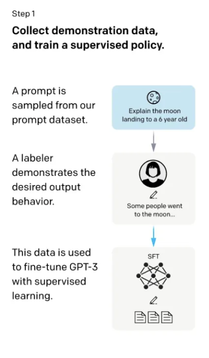
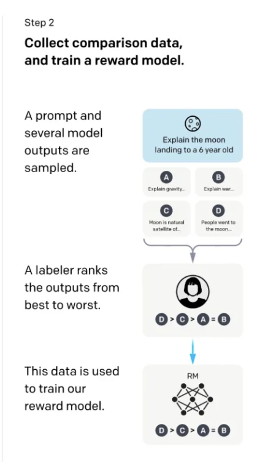
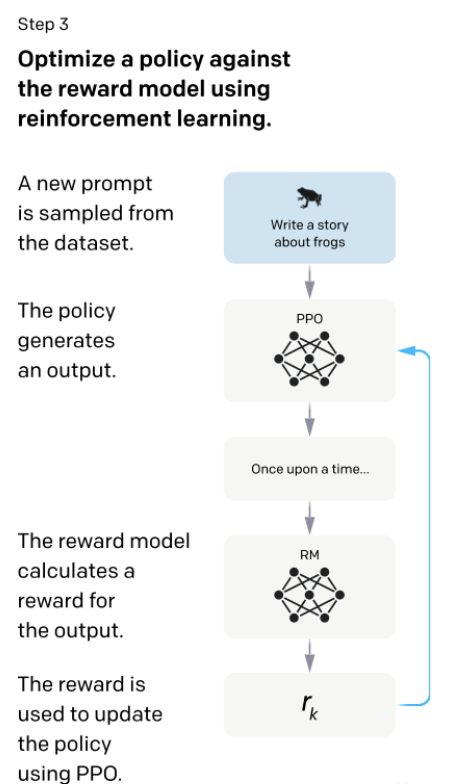

# ChatGPT背后的技术

ChatGPT背后的技术InstructGPT，论文标题为 Training language models to follow instructions with human feedback。

语言模型(Language model)的原理是给一段文本，让它去预测后面下面的词是什么。在预训练中它的训练数据是没有标签的，是自监督学习。当我们提出一些问题去问模型，比如说勾股定理是什么的时候，我们希望模型在预训练中就见过相关的数据，所以模型的行为取决于预训练的内容。在现在的大语言模型中，训练的词表是几十几百亿的级别，所以实际里面有什么我们没有办法详细的去看，我们只能大概知道我们获得的文本质量不错，然后经过数据预处理后去喂给模型训练。这种情况下会导致模型的精细度不够，可控性也比较低，同时面临着有效性和安全性问题，比如说如果我让模型做一些任务，但是它在训练文本里没有出现，模型没学会。或者模型输出一些很不好很敏感的内容怎么办？

总的来说，模型并不是越大用户体验就越好，因为它不一定符合用户使用的目标（在工作中我们常用“对齐” aligned这个词来保证公司里各个团队之间的目标保持一致），模型也一样，它没有和用户“对齐”，因此可能会输出让用户觉得不满意、甚至觉得感到冒犯的内容。从学术上来说，模型只要能刷榜刷很高的分数就可以了，但是在实际的商业落地场景中，用户的体验非常重要，如果模型输出敏感性的内容会产生非常大的负面影响。因此需要模型和人类之间“对齐”，于是引出了基于人类反馈的微调（fine-tuning　with　human　feedback）

首先通过OpenAI API收集到的问题，使用标注工具来对这些问题标注了一个数据集，在这个数据集上对GPT3进行微调（监督学习）。

接下来，再收集了一个数据集，这个数据集是给定一些问题，模型会产生不同的输出，对模型的输出进行打分，有了排序之后这个数据集会在后面使用向基于人类反馈的强化学习的方法进行微调，最终的模型就叫InstructGPT。

## RLHF

第一步，首先找了些人来标注一个数据集，在数据集里写了各种各样的问题，这些问题在GPT里我们叫做 prompt。这里面的问题就类似于给6岁的小朋友来解释什么是登月，然后标注员对问题写了答案，比如回答登月的这个问题的答案为“一些人去了月球巴拉巴拉的....“。于是就得到了问题和答案，把问题和答案拼接成一段话，然后在这些数据上进行微调GPT3,微调出来的模型叫做SFT（supervised Fine-tune,基于监督学习的微调)。虽然这里标注了数据进行了微调，但是实际上在GPT眼里，它实际上就是给定一些词，让它预测后面的词，这个过程和语言模型预训练的过程没有太多区别。这个过程有个问题就是如果把所有收集到的数据都进行标注成本非常高，于是就有了第二步。

在第二步里，这里的标注会更简单一些。我们给模型问题，比如还是前面的给6岁的小朋友来解释什么是登月，让第一步训练好的SFT这个模型来生成问题的答案，GPT生成的原理是每一次预测一个词的概率，根据这个概率进行采样，可以采样出多个不同的答案，简单来说就是让GPT对每个问题都生成多个不同的答案。然后让人来给模型生成的每个问题的这些答案进行打分。比如上图中，模型生成了A,B,C,D四个答案，然后让人来对这四个答案进行打分排序（D比C好，C比A好，A和B差不多），这个排序就是数据的标注了。有了这些排序之后，训练一个模型，这个模型叫做RM（Reward Model 奖励模型）。这个模型负责的工作是：给一个prompt，给对应的输出，对输出生成一个打分，使得对答案的打分满足标注的数据排序的关系（D>C>A=B）。第二步的目标就是训练一个打分的模型。

第三步就是继续微调第一步中训练好的SFT模型，生成的答案给第二步的RM模型打分，更新SFT模型的参数使得生成的答案尽可能的得到一个比较高的打分。理论上来说，如果第一步能标注足够多的数据的话，其实后面两步可以忽略可能也是可行的，但是写一个答案属于生成式的任务标注，和给第二步中给答案打分属于判别式的任务标注，判别式的任务标注数据的成本是远低于生成式任务的成本的。因此，第二和第三步可以让在同样标注的成本下能得到更多的数据，使得模型的性能更好。第三步训练完成之后的模型就是InstructGPT。

