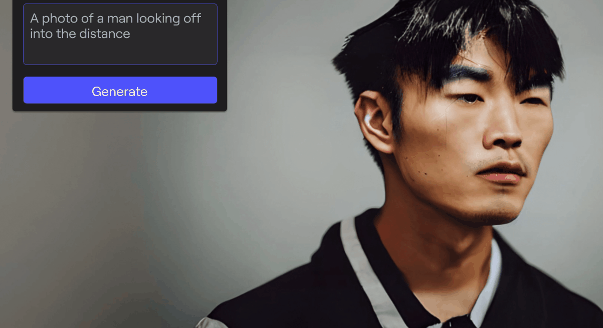

# 简介

继ChatGPT的爆火证明了大型预训练模型在文本领域的统治地位之后，大型预训练模型在图片、视频等领域结合文本的多模态应用也开始兴起。Diffusion、 Midjourney等文本生成图片的应用也受到了广大关注。Runway是一个结合了人工智能技术的创意套件，可以利用人工智能创造任何想象的东西。该平台集成了30多个人工智能工具让用户们构思、迭代和生成内容。

:::note
第一次打开需要等待1-2分钟，gif加载需要一定时间。我们后期会进一步优化。
:::

其AI工具包含了：
1. 视频生成

2. 图片生成

3. 扩展的图像

4. 重新想象任何图像

5. 擦除视频中的东西

6. 放慢视频播放速度

7. 让图片动起来

8. 去除背景

9. 训练自己的想要风格的AI模型

.
.
.
等30多个工具

在下一章节中，我会讲到如何使用Runway。如果你有更多关于 Runway 的例子，非常欢迎你加入我们，与我们共同优化这一课程。

