# 视频生成

## # 注册账号
平台链接：https://runwayml.com/
进入平台后点击Try RUNWAY FOR FREE可进入使用界面
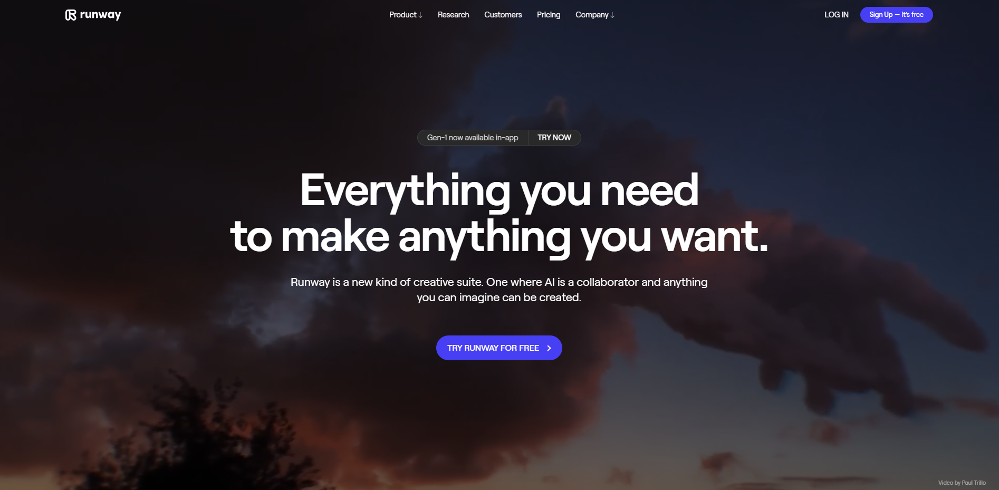
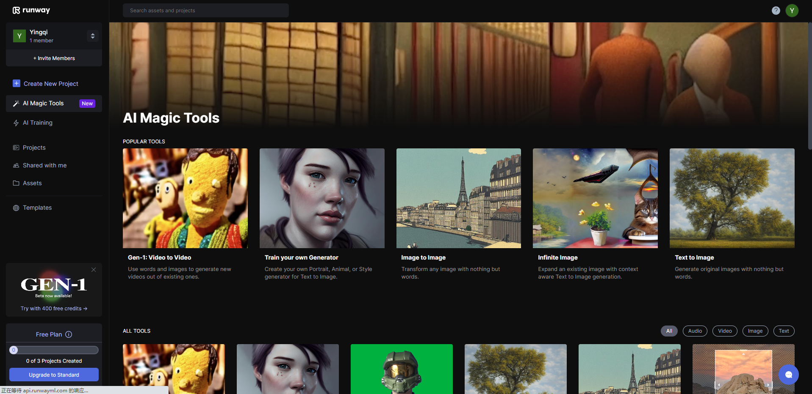
该平台可免费使用

## Gen1: Video to Video
该工具是使用文本或者图片作为Prompt,使用视频生成新的视频

进入Runway工具界面后，点击左侧菜单栏的Assets，可以上传自己电脑上的素材，可上传视频、图片、文件夹。上传文件夹会把目标文件夹中含有的所有素材都上传至Runway
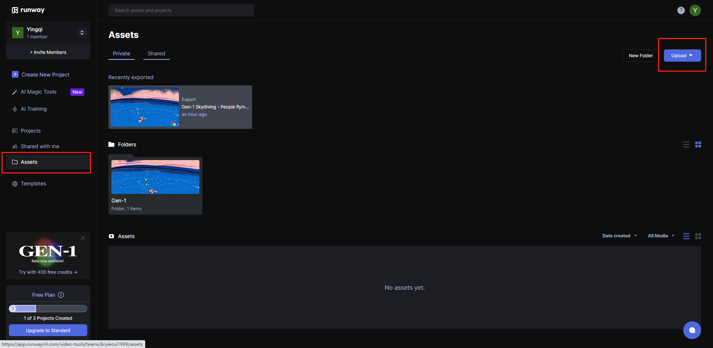

点击左侧菜单栏的AI Magic Tools，选择Gen1: Video toVideo

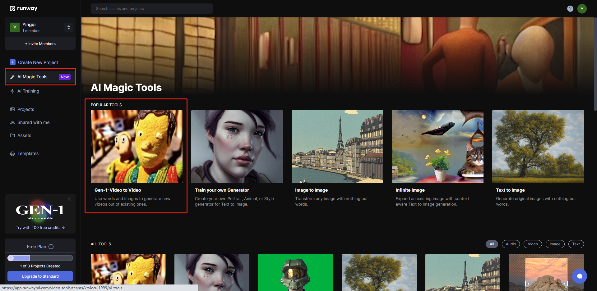

进入Gen1工具后页面如下，此时我们需要上传一个视频素材所谓基本模板。

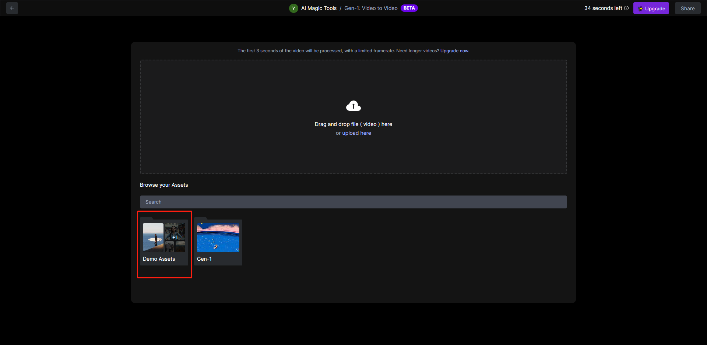

此时我们选择平台自带的demo素材中的一个视频实验

此工具右上角中为视频风格迁移的Prompt，可使用图片、文字作为Prompt同时也可以使用系统自带预设。

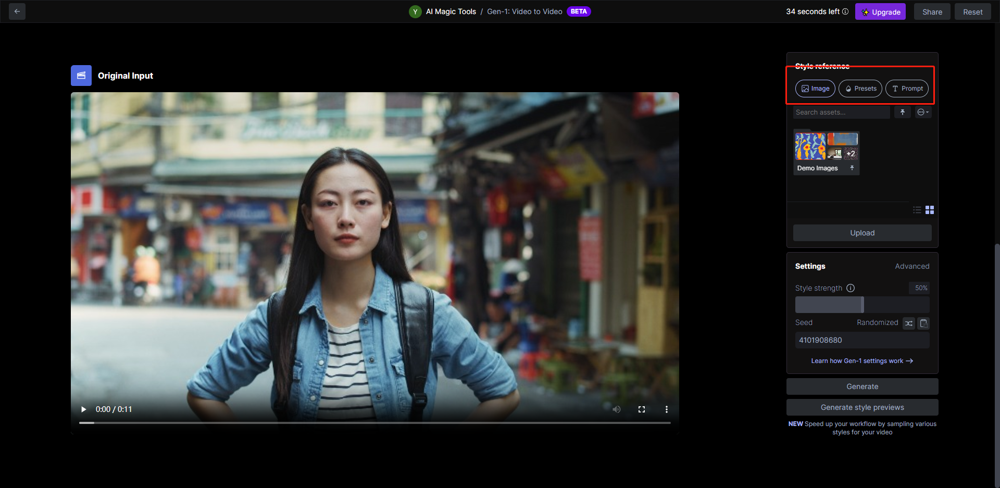
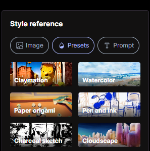
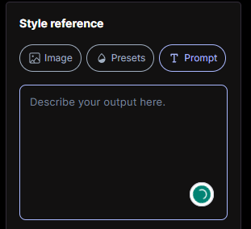

我们使用图片作为Prompt，此时我们上传了一张图片，这中图片的风格很抽象。选中图片后点击Generate按钮后视频开始生成。

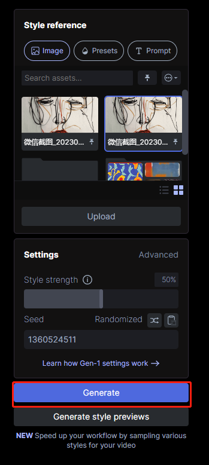

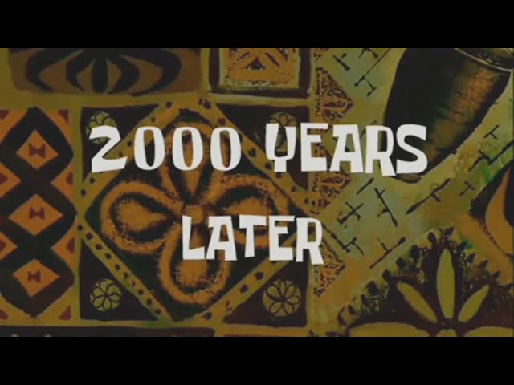

经过一段时间的等候后，我们可以看到生成的视频，原本的视频的画风将会被我们选中的图片prompt的画风替代。

## 高级设置
在右侧菜单栏的Settings中，点击Advanced可调整更多设置
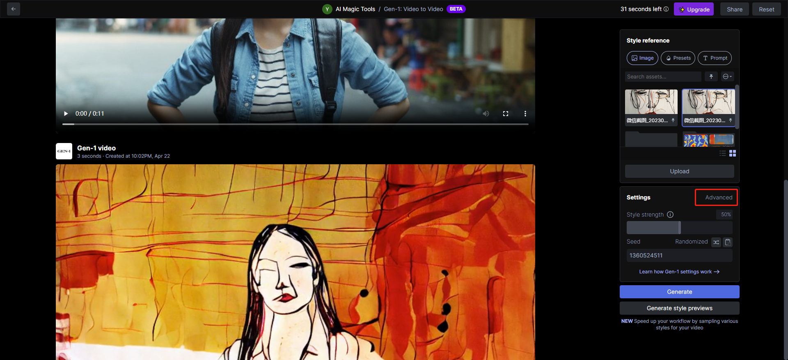
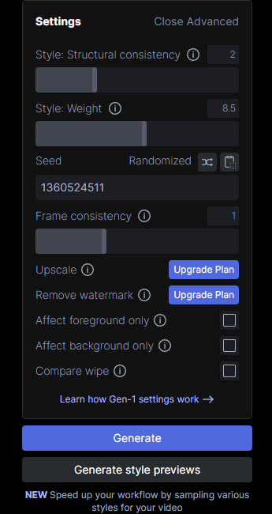

### structural consistency
 structural consistency：更高的数值使输出的视频在结构上与输入的视频有更大的差异。推荐使用： 0到5。下图展示该属性不同值生成的结果。

### weight
weight： 更高的值会导致更多强调匹配风格而不是输入视频。推荐使用： 7.5至12.5。下图展示该属性不同值生成的结果。

### Frame Consistency
Frame Consistency： 低于1的值会降低整个时间段的一致性；高于1的值会增加框架与先前框架的紧密联系。建议： 1.0到1.25。

### Affect foreground only
Affect foreground only：选择后将只影响前景主体，而不影响背景。

### Affect background only
Affect background only：选择后将只影响背景，而不影响前景主体。

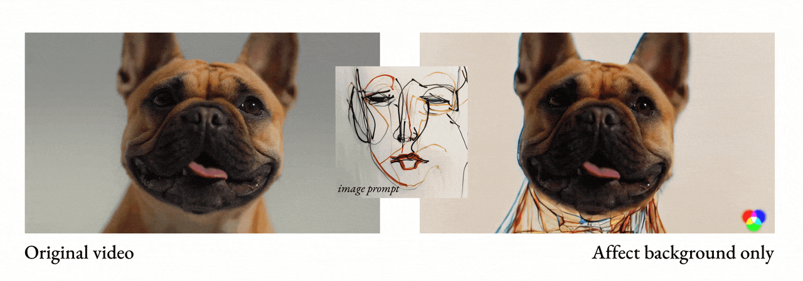

### Compare wipe
Compare wipe：选择后在原视频和新视频之间进行切换。

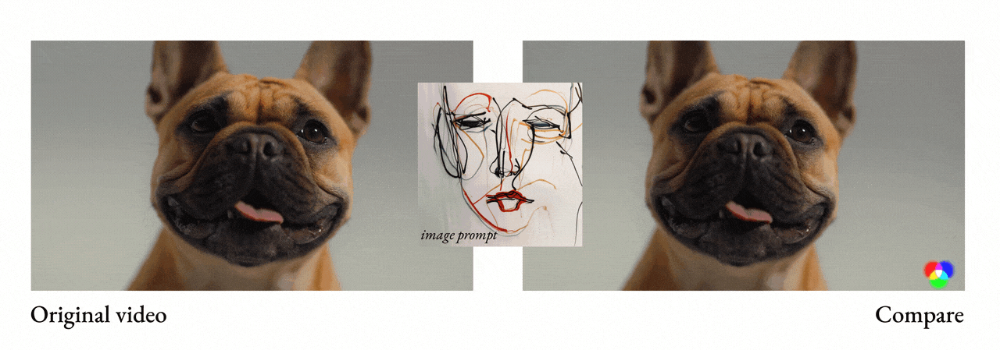

