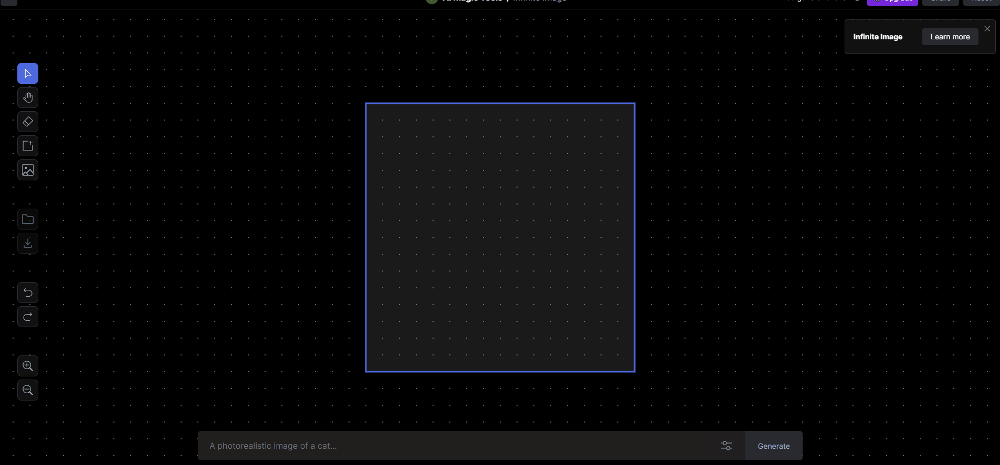
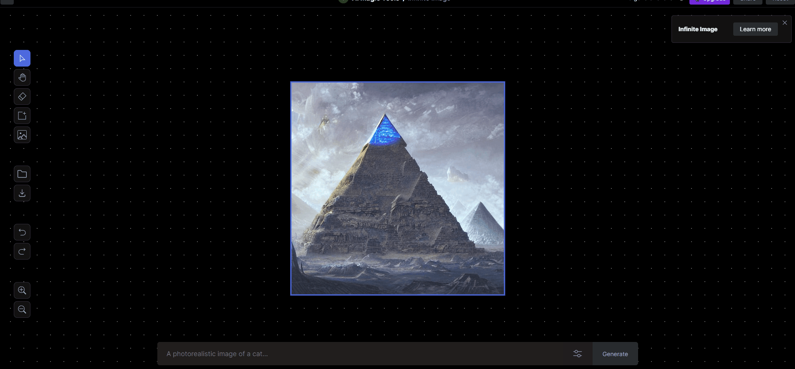
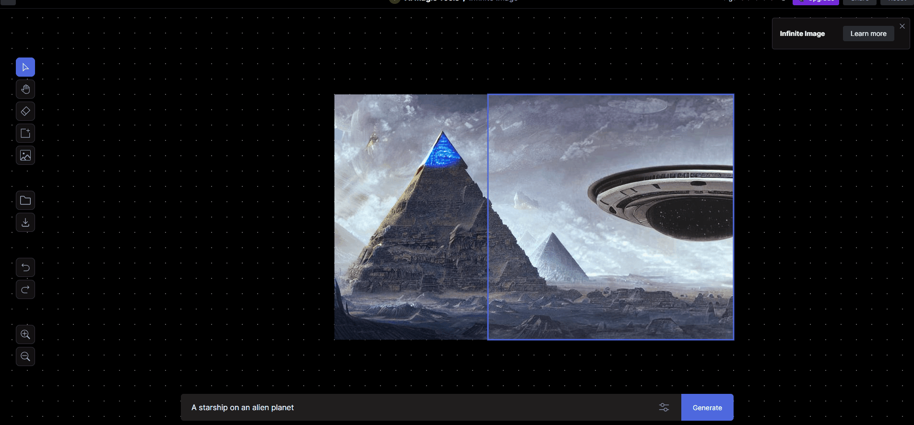

# 图片扩展

用简单的文字提示Prompt无休止地扩展任何图像。

回到Runway的工具界面，选择Infinite Image

进入Infinite Imageg工具界面后，在左侧图表中选择Add Image，这里大家可以直接从自己电脑上上传图片，也可以选择上传到Runway平台的照片，这里的示范我从自己电脑上上传一张图片。

然后我们用鼠标拖动图片的紫框到我们想要生成图片的位置，在下方的文本输入栏中输入我们想生成的图像，比如我想在原图片的右方生成一艘星舰，于是我在下方的文本输入框中输入提示Prompt "A starship on an alien planet",然后该工具会为我们生成想生成的内容。系统会生成多个候选，我们可以符合自己想象的画面，当然也可以下修改文本Prompt重新生成更符合自己要求的画面。

我们可以随意的拖动边框，在我们想要的位置随意无限地扩展我们的原图

