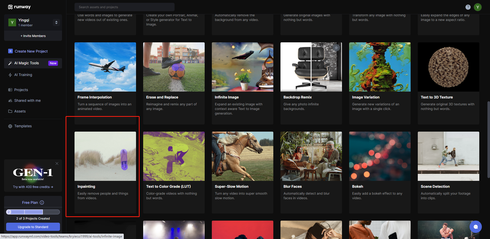
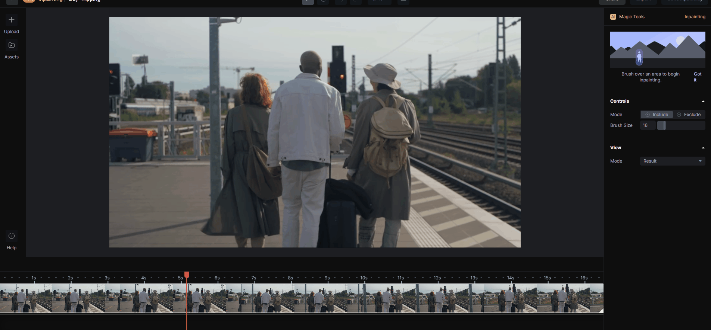

# 擦除视频中的东西
该工具可以用一个简单的笔触从任何视频中删除任何人或任何东西。

回到Runway的工具页面，往下拉在所有工具中选择Inpainting这个工具。

进入工具界面后，我们选择我们需要编辑的素材，这里笔者使用平台自带的素材所谓例子，把选中的视频拖入下方的视频条中加载视频。我们可以通过鼠标拖动视频条的光标来找到我们需要编辑的位置。

我们把鼠标移到上方的视频中，在制品中会出现紫色光标，我们把光标移动到我们想消除的东西或者人物的部分，按住鼠标左键，像使用橡皮擦一样擦掉视频中我们想删除的东西。然后等待即可完成视频该帧下的处理。

