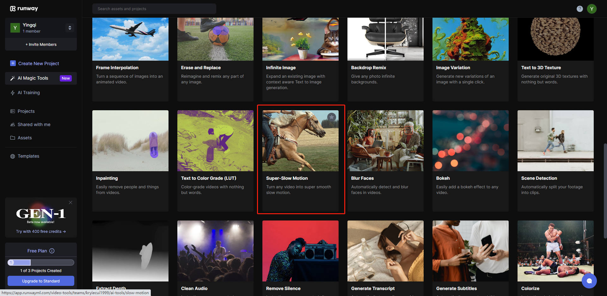
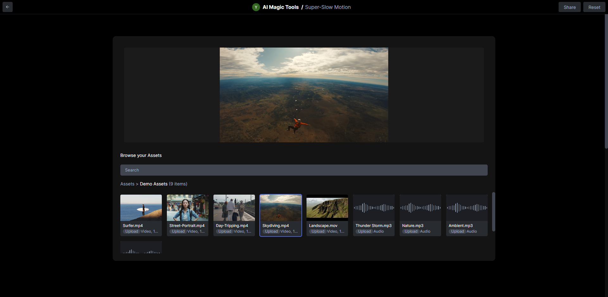

# 放慢视频播放速度
该工具能将任何视频变成超级慢镜头。无论帧率如何。

返回Runway工具界面，选择Super-Slow Motion工具

这里我们依然用平台自带的素材进行展示，用户可以选择自己想处理的素材。此功能除了视频之外，还可以放慢音频。

该功能使用步骤十分简单粗暴
这是视频原速度

通过拖动右侧的speed,我们可以给视频加速或者减速，点击process按钮生成处理后的视频。

