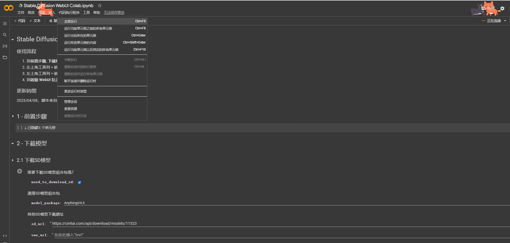
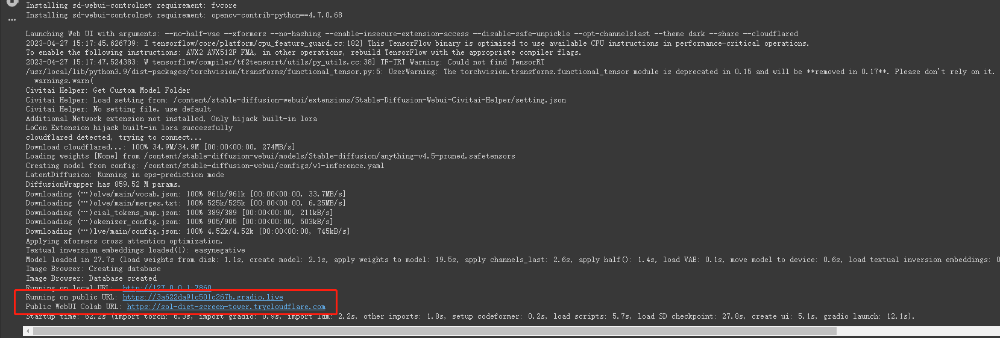
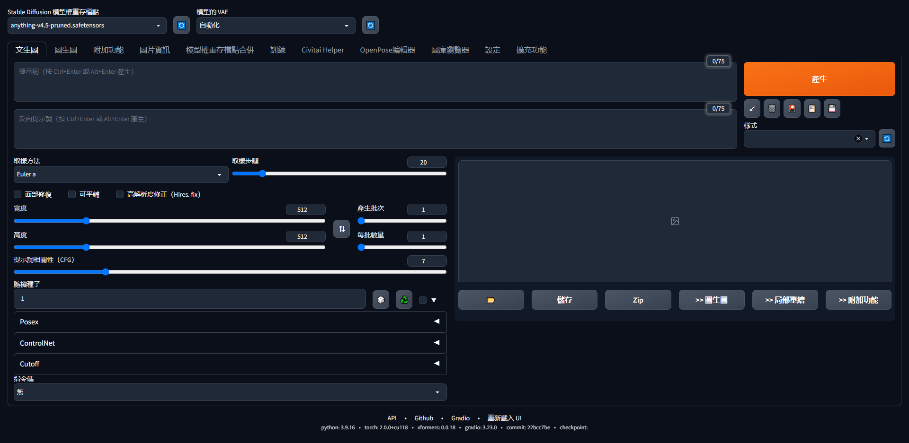
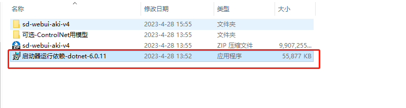
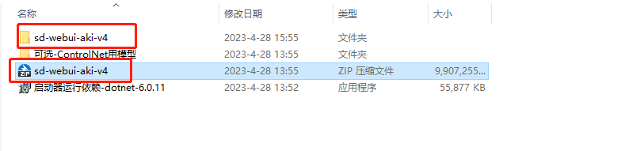
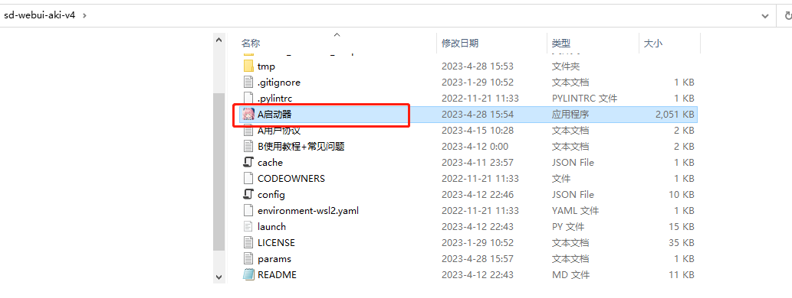
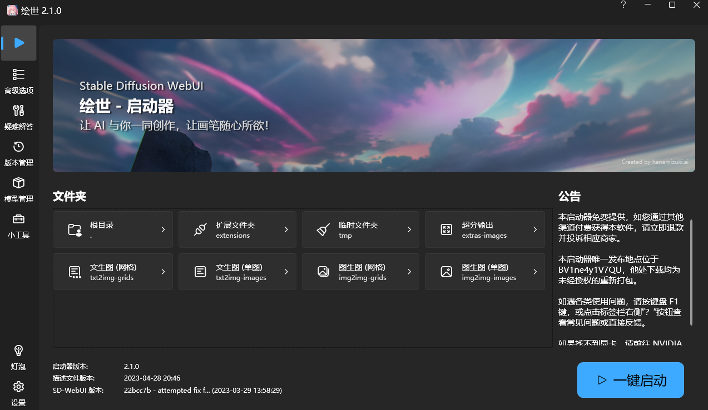
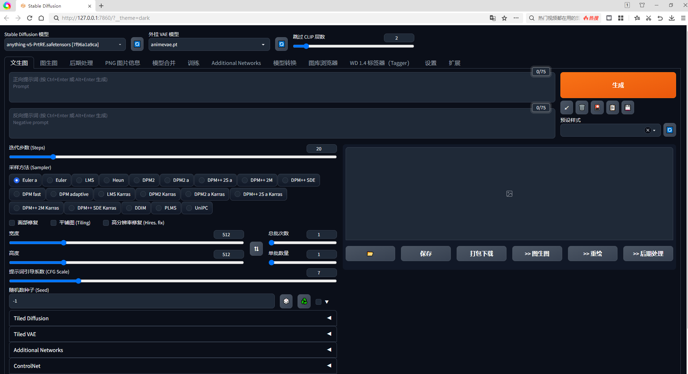

# 安装与部署
本地安装使用Stable Diffusion 推荐电脑带有显卡，内存在16G以上，显存8G以上。使用Mac的朋友们8G m1及以上配置的朋友们也可本地部署。如果电脑配置不够的朋友可以使用云服务器进行部署使用。在我们的教程中将给出Google Colab的部署示例。

## Colab安装部署
此方法需要科学上网，注册谷歌邮箱账户（已注册的朋友可跳过），https://colab.research.google.com/drive/1piBCgnoPfiPn8alD6y3_O8mEIaj4d1q1?usp=sharing 点击链接进入脚本，运行所有代码块。

等待所有代码块运行完后，最下方的代码块会给出URL地址，可随意点击两个中的一个访问Stable Diffusion WebUI进行使用。

## Windows本地部署
本地部署的朋友们建议有带有显卡的电脑。笔者实验过因为国内网络问题，本地直接部署代码会有很多坑，因此建议大家通过整合包的方式在本地部署。
通过链接： https://pan.baidu.com/s/19pYemrQ3tLzq6pPg-2zWwg?pwd=jxau 下载整合包。提取码： jxau

首先运行该应用程序安装依赖。

解压压缩包后，进入文件夹

双击A启动器

点击一键启动，等待即可。

## Mac
diffusionBee 提供了一个基于 Stable Diffusion 的应用程序，无需复杂部署，正常安装就可以使用
官网地址：https://diffusionbee.com/