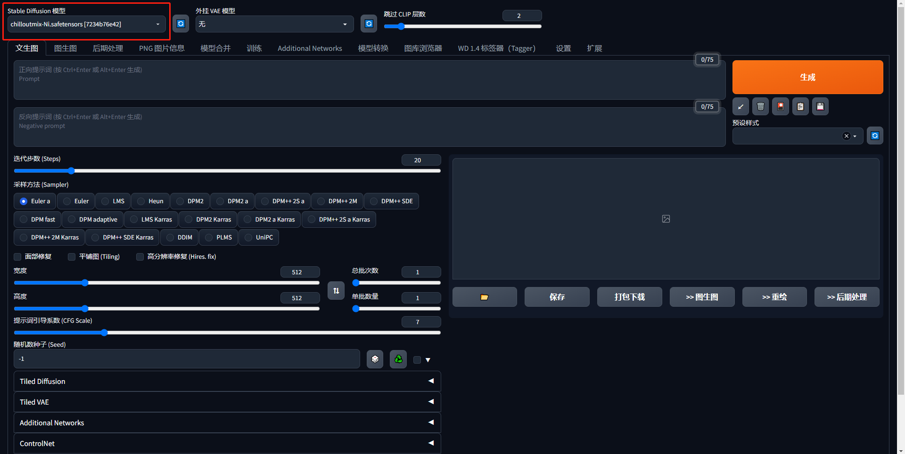
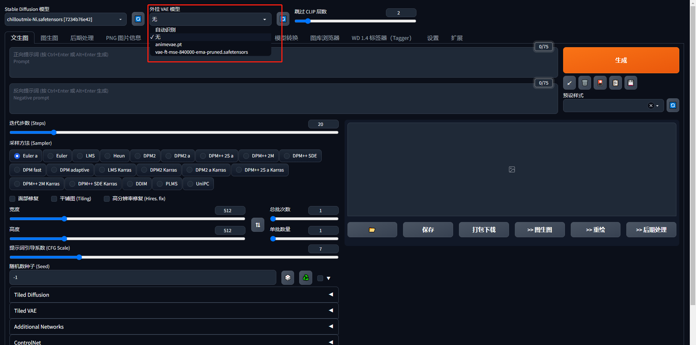
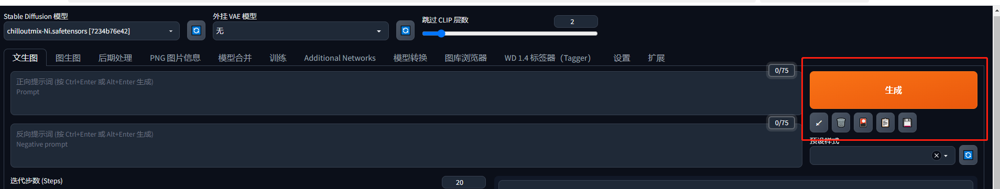
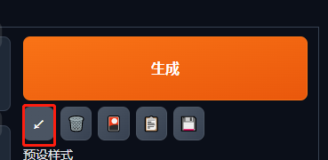
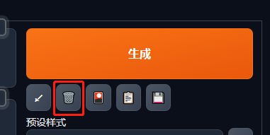
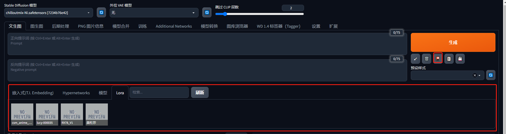
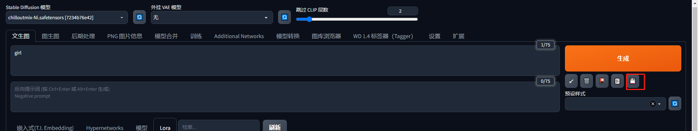
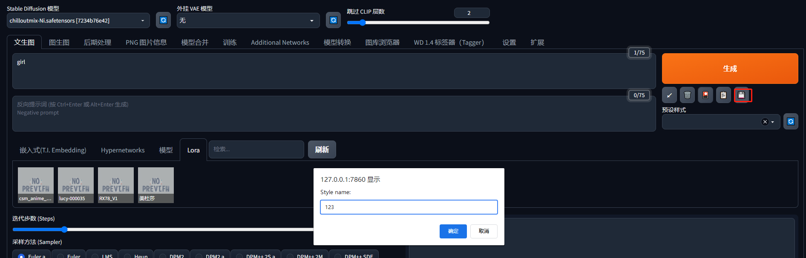

# 认识SD_WebUI

左上角为切换Stable Diffusion大模型，我们可以把下载好的大模型文件放在/sd-webui-aki/sd-webui-aki-v4/models/Stable-diffusion路径下，然后就可以切换我们需要的大模型了。

以下网站我们可以下载我们想要的大模型
https://huggingface.co/models?pipeline_tag=text-to-image

https://civitai.com/

VAE(Variational Auto-Encoder),这里可以切换VAE模型，VAE模型可以把它看作滤镜。我们下载好的VAE模型放在/sd-webui-aki/sd-webui-aki-v4/models/VAE路径下即可切换VAE模型

相比于Midjourney，SD除了正面提示词之外还多了反面提示词的功能，反面提示词可以用来控制生成的图片不要出现的内容，具体使用在后面的章节会出现。

接下来我们讲讲这里按键的功能，生成按钮就是我们设置好提示词和参数后，点击生成图片的按钮。

第一按钮是读取生成上一张图的所有参数信息（包括关键词），比如你画一张图之后，关掉了软件，再次启动点击这个就会把参数复制进来。

第二个按钮是删除，清空关键词

第三个按钮是模型选择管理，点击后会多出一个框可以手动选择模型

最后一个按钮是保存我们的预设，我们设置好提示词后，点击最后一个按钮，就会出现一个框，输入名称可以保存为预设模板。

在预设样式中选中我们刚保存的预设，点击第四个按钮就会加载我们刚刚保存的预设

