# 咒语篇

在生成图像之前，我们先使用以下咒语，用来提高图片质量

## 基本咒语
```
best quality, ultra-detailed, masterpiece, finely detail, highres, 8k wallpaper
```
以下是生成图的比较
1girl, magic Steps: 20, Sampler: Euler a, CFG scale: 7, Seed: 2785601337, Size: 512x512, Model hash: fc2511737a, Model: chilloutmix_NiPrunedFp32Fix

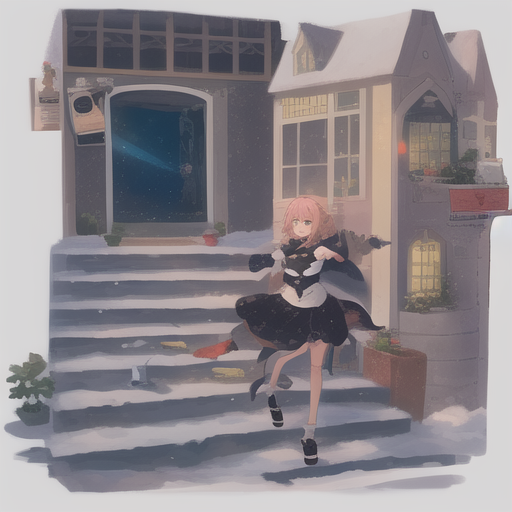

1girl, magic, best quality, ultra-detailed, masterpiece, finely detail, highres, 8k wallpaper Steps: 20, Sampler: Euler a, CFG scale: 7, Seed: 2785601337, Size: 512x512, Model hash: fc2511737a, Model: chilloutmix_NiPrunedFp32Fix

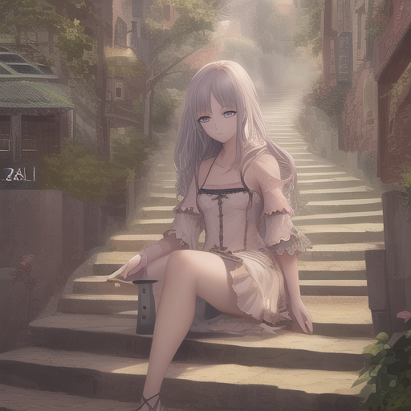

## 人物细节魔法
以下提示词用来提升人物细节和精细度
```
beautiful detailed eyes
highly detailed skin
extremely delicate and beautiful girls
```

前后对比
1girl, sailor dress Steps: 20, Sampler: Euler a, CFG scale: 7, Seed: 241507614, Size: 512x512, Model hash: a074b8864e, Model: CounterfeitV25_25

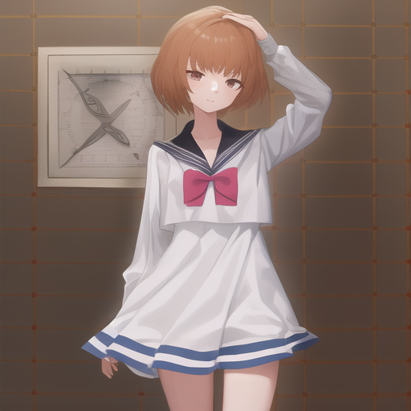

1girl, sailor dress, beautiful detailed eyes, highly detailed skin, extremely delicate and beautiful girls Steps: 20, Sampler: Euler a, CFG scale: 7, Seed: 745832415, Size: 512x512, Model hash: a074b8864e, Model: CounterfeitV25_25

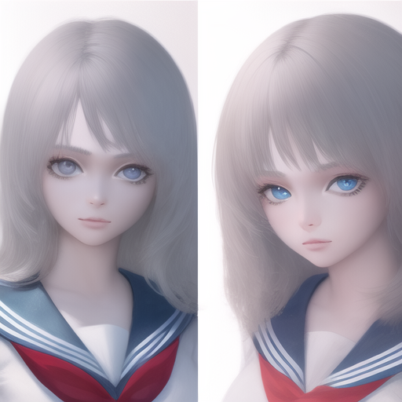


## 特定部位质量改进咒语
以下咒语用于提升你想提升的部位的质感
```
extremely detailed [ 某部位 ]
beautiful detailed [ 某部位 ]
```

extremely detailed hair
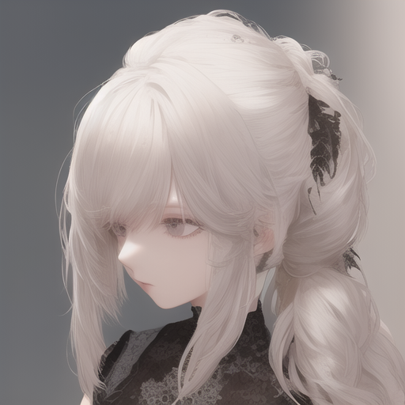

## 负面提示词用法
使用负面提示词可以筛选掉不需要的画风、要素、或错误绘画结果
```
mutated hands and fingers,text,title,deformed, bad anatomy, disfigured, poorly drawn face, mutation, mutated, extra limb, ugly, poorly drawn hands, missing limb, floating limbs, disconnected limbs, malformed hands, out of focus, long neck, long body
```

目前AI有不会画手化脚的问题， 可以使用以下咒语作为negative prompt不画手
```
((poorly drawn hands)),more than 1 left hand, more than 1 right hand, short arm, (((missing arms))), bad hands,missing fingers,(extradigit),(fewer digits),mutated hands,(fused fingers),(too many fingers),sharp fingers,wrong figernails,long hand,double middle finger,index fingers together,missing indexfinger,interlocked fingers,pieck fingers,sharp fingernails,(steepled fingers),x fingers,((curled fingers)),(no finger gaps),interlocked fingers,fingers different thickness,cross fingers,poor outline,big fingers,finger growth,outline on body,outline on hair,out line on background,more than one hands,fuse arm,fuse elbow,more than two arm,more than two elbow
```


手部有明显瑕疵

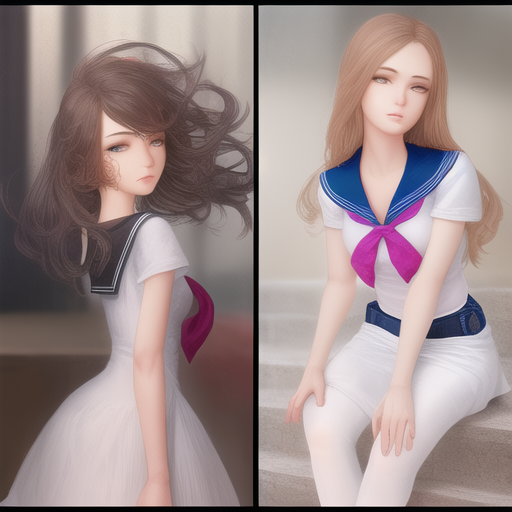

使用咒语后

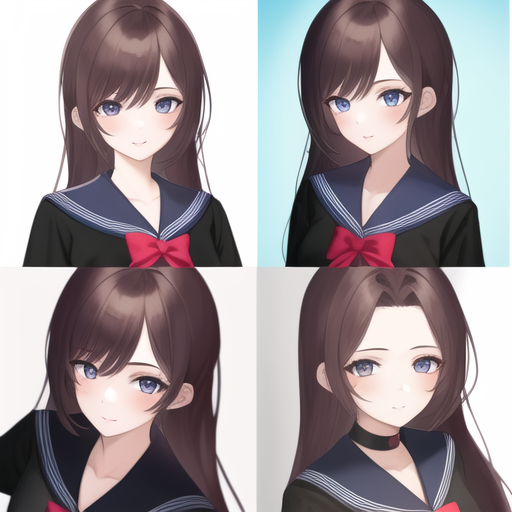

## 视角咒语
- dynamic angle
- from above
- from below
- wide shot
- Aerial View

best quality, ultra-detailed, masterpiece, finely detail, highres, 1girl, kimono, in shinto shrine, Aerial View Steps: 20, Sampler: Euler a, CFG scale: 7, Seed: 4093211569, Size: 512x512, Model hash:

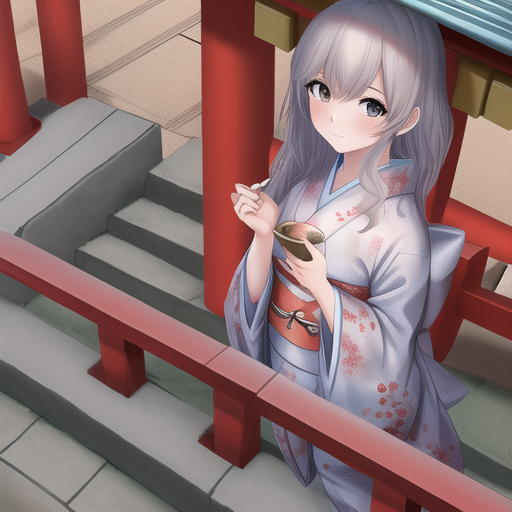

主体远近的相关提示词

- full body shot（全身）
- cowboy shot （ 半身）
- close-up shot （接近）

best quality, ultra-detailed, masterpiece, finely detail, highres, 1girl, extremely delicate and beautiful girls,cyberpunk, full body shot Steps: 20, Sampler: Euler a, CFG scale: 7, Seed: 923218373, Size: 512x512, Model hash: a074b8864e, Model: CounterfeitV25_25

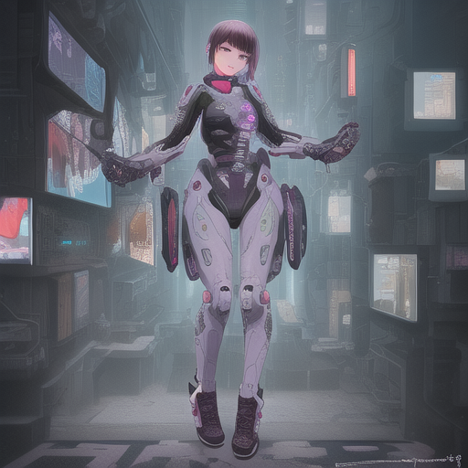

best quality, ultra-detailed, masterpiece, finely detail, highres, 1girl, extremely delicate and beautiful girls,cyberpunk, cowboy shot Steps: 20, Sampler: Euler a, CFG scale: 7, Seed: 3024702595, Size: 512x512, Model hash: a074b8864e, Model: CounterfeitV25_25

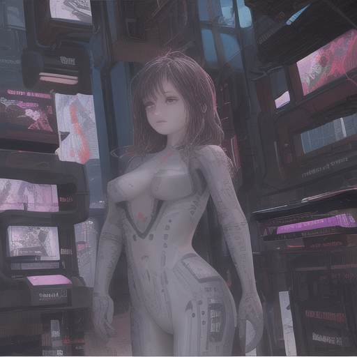

best quality, ultra-detailed, masterpiece, finely detail, highres, 1girl, extremely delicate and beautiful girls,cyberpunk, close-up shot Steps: 20, Sampler: Euler a, CFG scale: 7, Seed: 1257468238, Size: 512x512, Model hash: a074b8864e, Model: CounterfeitV25_25

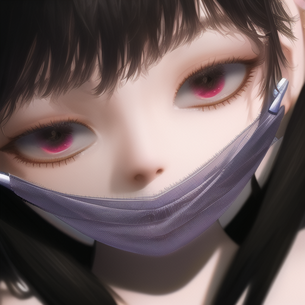

## 光线咒语
|  光线   | 说明|
| ----- | --- |  
| cinematic lighting  |  电影光 |
|  volumetric lighting   | 体积光   | 
| mood lighting| 气氛光|
| bright |明亮| 
| Soft illumination | 柔光照明|
| soft lights |瑞光千条|
| rays of shimmering light | 闪烁的光线 | 
| Crepuscular Ray | 云隙光（耶稣光）|
| bioluminescence | 生物发光 |
|bisexual lighting | 气氛光 |
| Rembrandt Lighting|人物的45度角侧向光|
|Split Lighting |高对比的侧面光 |
|front lighting |正面光顺光 |
|Back lighting | 逆光|
|clean background trending | 斜逆光|
|rim lights | 边缘光|
| global illuminations|全局光 |
|Warming lighting |暖光灯 |
|Natural lighting |戏剧灯光 |

## 视线咒语
- looking at viewer
- looking at another
- looking away
- looking back
- looking up


## 画风
- sketch， one-hour drawing challenge （手绘风）

## 身体指定
表情
- blush（脸红）
- wet sweat（大汗）
- flying sweatdrops （飞汗 ）

## 衣服指定
- china dress
- sailor dress
- school uniform
- sailor senshi uniform

## 风景指定
- underwater （水下）
- shinto shrine （神社）

## 姿势指定

- hands on 例 hands on own face， hands on feet， hands on breast
- kneeling
- hand between legs
- hair flip
- skirt flip


## 各种类型的咒语库
https://arthub.ai/library

## 常用prompt

正面提示词（positive prompt）

|  Prompt   | 说明|
| ----- | --- | 
|HDR, UHD, 64K | (HDR、UHD、4K、8K和64K)这样的质量词可以带来巨大的差异提升照片的质量 |
| Highly detailed | 更多细节 |
| Studio lighting |添加演播室的灯光，可以为图像添加一些漂亮的纹理 | 
| Professional | 可以大大改善图像的色彩对比和细节 | 
| Vivid Colors | 给图片添加鲜艳的色彩，为图像增添活力 | 
|Bokeh | 虚化模糊了背景，突出了主体 | 
| High resolution scan | 具有年代感 | 
| Sketch | 素描 |
| Painting | 绘画 |

负面提示词（negative prompt）

|  Prompt   | 说明|
| ----- | --- | 
|mutated hands and fingers | 变异的手和手指 |
| deformed | deformed | 
| bad anatomy | 解剖不良 |
| disfigured | 毁容|
| poorly drawn face | 脸部画得不好 |
|mutated|变异的|
|extra limb|多余的肢体|
|ugly|丑陋|
|poorly drawn hands|手部画得很差|
|missing limb|缺少的肢体|
|floating limbs|漂浮的四肢|
|disconnected limbs|肢体不连贯|
|malformed hands|畸形的手|
|out of focus|脱离焦点|
|long neck|长颈|
|long body|身体长|

## 艺术风格


|  艺术风格   | 艺术家|说明|
| ----- | --- | -----|
|Portraits|Derek Gores, Miles Aldridge, Jean Baptiste-Carpeaux, Anne-Louis Girodet|肖像画|
|Landscape|Alejandro Bursido, Jacques-Laurent Agasse, Andreas Achenbach, Cuno Amiet|风景画|
|Horror|H.R.Giger, Tim Burton, Andy Fairhurst, Zdzislaw Beksinski|恐怖画|
|Anime|Makoto Shinkai, Katsuhiro Otomo, Masashi Kishimoto, Kentaro Miura|动漫画|
|Sci-fi|Chesley Bonestell, Karel Thole, Jim Burns, Enki Bilal|科幻画|
|Photography|Ansel Adams, Ray Earnes, Peter Kemp, Ruth Bernhard|摄影|
|（Concept artists (video game))|Emerson Tung, Shaddy Safadi, Kentaro Miura|概念艺术|
|Digital painting| -|数字艺术风格|
|Concept art|- |2d插画风格|
|Ultra realistic illustration|-|画风真实和逼真，用于生成人物|