# Stable Diffusion模型介绍

模型是决定图片生成的效果的最重要的因素，因此如何利用模型来提高生成的图片的质量、风格是非常值得学习的一环。

这里可以找到各种各样的模型：

https://huggingface.co/models?pipeline_tag=text-to-image

https://civitai.com/

## 大模型
又可以称为base model，这一类模型的训练数据集最大，对图片生成效果的影响也最大。Stable Diffusion一般默认的大模型为SD x.x(版本号)

下载的大模型我们把它放在应用的models/Stable_diffusion 路径下，即可使用

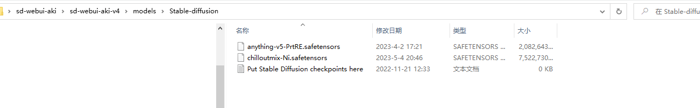

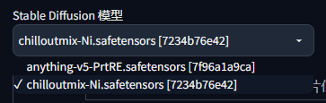
### 二次元风格大模型
abyssorangemix3AOM3_aom3a1

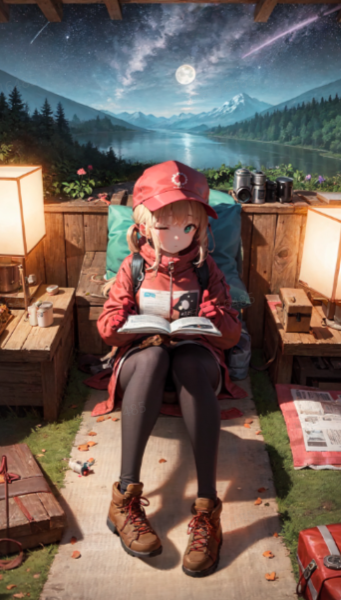

dalcefoPainting_v4

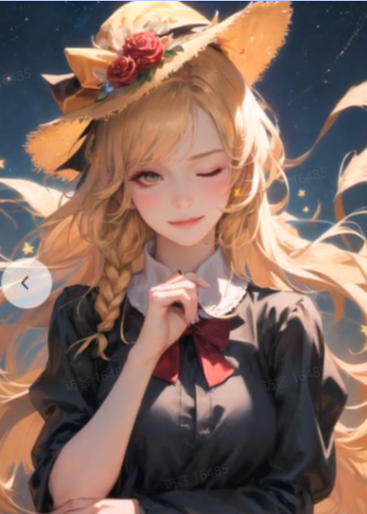

pastelMixStylizedAnime_pastelMixPrunedFP16

油画风

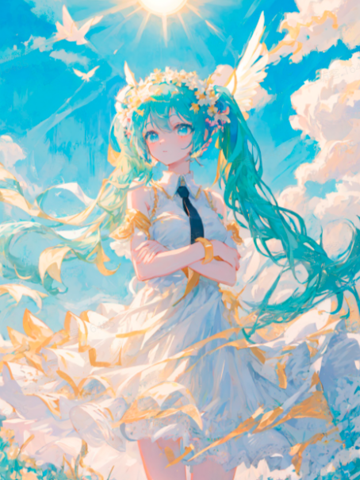

threeDelicacyWonton_threeflavorwontonmixv

水墨风

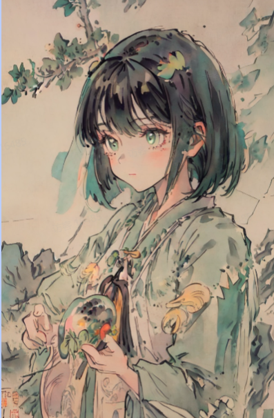

revAnimated_v11

大场景

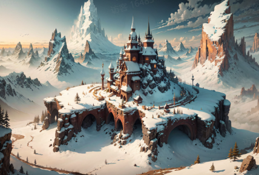

Counterfeit

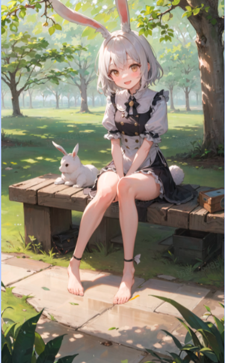

TMND-Mix

优秀的室内环境

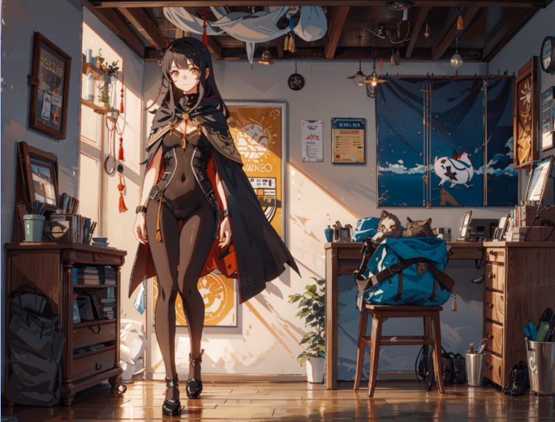

animelike2D

动漫番画风

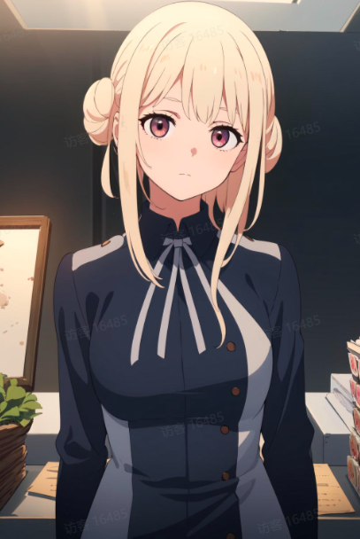

cetusMix

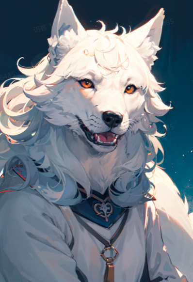

Color Box Model

Night Sky YOZORA Style Model

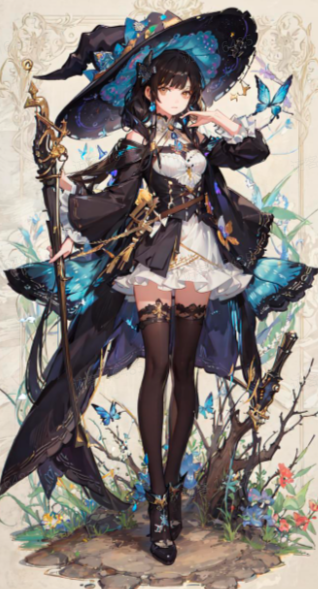

## VAE美化模型
比较像滤镜的感觉，选择VAE相当于给图片加上滤镜；默认是无。

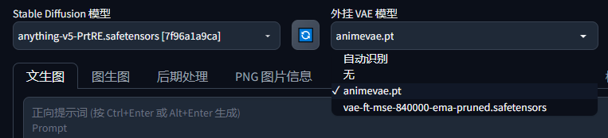
## Lora模型
Lora模型是拿大模型的一部分生成的小模型，它的能力没有大模型完整，但是经过特定的训练在某些特定内容下会有更好的效果。

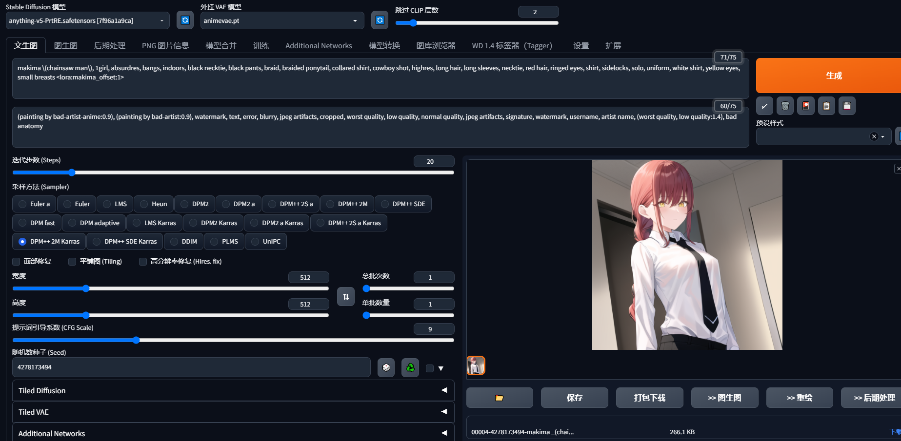

比如我们看到C站上一些喜欢的Lora模型的图片，我们可以下载它的lora模型，点击感叹号查看它的参数

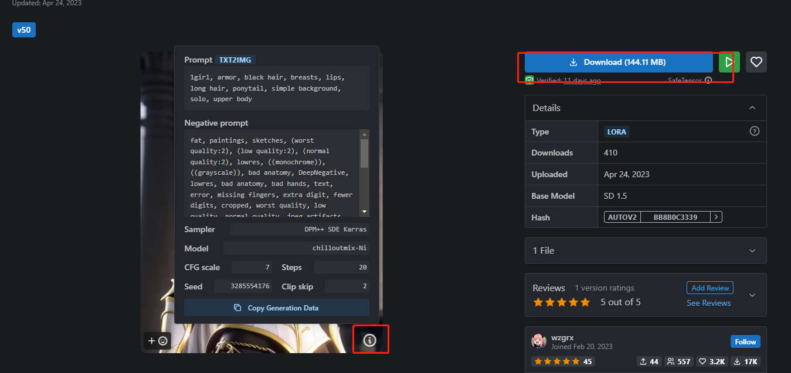

下载好的lora模型我们放在此路径下
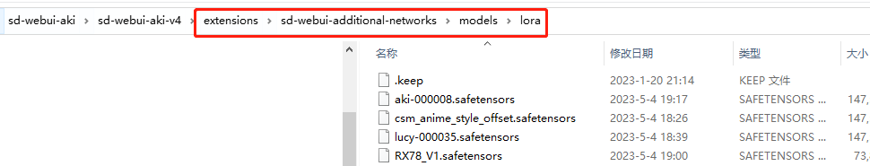

在应用中的additional network就可以选择lora模型使用了

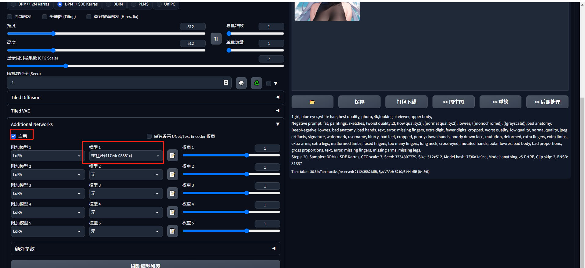

以下是使用lora模型和未使用的生成图片的对比

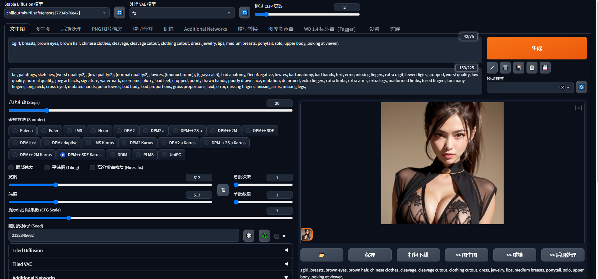

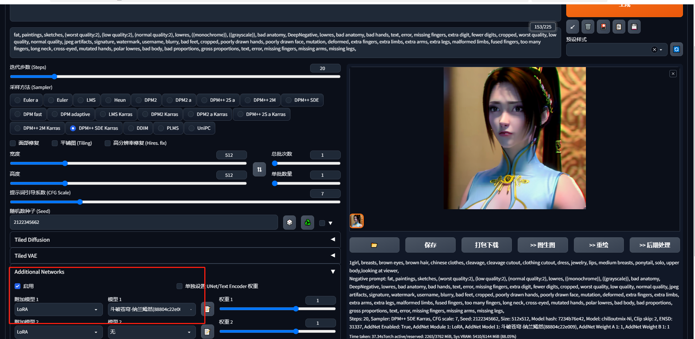