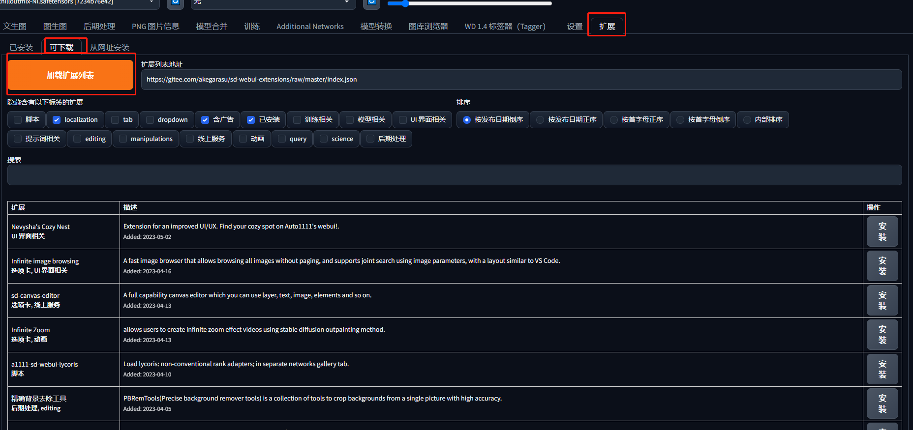
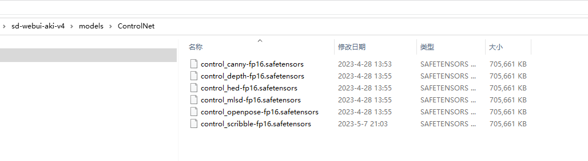
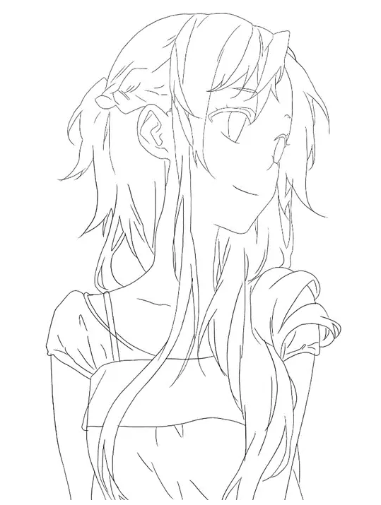
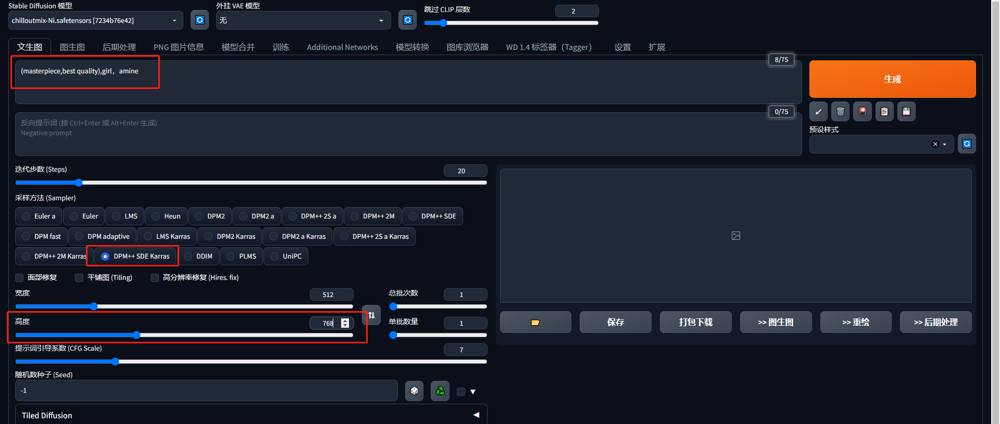
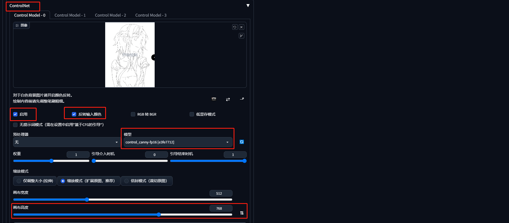
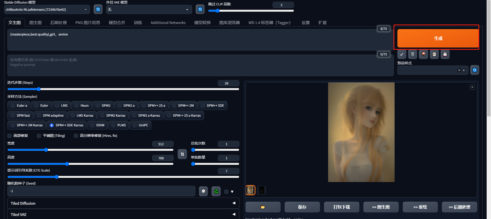
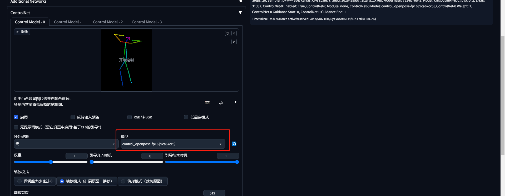
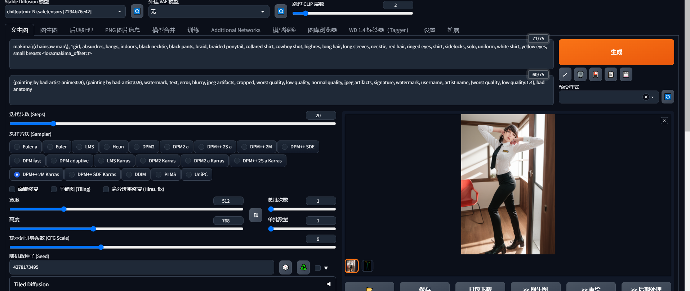

# ControlNet

ControlNet是stable diffusion的一个插件，它可以在AI生成图片之初就将一个型先印在一开始的图中,在由AI去补剩下的东西

## 插件安装
在笔者安装与部署篇中windows的朋友们下载的压缩包已经有插件，所以不用自行安装，如果没有的朋友可以在拓展，这里安装sd-webui-controlnet的插件

## 模组安装
除了插件之外，还需要下载controlnet的模型

https://huggingface.co/webui/ControlNet-modules-safetensors/tree/main

https://huggingface.co/lllyasviel/ControlNet/tree/main/models

下载的模型放在此路径下

部分版本的应用放在/extensions/sd-webui-controlnet/models路径下

## 模组简述
|  模组   | 效果|
| -----| -----|
|Canny |会用演算法详细的抓图片的边缘线做为参考生成图片 |
| mlsd|会尝试抓图片中明显的直线做为参考生成图片 |
| hed|会尝试抓取图片中的特征做为参考生成图片|
|Scribbles|会尝试以提供的线条为结构做为参考生成图片|
|openpose|会尝试从图片中的人物生成骨架后做为参考生成图片|
|seg|会将图片用一个大略的色块取代后做为参考生成图片|
|depth|会尝试从图片中抓取图片的深浅远近做为参考生成图片|
|normal|与depth类似，也会尝试从图片中抓取图片的深浅远近做为参考生成图片|

## 示例

比如我们用canny给线稿上色

我们输入我们的提示词，选择好主模型，采样器，以及调整以下高度

然后我们点击controlnet的模块，上传我们的线稿，勾选启用，和反转输入颜色（因为我们的图片是白色背景）,调整画布高度一致，GPU性能不够好的朋友可以勾选低显存模式

然后点击生成，结果如图所示

再比如我们使用openpose,这个功能是根据骨架生成图片

我们在controlnet中选择openpose的模型，点击生成

