# 训练LoRa

根据用户反馈，有的朋友想了解自己训练LoRa，为了方便不同背景的用户实操，因此这里我们使用了B站 Up主秋叶aaaki的整合包进行示范。

训练包下载：
https://pan.quark.cn/s/d81b8754a484

程序员可通过Git直接clone
https://github.com/Akegarasu/lora-scripts

```
git clone --recurse-submodules https://github.com/Akegarasu/lora-scripts
```


 ## 环境配置
1. 安装python 3.10版本

记得勾选add python.exe to PATH 

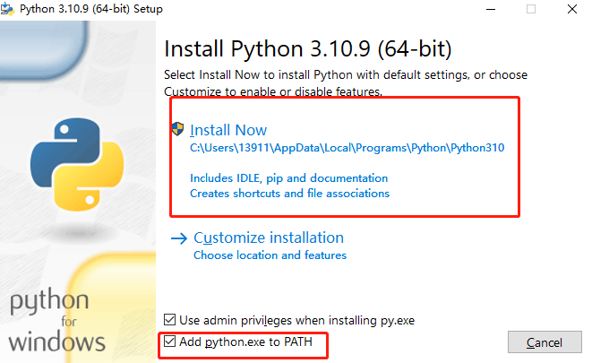

点这个

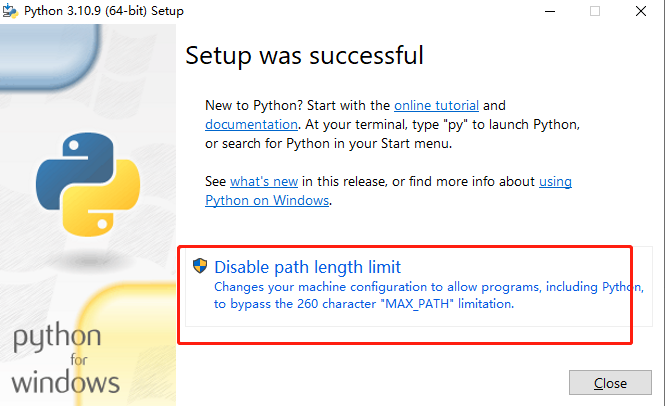

2. 以管理员身份运行powershell

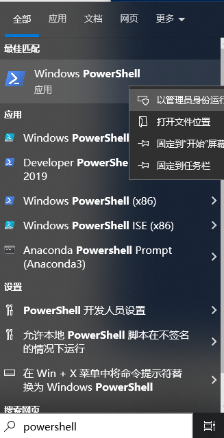

输入 Set-ExecutionPolicy -ExecutionPolicy RemoteSigned
敲回车，然后弹出以下信息属于 y，敲回车


完成后，属于python，敲回车，出现如图所示则完成此步骤。

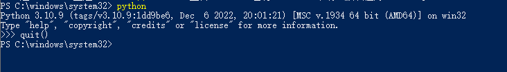

3. 安装依赖
我们去到下载好的lora-scripts路径下，右键install-cn，使用powershell运行

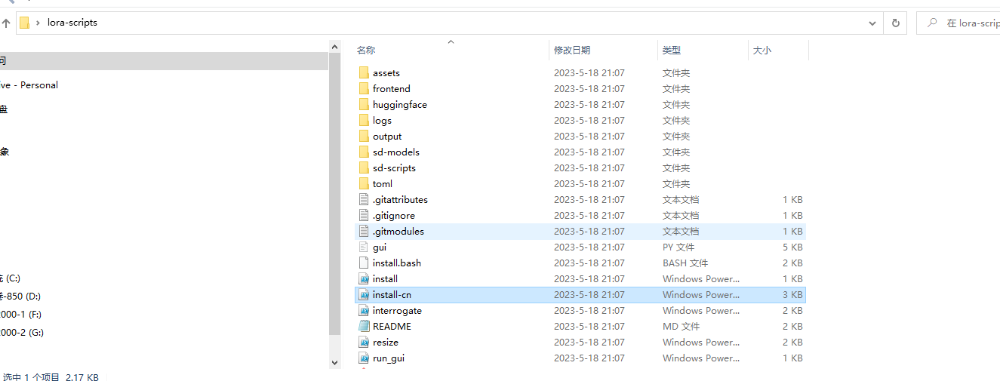

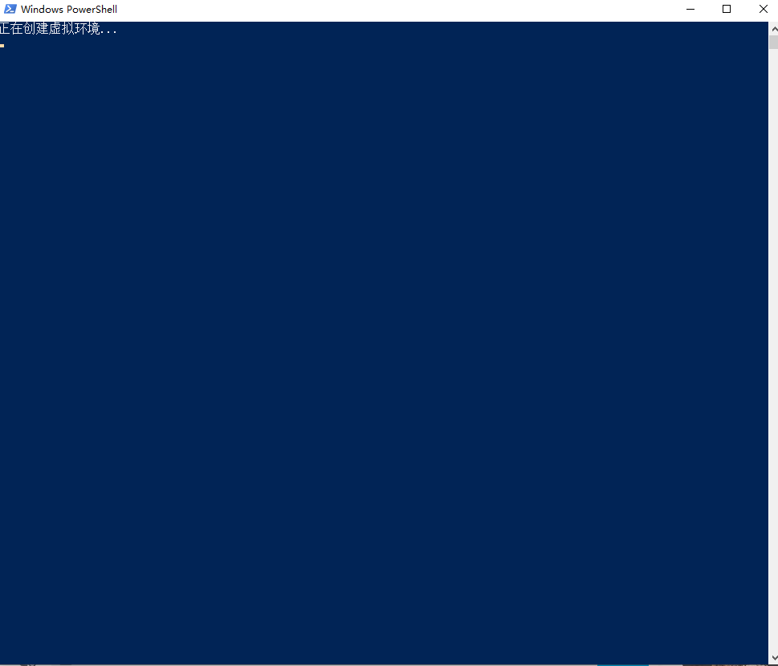

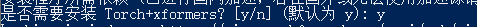

然后安装完成后，笔者这里powershell的窗口会自己消失，如果有报错，窗口会显示错误信息，笔者这步没有遇到报错。

## 准备训练图片

启动Stable diffusion web ui应用，参考前面的章节，选择训练->图像预处理, 我们事先在一个文件夹中放了训练的图片，笔者这里用了迪丽热巴的图片作为实验，在webUI的源目录中把图片所在文件夹的路径粘贴上去。

目标目录把某个空文件夹的路径粘贴上去。

勾选自动面部焦点裁剪和使用Deepbooru生成标签，点击预处理。

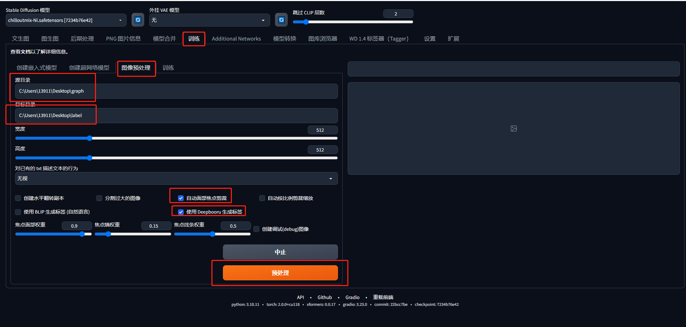

完成后，我们的目标文件夹以及标签如下图所示

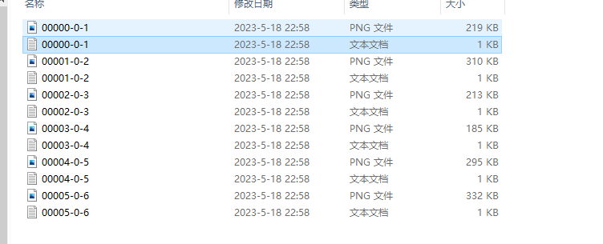

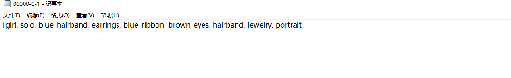

**关闭WebUI应用！！！**

然后在lora-scripts目录下新建一个文件夹，笔者这里取名为train_graph

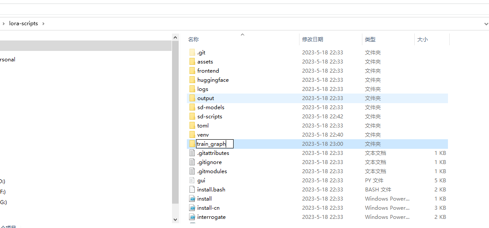

进入刚新建的这个文件夹，再新建一个文件夹

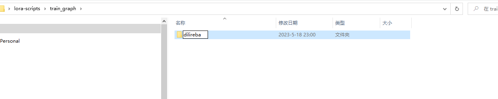

再进入刚新建的文件夹，再新建一个文件夹，这个文件夹取名为 ```[数字]_[名字]``` 笔者这里为6_dilireba


把我们之前预处理好的图片数据都放入到这个文件夹中

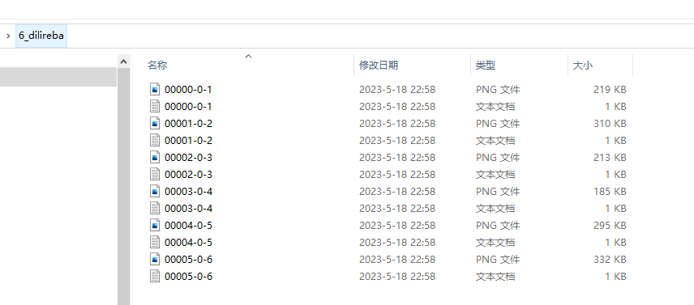

然后我们在lora-scripts路径下，使用文本编辑器（记事本、VScode、notepade++等）打开train.ps1这个文件

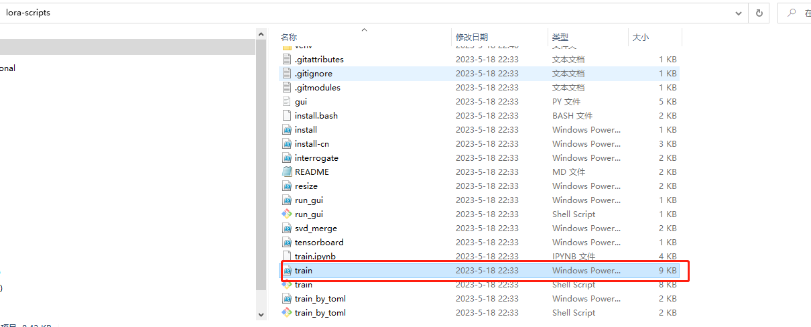

内容如下所示

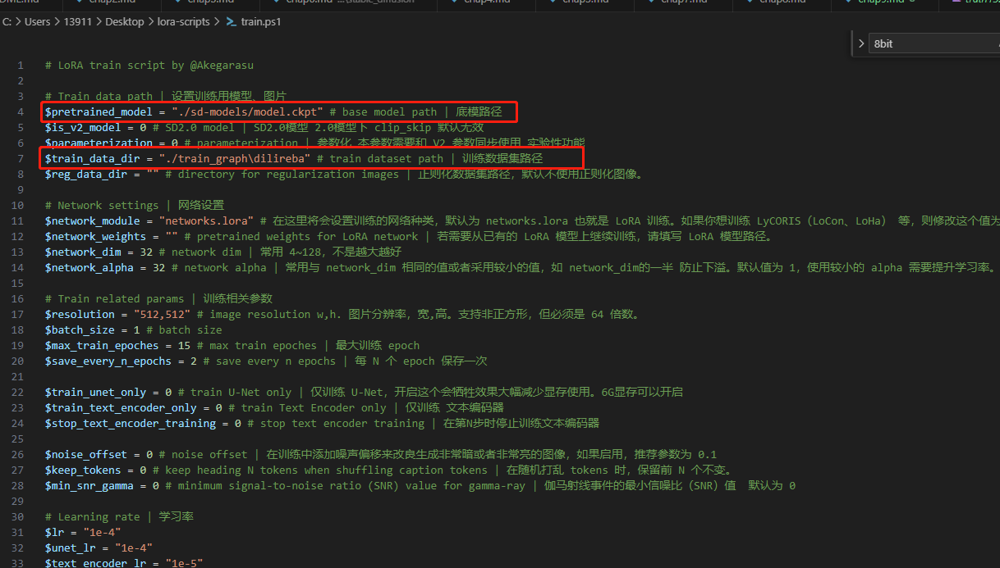

这里我们注意的这两处地方，第一个为底模型的路径，也就是Stable Diffusion大模型的路径。
这里笔者在 https://huggingface.co/runwayml/stable-diffusion-v1-5/tree/main  
上下载了v1-5-pruned.ckpt作为实验，并把它改名为model.ckpt放在lora-script/sd-models路径下，也就是第一个红框对应的路径。

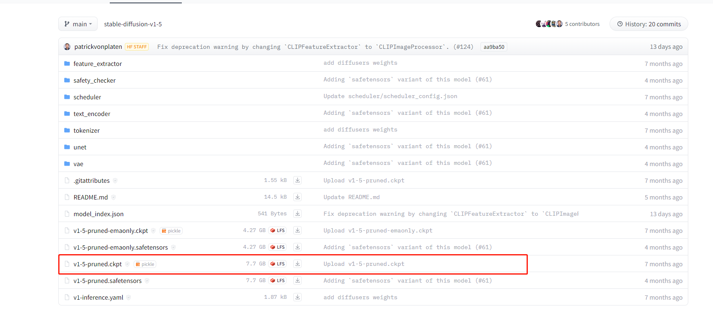

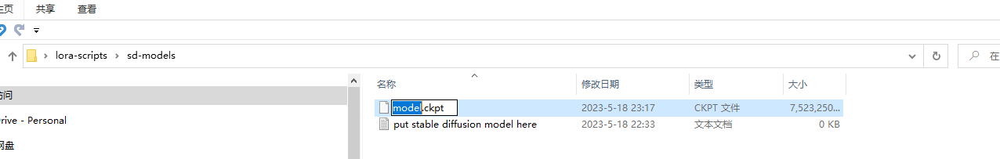

然后把第二个红框的数据路径修改为我们前面创建的/train_graph/dilireba这个路径

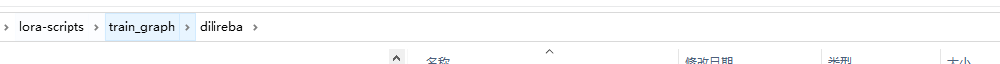

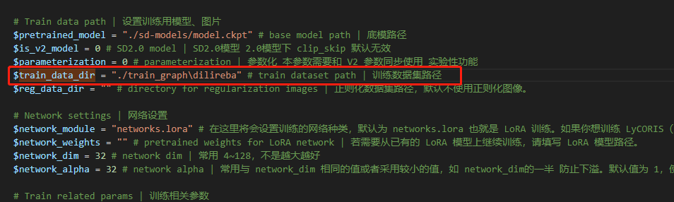

找到 output_name这个地方，模型名字自己命名

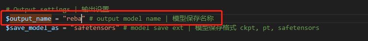

**保存修改！保存修改！保存修改！**

## 训练
回到lora-scripts路径下，右键train.ps，使用powershell运行

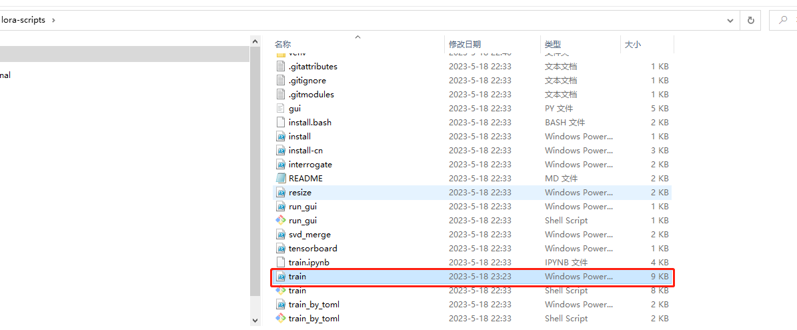


这里笔者遇到一个报错如下图所示

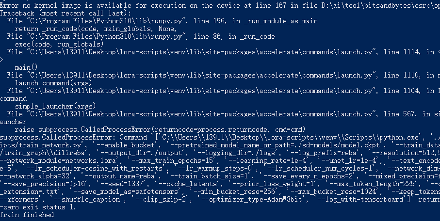

我们再次使用文本编辑器打开lora-scripts路径下的train.ps，**如果没有出现同款报错，可忽略这步**

找到optimizer_type,它默认为AdamW8bit，笔者修改成AdamW如下图所示，**保存修改！保存修改！保存修改！**

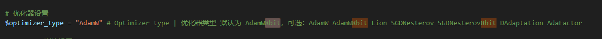

然后回到lora-scripts，右键train.ps，使用powershell运行，即可正常训练如下图所示。

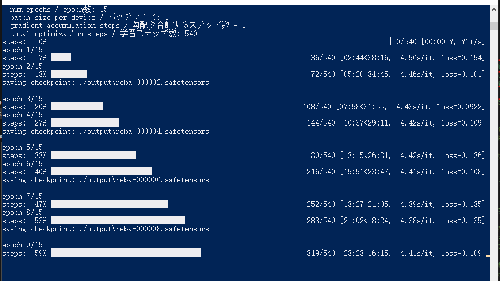

## 完成训练
训练完成后，lora-scripts/output路径下可以看到我们训练好的lora模型。

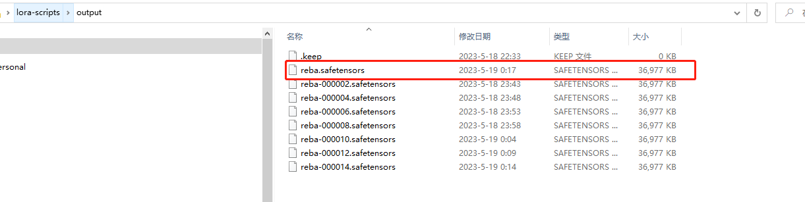

然后我们就可以使用自己训练好的lora模型了，具体使用方法参考前面Stable Diffusion模型介绍章节里的Lora部分

使用lora前后对比。笔者这里只使用了6张图片来训练，也没有调参之类的，所以效果有限，但风格的变化对比起来还是比较明显的。

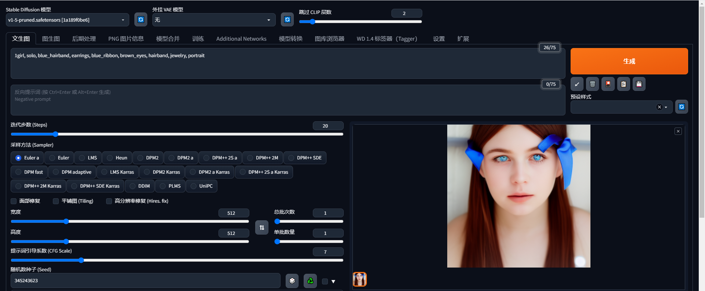

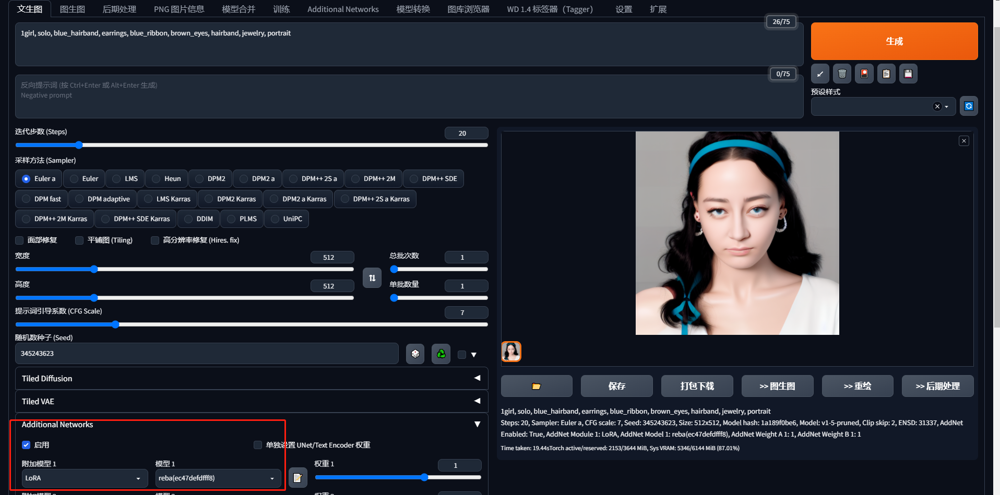